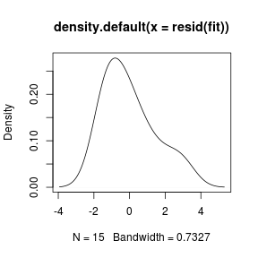
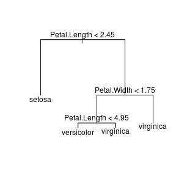
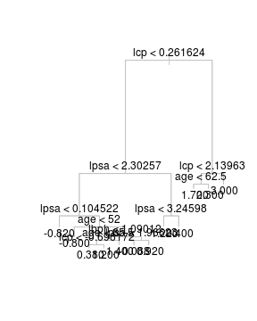
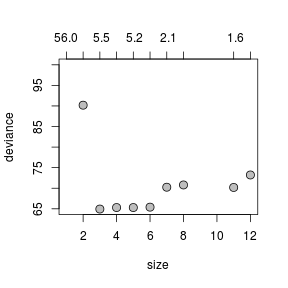
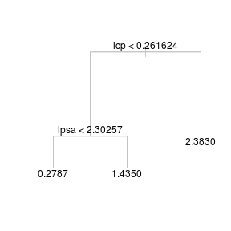

  
## Install R packages
  
R has a lot of powerful packages. You need to load a package into memory before using it.

```r
library(ggplot2) ## a package for plotting
```

--- 
  
## Install R packages

If you see an error message:
```
there is no package called 'ggplot2'
```
it means you don't have this package and you need to install it.
* Using GUI
* Using command

--- .modal

## Install R packages (using command)


```r
## install directly from the default repository http://cran.r-project.org/
install.packages('ggplot2') 
```


```r
## download the package source, and then install from the downloaded file 
download.file('http://cran.r-project.org/src/contrib/ggplot2_0.9.3.1.tar.gz',
             destfile='~/Downloads/ggplot2_0.9.3.1.tar.gz')
install.packages('~/Downloads/ggplot2_0.9.3.1.tar.gz',repo=NULL,type='source')
```

---  .modal

## Getting help


```r
?read.delim # Access a function's help file

??base::delim # Search for 'delim' in all help files for functions in 'base'

help.search("delim") # Search for 'delimited' in all help files

RSiteSearch("parsing text") # Search for the term 'parsing text' on the R site
```

---  &twocolvar w1:40% w2:60% .modal

## Working with data

*** =left


*** =right
```r
## give the filename of your data; the file can be an URL
data.file = 'http://www.yurulin.com/class/spring2014_datamining/data/ml_hackers/01_heights_weights_genders.csv'
heights.weights = read.csv(data.file , header = TRUE , sep = ',')

View(heights.weights)
```

---  .modal

## Working with data


```r
class(heights.weights)
```

```
## [1] "data.frame"
```

```r
dim(heights.weights) # show the dimension of the data
```

```
## [1] 10000     3
```

---  .modal

## Working with data: summary


```r
## R summary function
# ?summary
summary(heights.weights)
```

```
##     Gender         Height          Weight     
##  Female:5000   Min.   :54.26   Min.   : 64.7  
##  Male  :5000   1st Qu.:63.51   1st Qu.:135.8  
##                Median :66.32   Median :161.2  
##                Mean   :66.37   Mean   :161.4  
##                3rd Qu.:69.17   3rd Qu.:187.2  
##                Max.   :79.00   Max.   :270.0
```

---  .modal

## Working with data: summary


```r
summary(heights.weights$Height) # summary for the 'Height' column  
```

```
##    Min. 1st Qu.  Median    Mean 3rd Qu.    Max. 
##   54.26   63.51   66.32   66.37   69.17   79.00
```

---  .modal

## Working with data


```r
## Means, Medians, Modes
heights = heights.weights$Height
mean(heights)
```

```
## [1] 66.36756
```

```r
median(heights)
```

```
## [1] 66.31807
```

```r
min(heights); max(heights)
```

```
## [1] 54.26313
```

```
## [1] 78.99874
```


---  .modal

## Working with data: Quantiles


```r
quantile(heights)
```

```
##       0%      25%      50%      75%     100% 
## 54.26313 63.50562 66.31807 69.17426 78.99874
```

```r
quantile(heights, prob = 0.25)
```

```
##      25% 
## 63.50562
```

```r
quantile(heights, probs = seq(0, 1, by = 0.20))
```

```
##       0%      20%      40%      60%      80%     100% 
## 54.26313 62.85901 65.19422 67.43537 69.81162 78.99874
```

---  .modal

## Working with data


```r
## Standard Deviations and Variances
sd(heights)
```

```
## [1] 3.847528
```

```r
var(heights)
```

```
## [1] 14.80347
```

```r
## Tabulation
table(heights.weights$Gender)
```

```
## 
## Female   Male 
##   5000   5000
```

---  .modal

## Working with data


```r
## Correlation 
weights = heights.weights$Weight
cor(heights,weights)
```

```
## [1] 0.9247563
```

---  .modal

## Plotting


```r
## Histogram and Density
library('ggplot2') 
theme_set(theme_bw()) # change the default ggplot theme to black-and-white

ggplot(heights.weights, aes(x = Height)) +
  geom_histogram(binwidth=1) 
```


---  .modal

## Plotting


```r
ggplot(heights.weights, aes(x = Height)) +
  geom_histogram(binwidth=0.5) # try different value for binwidth 
```


---  .modal

## Plotting


```r
ggplot(heights.weights, aes(x = Height)) +
  geom_density()
```


---  .modal

## Plotting


```r
## conditional density plot
ggplot(heights.weights, aes(x = Weight, fill = Gender)) +
  geom_density(alpha = 0.5) 
```


---  .modal

## Plotting


```r
ggplot(heights.weights, aes(x = Weight)) +
  geom_density(alpha = 0.5) + facet_grid(Gender ~ .) 
```



---  .modal

## Plotting


```r
ggplot(heights.weights, aes(x = Weight, fill = Gender)) +
  geom_density(alpha = 0.5) + facet_grid(Gender ~ .)  
```



---  .modal

## Plotting


```r
## Scatterplot
ggplot(heights.weights, aes(x = Weight, y = Height)) + geom_point()
```


---  .modal

## Plotting


```r
ggplot(heights.weights, aes(x = Weight, y = Height, color = Gender)) + geom_point()
```


---  .modal

## Plotting


```r
ggplot(heights.weights, aes(x = Weight, y = Height)) + geom_point(shape=1) + # use hollow circles 
  geom_smooth(method=lm, # add linear regression line
              se=FALSE) # (by default includes 95% confidence region)  
```



--- 

## More about plotting

See: [http://www.cookbook-r.com/Graphs/](http://www.cookbook-r.com/Graphs/)

--- .modal

## Example 1


```r
require(lattice)  
require(nutshell) # you will need to install this package
data(births2006.smpl)
births2006.smpl[1:3,]
```

```
##         DOB_MM DOB_WK MAGER TBO_REC WTGAIN SEX APGAR5             DMEDUC
## 591430       9      1    25       2     NA   F     NA               NULL
## 1827276      2      6    28       2     26   M      9 2 years of college
## 1705673      2      2    18       2     25   F      9               NULL
##         UPREVIS ESTGEST DMETH_REC  DPLURAL DBWT
## 591430       10      99   Vaginal 1 Single 3800
## 1827276      10      37   Vaginal 1 Single 3625
## 1705673      14      38   Vaginal 1 Single 3650
```

--- .modal

## Example 1


```r
dim(births2006.smpl) # the dimension of the data frame (data matrix)
```

```
## [1] 427323     13
```


--- .modal

## Example 1


```r
## generate frequency tables
births.dow=table(births2006.smpl$DOB_WK)
births.dow 
```

```
## 
##     1     2     3     4     5     6     7 
## 40274 62757 69775 70290 70164 68380 45683
```

--- .modal

## Example 1


```r
barchart(births.dow,ylab="Day of Week",col="black")
```


--- .modal

## Example 1


```r
## plot by ggplot
ggplot(data = births2006.smpl, aes(x=factor(DOB_WK))) + 
  geom_histogram(stat="count", binwidth=1) + 
  scale_x_discrete("Day of Week") + scale_y_continuous("Freq") + 
  coord_flip()
```


--- .modal

## Example 1


```r
dob.dm.tbl=table(WK=births2006.smpl$DOB_WK,MM=births2006.smpl$DMETH_REC)
dob.dm.tbl
```

```
##    MM
## WK  C-section Unknown Vaginal
##   1      8836      90   31348
##   2     20454     272   42031
##   3     22921     247   46607
##   4     23103     252   46935
##   5     22825     258   47081
##   6     23233     289   44858
##   7     10696     109   34878
```


--- .modal

## Example 1


```r
dob.dm.tbl=dob.dm.tbl[,-2]
dob.dm.tbl
```

```
##    MM
## WK  C-section Vaginal
##   1      8836   31348
##   2     20454   42031
##   3     22921   46607
##   4     23103   46935
##   5     22825   47081
##   6     23233   44858
##   7     10696   34878
```

--- .modal

## Example 1


```r
## plot by ggplot
ggplot(data = births2006.smpl, aes(x=factor(DOB_WK),fill=factor(DMETH_REC) )) + 
  geom_histogram(stat="count") + 
  scale_x_discrete("Day of Week") + scale_y_continuous("Freq") +
  scale_fill_discrete(name="method of\ndelivery") +
  coord_flip()
```


--- .modal

## Example 1


```r
## generate conditional histogram and density plots
histogram(~DBWT|DPLURAL,data=births2006.smpl,layout=c(1,5),col="black")
```


--- .modal

## Example 1


```r
## plot by ggplot
ggplot(data = births2006.smpl,aes(x=DBWT)) + facet_grid(DPLURAL~.,scales="free_y") + 
  geom_histogram(binwidth=500)
```


--- .modal

## Example 1


```r
histogram(~DBWT|DMETH_REC,data=births2006.smpl,layout=c(1,3),col="black")
```


--- .modal

## Example 1


```r
densityplot(~DBWT|DPLURAL,data=births2006.smpl,layout=c(1,5),plot.points=FALSE,col="black")
```




--- .modal

## Example 1


```r
## plot by ggplot
ggplot(data = births2006.smpl,aes(x=DBWT)) + facet_grid(DPLURAL~., scales="free_y") + 
  geom_density()  
```



--- .modal

## Example 2: thin-tailed v. heavy-tailed


```r
set.seed(1)
normal.values <- rnorm(100000, 0, 1)
cauchy.values <- rcauchy(100000, 0, 1)
range(normal.values)
```

```
## [1] -4.542122  4.313621
```

```r
range(cauchy.values)  
```

```
## [1] -65027.14  44901.98
```


--- .modal

## Example 2: thin-tailed v. heavy-tailed


```r
D=data.frame(X = cauchy.values,distribution='cauchy')
D=rbind(D,data.frame(X = normal.values,distribution='normal'))
ggplot(data=D, aes(x=X, linetype=distribution)) + 
  geom_density() + 
  scale_x_continuous(limits = c(-6, 6))
```


--- .modal

## Example 3: Power law


```r
## the frequency of family names can be downloaded from the 2000 Census:
## http://www.census.gov/genealogy/www/data/2000surnames/
data.url = 'http://www.yurulin.com/class/archive/fall2013_datamining/data/others'
data.file = sprintf('%s/Top1000names.csv',data.url)
topfamilynames = read.csv(data.file,stringsAsFactors=FALSE)
namecount = topfamilynames[-1,1:3]
names(namecount) = c('Surnames','Rank','Count')
D=namecount[order(as.numeric(namecount$Count),decreasing=T),]
D[1:3,]
```

```
##   Surnames Rank   Count
## 2    SMITH    1 2376206
## 3  JOHNSON    2 1857160
## 4 WILLIAMS    3 1534042
```


--- .modal

## Example 3: Power law


```r
data = as.numeric(namecount$Count)
# rank the family names according to frequency, from largest to smallest
data = sort(data,decreasing=TRUE) 
hist(data,xlab='Number of Family Surnames',main='Histogram of Family Surnames')
```


--- .modal

## Example 3: Power law


```r
plot(data,type='l',
     ylab='Frequency of Family Surnames',
     xlab='Index',
     main='Plot of Family Surnames')
```


--- .modal

## Example 3: Power law


```r
plot(data,type='p',log='xy',
     ylab='Frequency of Family Surnames',
     xlab='Index',
     main='Log-log Plot of Family Surnames')  
```


--- .ul: build

## References
* Ledolter, Johannes. Data mining and business analytics with R. John Wiley & Sons, 2013.
* Conway, Drew, and John White. Machine learning for hackers. O'Reilly Media, Inc., 2012.
* Lai, Willy. "Fitting power law distributions to data." (2016). 
