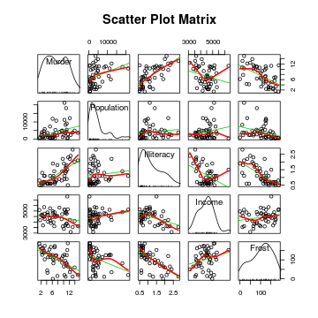
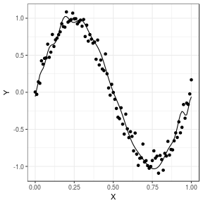
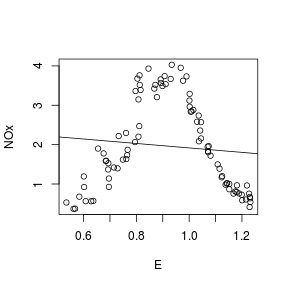
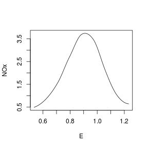
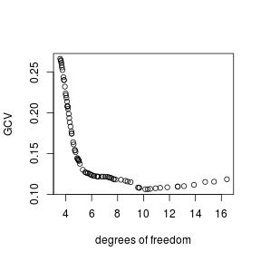
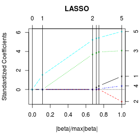

---
title       : Class02
subtitle    : regression examples
author      : 
job         : 
framework   : shower        # {io2012, html5slides, shower, dzslides, ...}
highlighter : highlight.js  # {highlight.js, prettify, highlight}
hitheme     : tomorrow      # 
widgets     : [mathjax]            # {mathjax, quiz, bootstrap}
mode        : selfcontained # {standalone, draft}
knit        : slidify::knit2slides
--- #toc

## Class02
* [Set up](#set-up)
* [Simple Regression](#simple-regression)
* [Multiple linear regression](#multiple-linear-regression)
* [Variable selection](#variable-selection)
* [Model performance](#model-performance)
* [Polynomial regression](#polynomial-regression)
* [Non-linear Data](#non-linear)
* [Cross-validation](#cross-validation)
* [Regularization](#regularization)
* [Local Polynomial Regression](#local-poly)
* [LASSO](#lasso)

--- #set-up .modal 

## Install R packages

```r
## this tutorial uses the following packages
install.packages('nutshell') 
install.packages('locfit')
install.packages('lars')
```

--- #simple-regression .modal 

## Simple Regression

The examples are taken from [R in Action](http://www.manning.com/kabacoff/)
$$\hat{y}=\alpha +\beta x$$


```r
## we'll use an exmaple dataset 'women' in the 'car' package
library(car) ## load the package
women
```

```
##    height weight
## 1      58    115
## 2      59    117
## 3      60    120
## 4      61    123
## 5      62    126
## 6      63    129
## 7      64    132
## 8      65    135
## 9      66    139
## 10     67    142
## 11     68    146
## 12     69    150
## 13     70    154
## 14     71    159
## 15     72    164
```

--- .modal

## Simple Regression


```r
## data summary
summary(women)
```

```
##      height         weight     
##  Min.   :58.0   Min.   :115.0  
##  1st Qu.:61.5   1st Qu.:124.5  
##  Median :65.0   Median :135.0  
##  Mean   :65.0   Mean   :136.7  
##  3rd Qu.:68.5   3rd Qu.:148.0  
##  Max.   :72.0   Max.   :164.0
```

--- .modal

## Simple Regression


```r
## plot the data
plot(women$height, women$weight)
```


--- .modal

## Simple Regression


```r
library(ggplot2) ## load the plotting package
theme_set(theme_bw()) ## set default theme with a white background
ggplot(data=women, aes(x=height,y=weight)) + geom_point() 
```


--- .modal

## Simple Regression


```r
## plot with regression line
ggplot(women, aes(x = height, y = weight)) + geom_point() + 
  geom_smooth(method=lm, # add linear regression line
              se=FALSE) # (by default includes 95% confidence region)  
```


--- .scode

## Simple Regression


```r
## perform linear regression
fit = lm(weight ~ height, data=women)
summary(fit)
```

```
## 
## Call:
## lm(formula = weight ~ height, data = women)
## 
## Residuals:
##     Min      1Q  Median      3Q     Max 
## -1.7333 -1.1333 -0.3833  0.7417  3.1167 
## 
## Coefficients:
##              Estimate Std. Error t value Pr(>|t|)    
## (Intercept) -87.51667    5.93694  -14.74 1.71e-09 ***
## height        3.45000    0.09114   37.85 1.09e-14 ***
## ---
## Signif. codes:  0 '***' 0.001 '**' 0.01 '*' 0.05 '.' 0.1 ' ' 1
## 
## Residual standard error: 1.525 on 13 degrees of freedom
## Multiple R-squared:  0.991,	Adjusted R-squared:  0.9903 
## F-statistic:  1433 on 1 and 13 DF,  p-value: 1.091e-14
```

--- &twocolvar w1:40% w2:60% .compact .scode-nowrap

### What does the result mean?  

*** =left
$$ \hat{weight}=-87.52+3.45\times height $$

* There's an expected increase of 3.45 pounds of weight for every 1 inch increase in height. 
* The intercept is merely an adjustment constant.  


*** =right

```
## 
## Call:
## lm(formula = weight ~ height, data = women)
## 
## Residuals:
##     Min      1Q  Median      3Q     Max 
## -1.7333 -1.1333 -0.3833  0.7417  3.1167 
## 
## Coefficients:
##              Estimate Std. Error t value Pr(>|t|)    
## (Intercept) -87.51667    5.93694  -14.74 1.71e-09 ***
## height        3.45000    0.09114   37.85 1.09e-14 ***
## ---
## Signif. codes:  0 '***' 0.001 '**' 0.01 '*' 0.05 '.' 0.1 ' ' 1
## 
## Residual standard error: 1.525 on 13 degrees of freedom
## Multiple R-squared:  0.991,	Adjusted R-squared:  0.9903 
## F-statistic:  1433 on 1 and 13 DF,  p-value: 1.091e-14
```

--- &twocolvar w1:40% w2:60% .compact .scode-nowrap

### Understand the summary

*** =left
**(1) Is the model statistically significant?**

* Check the **F statistic** at the bottom of the summary.
* The F statistic tells you whether the model is insignificant or significant. Big p-value indicates a high likelihood of insignificance. (Further reading: F-statistic [1](http://www.statisticshowto.com/f-statistic/), [2](https://onlinecourses.science.psu.edu/stat501/node/295).)

*** =right

```
## 
## Call:
## lm(formula = weight ~ height, data = women)
## 
## Residuals:
##     Min      1Q  Median      3Q     Max 
## -1.7333 -1.1333 -0.3833  0.7417  3.1167 
## 
## Coefficients:
##              Estimate Std. Error t value Pr(>|t|)    
## (Intercept) -87.51667    5.93694  -14.74 1.71e-09 ***
## height        3.45000    0.09114   37.85 1.09e-14 ***
## ---
## Signif. codes:  0 '***' 0.001 '**' 0.01 '*' 0.05 '.' 0.1 ' ' 1
## 
## Residual standard error: 1.525 on 13 degrees of freedom
## Multiple R-squared:  0.991,	Adjusted R-squared:  0.9903 
## F-statistic:  1433 on 1 and 13 DF,  p-value: 1.091e-14
```

--- &twocolvar w1:40% w2:60% .compact .scode-nowrap

### Understand the summary

*** =left
**(2) Are the coefficients significant?**

   * Check the coefficient's **t statistics** and **p-values** in the summary, or check their confidence intervals.
   * If a variable's coefficient is zero then the variable is worthless; it adds nothing to the model. 

*** =right

```
## 
## Call:
## lm(formula = weight ~ height, data = women)
## 
## Residuals:
##     Min      1Q  Median      3Q     Max 
## -1.7333 -1.1333 -0.3833  0.7417  3.1167 
## 
## Coefficients:
##              Estimate Std. Error t value Pr(>|t|)    
## (Intercept) -87.51667    5.93694  -14.74 1.71e-09 ***
## height        3.45000    0.09114   37.85 1.09e-14 ***
## ---
## Signif. codes:  0 '***' 0.001 '**' 0.01 '*' 0.05 '.' 0.1 ' ' 1
## 
## Residual standard error: 1.525 on 13 degrees of freedom
## Multiple R-squared:  0.991,	Adjusted R-squared:  0.9903 
## F-statistic:  1433 on 1 and 13 DF,  p-value: 1.091e-14
```

--- &twocolvar w1:40% w2:60% .compact .scode-nowrap

### Understand the summary

*** =left
**(2) Are the coefficients significant?**

   * The p-value is a probability that the coefficient is not significant. Big is bad because it indicates a high likelihood of insignificance.
   * The regression coefficient (3.45) is significantly different from zero (p < 0.001).

*** =right

```
## 
## Call:
## lm(formula = weight ~ height, data = women)
## 
## Residuals:
##     Min      1Q  Median      3Q     Max 
## -1.7333 -1.1333 -0.3833  0.7417  3.1167 
## 
## Coefficients:
##              Estimate Std. Error t value Pr(>|t|)    
## (Intercept) -87.51667    5.93694  -14.74 1.71e-09 ***
## height        3.45000    0.09114   37.85 1.09e-14 ***
## ---
## Signif. codes:  0 '***' 0.001 '**' 0.01 '*' 0.05 '.' 0.1 ' ' 1
## 
## Residual standard error: 1.525 on 13 degrees of freedom
## Multiple R-squared:  0.991,	Adjusted R-squared:  0.9903 
## F-statistic:  1433 on 1 and 13 DF,  p-value: 1.091e-14
```

--- &twocolvar w1:40% w2:60% .compact .scode-nowrap

### Understand the summary

*** =left
**(3) Is the model useful?**

   * Check the **R-squared** near the bottom of the summary.
   * R-squared is a measure of the model's quality -- the fraction of the variance of y that is explained by the regression model. Bigger is better.

*** =right

```
## 
## Call:
## lm(formula = weight ~ height, data = women)
## 
## Residuals:
##     Min      1Q  Median      3Q     Max 
## -1.7333 -1.1333 -0.3833  0.7417  3.1167 
## 
## Coefficients:
##              Estimate Std. Error t value Pr(>|t|)    
## (Intercept) -87.51667    5.93694  -14.74 1.71e-09 ***
## height        3.45000    0.09114   37.85 1.09e-14 ***
## ---
## Signif. codes:  0 '***' 0.001 '**' 0.01 '*' 0.05 '.' 0.1 ' ' 1
## 
## Residual standard error: 1.525 on 13 degrees of freedom
## Multiple R-squared:  0.991,	Adjusted R-squared:  0.9903 
## F-statistic:  1433 on 1 and 13 DF,  p-value: 1.091e-14
```

--- &twocolvar w1:40% w2:60% .compact .scode-nowrap

### Understand the summary

*** =left
**(3) Is the model useful?**

   * The multiple R-squared (0.991) indicates that the model accounts for 99.1 percent of the variance in weights. The multiple R-squared is also the squared correlation between the actual and predicted value. (Further reading: Correlation and R-Squared [1](http://mathworld.wolfram.com/CorrelationCoefficient.html), [2](https://economictheoryblog.com/2014/11/05/the-coefficient-of-determination-latex-r2/), [3](http://www.win-vector.com/blog/2011/11/correlation-and-r-squared/).)
   * The adjusted value accounts for the number of variables in your model and so is a more realistic assessment of its effectiveness.

*** =right

```
## 
## Call:
## lm(formula = weight ~ height, data = women)
## 
## Residuals:
##     Min      1Q  Median      3Q     Max 
## -1.7333 -1.1333 -0.3833  0.7417  3.1167 
## 
## Coefficients:
##              Estimate Std. Error t value Pr(>|t|)    
## (Intercept) -87.51667    5.93694  -14.74 1.71e-09 ***
## height        3.45000    0.09114   37.85 1.09e-14 ***
## ---
## Signif. codes:  0 '***' 0.001 '**' 0.01 '*' 0.05 '.' 0.1 ' ' 1
## 
## Residual standard error: 1.525 on 13 degrees of freedom
## Multiple R-squared:  0.991,	Adjusted R-squared:  0.9903 
## F-statistic:  1433 on 1 and 13 DF,  p-value: 1.091e-14
```

--- &twocolvar w1:40% w2:60% .compact .scode-nowrap

### Understand the summary

*** =left
**(4) Does the model fit the data well?**

   * Plot the residuals and check the regression diagnostics.
   * The residual standard error (1.53 lbs.) can be thought of as the average error in predicting weight from height using this model. 

*** =right

```
## 
## Call:
## lm(formula = weight ~ height, data = women)
## 
## Residuals:
##     Min      1Q  Median      3Q     Max 
## -1.7333 -1.1333 -0.3833  0.7417  3.1167 
## 
## Coefficients:
##              Estimate Std. Error t value Pr(>|t|)    
## (Intercept) -87.51667    5.93694  -14.74 1.71e-09 ***
## height        3.45000    0.09114   37.85 1.09e-14 ***
## ---
## Signif. codes:  0 '***' 0.001 '**' 0.01 '*' 0.05 '.' 0.1 ' ' 1
## 
## Residual standard error: 1.525 on 13 degrees of freedom
## Multiple R-squared:  0.991,	Adjusted R-squared:  0.9903 
## F-statistic:  1433 on 1 and 13 DF,  p-value: 1.091e-14
```


--- .modal

## Plot the residuals


```r
## plot the residuals and check if the residuals appear to be approximately normal
plot(density(resid(fit)))
```


--- &twocolvar w1:40% w2:60% .compact .scode-nowrap

### Understand the summary

*** =left
**(5) Does the data satisfy the assumptions behind linear regression?**

   * Check whether the diagnostics confirm that a linear model is reasonable for your data.
   * If the residuals have a normal distribution, then the first quartile (1Q) and third quartile (3Q) should have about the same magnitude.

*** =right

```
## 
## Call:
## lm(formula = weight ~ height, data = women)
## 
## Residuals:
##     Min      1Q  Median      3Q     Max 
## -1.7333 -1.1333 -0.3833  0.7417  3.1167 
## 
## Coefficients:
##              Estimate Std. Error t value Pr(>|t|)    
## (Intercept) -87.51667    5.93694  -14.74 1.71e-09 ***
## height        3.45000    0.09114   37.85 1.09e-14 ***
## ---
## Signif. codes:  0 '***' 0.001 '**' 0.01 '*' 0.05 '.' 0.1 ' ' 1
## 
## Residual standard error: 1.525 on 13 degrees of freedom
## Multiple R-squared:  0.991,	Adjusted R-squared:  0.9903 
## F-statistic:  1433 on 1 and 13 DF,  p-value: 1.091e-14
```

--- .modal

## Plot the residuals


```r
qqnorm(resid(fit)) # a quantile normal plot 
qqline(resid(fit))
```


--- .modal

## Check statistical assumptions


```r
## plot regression diagnostics
par(mfrow=c(2,2))
plot(fit)
```


--- &twocolvar w1:50% w2:50% .compact .scode

### Check statistical assumptions
*** =left
**Normality**
   * If the dependent variable is normally distributed for a fixed set of predictor values, then the residual values should be normally distributed with a mean of 0. 
   * The **Normal Q-Q plot** (upper right) is a probability plot of the standardized residuals against the values that would be expected under normality. If you've met the normality assumption, the points on this graph should fall on the straight 45-degree line. If they don't, you've clearly violated the normality assumption.

*** =right


--- &twocolvar w1:50% w2:50% .compact .scode

### Check statistical assumptions
*** =left
**Independence**
   * You have to use your understanding of how the data were collected. There's no a priori reason to believe that one woman's weight influences another woman's weight. If you found out that the data were sampled from families, you may have to adjust your assumption of independence.

*** =right


--- &twocolvar w1:50% w2:50% .compact .scode

### Check statistical assumptions
*** =left
**Linearity**
   * If the dependent variable is linearly related to the independent variables, there should be no systematic relationship between the residuals and the predicted (that is, fitted) values. 
   * In other words, the model should capture all the systematic variance present in the data, leaving nothing but random noise. 
   * In the **Residuals vs Fitted** graph (upper left), you see clear evidence of a curved relationship, which suggests that you may want to add a quadratic term to the regression.

*** =right


--- &twocolvar w1:50% w2:50% .compact .scode

### Check statistical assumptions
*** =left
**Homoscedasticity**
   * If you've met the constant variance assumption, the points in the **Scale-Location** graph (bottom left) should be a random band around a horizontal line. You seem to meet this assumption.

*** =right


--- #multiple-linear-regression .modal

## Multiple linear regression

```r
## we'll use the state.x77 dataset in the base package
states = as.data.frame(state.x77[,c("Murder", "Population",
                                     "Illiteracy", "Income", "Frost")])
head(states)
```

```
##            Murder Population Illiteracy Income Frost
## Alabama      15.1       3615        2.1   3624    20
## Alaska       11.3        365        1.5   6315   152
## Arizona       7.8       2212        1.8   4530    15
## Arkansas     10.1       2110        1.9   3378    65
## California   10.3      21198        1.1   5114    20
## Colorado      6.8       2541        0.7   4884   166
```

--- .modal .compact .scode

## Examining data 

```r
cor(states)
```

```
##                Murder Population Illiteracy     Income      Frost
## Murder      1.0000000  0.3436428  0.7029752 -0.2300776 -0.5388834
## Population  0.3436428  1.0000000  0.1076224  0.2082276 -0.3321525
## Illiteracy  0.7029752  0.1076224  1.0000000 -0.4370752 -0.6719470
## Income     -0.2300776  0.2082276 -0.4370752  1.0000000  0.2262822
## Frost      -0.5388834 -0.3321525 -0.6719470  0.2262822  1.0000000
```

--- .modal

## Examining data 

```r
## examining bivariate relationships using 'scatterplotMatrix' in the 'car' package
scatterplotMatrix(states, spread=FALSE, lty.smooth=2,
                  main="Scatter Plot Matrix")
```



--- .modal

## Multiple linear regression

```r
fit = lm(Murder ~ Population + Illiteracy + Income + Frost, data=states)
summary(fit)
```

```
## 
## Call:
## lm(formula = Murder ~ Population + Illiteracy + Income + Frost, 
##     data = states)
## 
## Residuals:
##     Min      1Q  Median      3Q     Max 
## -4.7960 -1.6495 -0.0811  1.4815  7.6210 
## 
## Coefficients:
##              Estimate Std. Error t value Pr(>|t|)    
## (Intercept) 1.235e+00  3.866e+00   0.319   0.7510    
## Population  2.237e-04  9.052e-05   2.471   0.0173 *  
## Illiteracy  4.143e+00  8.744e-01   4.738 2.19e-05 ***
## Income      6.442e-05  6.837e-04   0.094   0.9253    
## Frost       5.813e-04  1.005e-02   0.058   0.9541    
## ---
## Signif. codes:  0 '***' 0.001 '**' 0.01 '*' 0.05 '.' 0.1 ' ' 1
## 
## Residual standard error: 2.535 on 45 degrees of freedom
## Multiple R-squared:  0.567,	Adjusted R-squared:  0.5285 
## F-statistic: 14.73 on 4 and 45 DF,  p-value: 9.133e-08
```

--- &twocolvar w1:40% w2:60% .compact .scode-nowrap

### What does the result mean?  

*** =left
   * In multiple regression, the coefficients indicate the increase in the dependent variable for a unit change in a predictor variable, *holding all other predictor variables constant*. 
   * For example, the regression coefficient for Illiteracy is 4.14, suggesting that an increase of 1 percent in illiteracy is associated with a 4.14 percent increase in the murder rate, controlling for population, income, and temperature. 

*** =right

```
## 
## Call:
## lm(formula = Murder ~ Population + Illiteracy + Income + Frost, 
##     data = states)
## 
## Residuals:
##     Min      1Q  Median      3Q     Max 
## -4.7960 -1.6495 -0.0811  1.4815  7.6210 
## 
## Coefficients:
##              Estimate Std. Error t value Pr(>|t|)    
## (Intercept) 1.235e+00  3.866e+00   0.319   0.7510    
## Population  2.237e-04  9.052e-05   2.471   0.0173 *  
## Illiteracy  4.143e+00  8.744e-01   4.738 2.19e-05 ***
## Income      6.442e-05  6.837e-04   0.094   0.9253    
## Frost       5.813e-04  1.005e-02   0.058   0.9541    
## ---
## Signif. codes:  0 '***' 0.001 '**' 0.01 '*' 0.05 '.' 0.1 ' ' 1
## 
## Residual standard error: 2.535 on 45 degrees of freedom
## Multiple R-squared:  0.567,	Adjusted R-squared:  0.5285 
## F-statistic: 14.73 on 4 and 45 DF,  p-value: 9.133e-08
```

--- &twocolvar w1:40% w2:60% .compact .scode-nowrap

### What does the result mean?  

*** =left
   * The coefficient is significantly different from zero at the p < .0001 level. The coefficient for Frost isn't significantly different from zero (p = 0.954) suggesting that Frost and Murder aren't linearly related when controlling for the other predictor variables. 
   * Taken together, the predictor variables account for 57 percent of the variance in murder rates across states.

*** =right

```
## 
## Call:
## lm(formula = Murder ~ Population + Illiteracy + Income + Frost, 
##     data = states)
## 
## Residuals:
##     Min      1Q  Median      3Q     Max 
## -4.7960 -1.6495 -0.0811  1.4815  7.6210 
## 
## Coefficients:
##              Estimate Std. Error t value Pr(>|t|)    
## (Intercept) 1.235e+00  3.866e+00   0.319   0.7510    
## Population  2.237e-04  9.052e-05   2.471   0.0173 *  
## Illiteracy  4.143e+00  8.744e-01   4.738 2.19e-05 ***
## Income      6.442e-05  6.837e-04   0.094   0.9253    
## Frost       5.813e-04  1.005e-02   0.058   0.9541    
## ---
## Signif. codes:  0 '***' 0.001 '**' 0.01 '*' 0.05 '.' 0.1 ' ' 1
## 
## Residual standard error: 2.535 on 45 degrees of freedom
## Multiple R-squared:  0.567,	Adjusted R-squared:  0.5285 
## F-statistic: 14.73 on 4 and 45 DF,  p-value: 9.133e-08
```

--- .compact

## Variable selection
**Stepwise selection**: variables are added to or deleted from a model one at a time.
* forward: add predictor variables to the model one at a time, stopping when the addition of variables would no longer improve the model
* backward: start with a model that includes all predictor variables, and then delete them one at a time until removing variables would degrade the quality of the model

--- .scode

## Variable selection

```r
## backward stepwise selection
library(MASS)
fit1 = lm(Murder ~ Population + Illiteracy + Income + Frost,
          data=states)
stepAIC(fit, direction="backward")
```

```
## Start:  AIC=97.75
## Murder ~ Population + Illiteracy + Income + Frost
## 
##              Df Sum of Sq    RSS     AIC
## - Frost       1     0.021 289.19  95.753
## - Income      1     0.057 289.22  95.759
## <none>                    289.17  97.749
## - Population  1    39.238 328.41 102.111
## - Illiteracy  1   144.264 433.43 115.986
## 
## Step:  AIC=95.75
## Murder ~ Population + Illiteracy + Income
## 
##              Df Sum of Sq    RSS     AIC
## - Income      1     0.057 289.25  93.763
## <none>                    289.19  95.753
## - Population  1    43.658 332.85 100.783
## - Illiteracy  1   236.196 525.38 123.605
## 
## Step:  AIC=93.76
## Murder ~ Population + Illiteracy
## 
##              Df Sum of Sq    RSS     AIC
## <none>                    289.25  93.763
## - Population  1    48.517 337.76  99.516
## - Illiteracy  1   299.646 588.89 127.311
```

```
## 
## Call:
## lm(formula = Murder ~ Population + Illiteracy, data = states)
## 
## Coefficients:
## (Intercept)   Population   Illiteracy  
##   1.6515497    0.0002242    4.0807366
```


--- &twocolvar w1:40% w2:60% .compact .sscode-nowrap

## Variable selection

*** =left
* You start with all four predictors in the model. For each step, the AIC column provides the model AIC resulting from the deletion of the variable listed in that row.
* Models with smaller AIC values (indicating adequate fit with fewer parameters) are preferred.
* Although stepwise selection may find a good model, there's no guarantee that it will find the best model because not every possible model is evaluated. (Alternative: all subsets method. See library `leaps`.)

*** =right

```
## Start:  AIC=97.75
## Murder ~ Population + Illiteracy + Income + Frost
## 
##              Df Sum of Sq    RSS     AIC
## - Frost       1     0.021 289.19  95.753
## - Income      1     0.057 289.22  95.759
## <none>                    289.17  97.749
## - Population  1    39.238 328.41 102.111
## - Illiteracy  1   144.264 433.43 115.986
## 
## Step:  AIC=95.75
## Murder ~ Population + Illiteracy + Income
## 
##              Df Sum of Sq    RSS     AIC
## - Income      1     0.057 289.25  93.763
## <none>                    289.19  95.753
## - Population  1    43.658 332.85 100.783
## - Illiteracy  1   236.196 525.38 123.605
## 
## Step:  AIC=93.76
## Murder ~ Population + Illiteracy
## 
##              Df Sum of Sq    RSS     AIC
## <none>                    289.25  93.763
## - Population  1    48.517 337.76  99.516
## - Illiteracy  1   299.646 588.89 127.311
```

```
## 
## Call:
## lm(formula = Murder ~ Population + Illiteracy, data = states)
## 
## Coefficients:
## (Intercept)   Population   Illiteracy  
##   1.6515497    0.0002242    4.0807366
```

--- .compact .scode

## Model performance

```r
## compute R-squared for the woman data
y = women$weight; x = women$height
fit = lm(y~x)
summary(fit)
```

```
## 
## Call:
## lm(formula = y ~ x)
## 
## Residuals:
##     Min      1Q  Median      3Q     Max 
## -1.7333 -1.1333 -0.3833  0.7417  3.1167 
## 
## Coefficients:
##              Estimate Std. Error t value Pr(>|t|)    
## (Intercept) -87.51667    5.93694  -14.74 1.71e-09 ***
## x             3.45000    0.09114   37.85 1.09e-14 ***
## ---
## Signif. codes:  0 '***' 0.001 '**' 0.01 '*' 0.05 '.' 0.1 ' ' 1
## 
## Residual standard error: 1.525 on 13 degrees of freedom
## Multiple R-squared:  0.991,	Adjusted R-squared:  0.9903 
## F-statistic:  1433 on 1 and 13 DF,  p-value: 1.091e-14
```

--- .compact .scode

## Model performance

```r
## compute R-squared for the woman data
mean.mse = mean((rep(mean(y),length(y)) - y)^2)
model.mse = mean(residuals(fit)^2)
rmse = sqrt(model.mse)
rmse ## root mean square error
```

```
## [1] 1.419703
```

```r
r2 = 1 - (model.mse / mean.mse)
r2
```

```
## [1] 0.9910098
```

```r
cor(y, fit$fitted.values)^2
```

```
## [1] 0.9910098
```

--- .compact .scode

## Model performance

```r
## leave-one-out cross validation
n = length(women$weight)
error = dim(n)
for (k in 1:n) {
  train1 = c(1:n)
  train = train1[train1!=k] ## pick elements that are different from k
  m2 = lm(weight ~ height, data=women[train ,])
  pred = predict(m2, newdat=women[-train ,])
  obs = women$weight[-train]
  error[k] = obs-pred
}
me=mean(error)
me ## mean error
```

```
## [1] 0.1148222
```

```r
rmse=sqrt(mean(error^2))
rmse ## root mean square error (out-of-sample)
```

```
## [1] 1.743782
```


--- #polynomial-regression .compact .scode

## Polynomial regression

```r
fit2 = lm(weight ~ height + I(height^2), data=women)
summary(fit2)
```

```
## 
## Call:
## lm(formula = weight ~ height + I(height^2), data = women)
## 
## Residuals:
##      Min       1Q   Median       3Q      Max 
## -0.50941 -0.29611 -0.00941  0.28615  0.59706 
## 
## Coefficients:
##              Estimate Std. Error t value Pr(>|t|)    
## (Intercept) 261.87818   25.19677  10.393 2.36e-07 ***
## height       -7.34832    0.77769  -9.449 6.58e-07 ***
## I(height^2)   0.08306    0.00598  13.891 9.32e-09 ***
## ---
## Signif. codes:  0 '***' 0.001 '**' 0.01 '*' 0.05 '.' 0.1 ' ' 1
## 
## Residual standard error: 0.3841 on 12 degrees of freedom
## Multiple R-squared:  0.9995,	Adjusted R-squared:  0.9994 
## F-statistic: 1.139e+04 on 2 and 12 DF,  p-value: < 2.2e-16
```

--- .compact .scode

## Polynomial regression

```r
plot(women$height,women$weight,
     xlab="Height (in inches)",
     ylab="Weight (in lbs)")
lines(women$height,fitted(fit2))
```


--- &twocolvar w1:48% w2:50% .compact .sscode-nowrap

## Polynomial regression

*** =left
$$ \hat{weight}= 261.88- 7.35\times height +0.083 \times height^2 $$
Both regression coefficients are significant at the p < 0.0001 level. The amount of variance accounted for has increased to 99.9 percent. The significance of the squared term (t = 13.89, p < .001) suggests that inclusion of the quadratic term improves the model fit.

*** =right

```
## 
## Call:
## lm(formula = weight ~ height + I(height^2), data = women)
## 
## Residuals:
##      Min       1Q   Median       3Q      Max 
## -0.50941 -0.29611 -0.00941  0.28615  0.59706 
## 
## Coefficients:
##              Estimate Std. Error t value Pr(>|t|)    
## (Intercept) 261.87818   25.19677  10.393 2.36e-07 ***
## height       -7.34832    0.77769  -9.449 6.58e-07 ***
## I(height^2)   0.08306    0.00598  13.891 9.32e-09 ***
## ---
## Signif. codes:  0 '***' 0.001 '**' 0.01 '*' 0.05 '.' 0.1 ' ' 1
## 
## Residual standard error: 0.3841 on 12 degrees of freedom
## Multiple R-squared:  0.9995,	Adjusted R-squared:  0.9994 
## F-statistic: 1.139e+04 on 2 and 12 DF,  p-value: < 2.2e-16
```

--- #non-linear .modal 

## Non-linear Data

```r
## create testing data (sine wave)
set.seed(1)
x = seq(0, 1, by = 0.01)
y = sin(2 * pi * x) + rnorm(length(x), 0, 0.1)
df = data.frame(X = x, Y = y)
ggplot(df, aes(x = X, y = Y)) + geom_point()
```


--- .scode 

## Non-linear Data

```r
## fit with linear regression
summary(lm(Y ~ X, data = df)) # explain 60% of the variance
```

```
## 
## Call:
## lm(formula = Y ~ X, data = df)
## 
## Residuals:
##      Min       1Q   Median       3Q      Max 
## -1.00376 -0.41253 -0.00409  0.40664  0.85874 
## 
## Coefficients:
##             Estimate Std. Error t value Pr(>|t|)    
## (Intercept)  0.94111    0.09057   10.39   <2e-16 ***
## X           -1.86189    0.15648  -11.90   <2e-16 ***
## ---
## Signif. codes:  0 '***' 0.001 '**' 0.01 '*' 0.05 '.' 0.1 ' ' 1
## 
## Residual standard error: 0.4585 on 99 degrees of freedom
## Multiple R-squared:  0.5885,	Adjusted R-squared:  0.5843 
## F-statistic: 141.6 on 1 and 99 DF,  p-value: < 2.2e-16
```

--- .scode

## Non-linear Data

```r
ggplot(data.frame(X = x, Y = y), aes(x = X, y = Y)) +
  geom_point() +
  geom_smooth(method = 'lm', se = FALSE)
```


--- .scode 

## Non-linear Data

```r
## add new features
df <- transform(df, X2 = X ^ 2)
df <- transform(df, X3 = X ^ 3)
summary(lm(Y ~ X + X2 + X3, data = df)) # R2 from 60% to 97%, by adding two more inputs
```

```
## 
## Call:
## lm(formula = Y ~ X + X2 + X3, data = df)
## 
## Residuals:
##      Min       1Q   Median       3Q      Max 
## -0.32331 -0.08538  0.00652  0.08320  0.20239 
## 
## Coefficients:
##              Estimate Std. Error t value Pr(>|t|)    
## (Intercept)  -0.16341    0.04425  -3.693 0.000367 ***
## X            11.67844    0.38513  30.323  < 2e-16 ***
## X2          -33.94179    0.89748 -37.819  < 2e-16 ***
## X3           22.59349    0.58979  38.308  < 2e-16 ***
## ---
## Signif. codes:  0 '***' 0.001 '**' 0.01 '*' 0.05 '.' 0.1 ' ' 1
## 
## Residual standard error: 0.1153 on 97 degrees of freedom
## Multiple R-squared:  0.9745,	Adjusted R-squared:  0.9737 
## F-statistic:  1235 on 3 and 97 DF,  p-value: < 2.2e-16
```

--- .sscode-nowrap .compact

## Non-linear Data

```r
## add more features
df <- transform(df, X4 = X ^ 4)
df <- transform(df, X5 = X ^ 5)
df <- transform(df, X6 = X ^ 6)
df <- transform(df, X7 = X ^ 7)
df <- transform(df, X8 = X ^ 8)
df <- transform(df, X9 = X ^ 9)
df <- transform(df, X10 = X ^ 10)
df <- transform(df, X11 = X ^ 11)
df <- transform(df, X12 = X ^ 12)
df <- transform(df, X13 = X ^ 13)
df <- transform(df, X14 = X ^ 14)
df <- transform(df, X15 = X ^ 15)
summary(lm(Y ~ X + X2 + X3 + X4 + X5 + X6 + X7 + X8 + X9 + X10 + X11 + X12 + X13 + X14 , data = df))
```

```
## 
## Call:
## lm(formula = Y ~ X + X2 + X3 + X4 + X5 + X6 + X7 + X8 + X9 + 
##     X10 + X11 + X12 + X13 + X14, data = df)
## 
## Residuals:
##       Min        1Q    Median        3Q       Max 
## -0.242662 -0.038179  0.002771  0.052484  0.210917 
## 
## Coefficients: (1 not defined because of singularities)
##               Estimate Std. Error t value Pr(>|t|)
## (Intercept) -6.909e-02  8.413e-02  -0.821    0.414
## X            1.494e+01  1.056e+01   1.415    0.161
## X2          -2.609e+02  4.275e+02  -0.610    0.543
## X3           3.764e+03  7.863e+03   0.479    0.633
## X4          -3.203e+04  8.020e+04  -0.399    0.691
## X5           1.717e+05  5.050e+05   0.340    0.735
## X6          -6.225e+05  2.089e+06  -0.298    0.766
## X7           1.587e+06  5.881e+06   0.270    0.788
## X8          -2.889e+06  1.146e+07  -0.252    0.801
## X9           3.752e+06  1.544e+07   0.243    0.809
## X10         -3.398e+06  1.414e+07  -0.240    0.811
## X11          2.039e+06  8.384e+06   0.243    0.808
## X12         -7.276e+05  2.906e+06  -0.250    0.803
## X13          1.166e+05  4.467e+05   0.261    0.795
## X14                 NA         NA      NA       NA
## 
## Residual standard error: 0.09079 on 87 degrees of freedom
## Multiple R-squared:  0.9858,	Adjusted R-squared:  0.9837 
## F-statistic: 465.2 on 13 and 87 DF,  p-value: < 2.2e-16
```

--- &twocolvar w1:30% w2:70% .compact .sscode-nowrap

## Non-linear Data

*** =left
* new feature correlated with the old columns
* the linear regression breaks down and can't find coefficients for all of the columns separately

*** =right

```
## 
## Call:
## lm(formula = Y ~ X + X2 + X3 + X4 + X5 + X6 + X7 + X8 + X9 + 
##     X10 + X11 + X12 + X13 + X14, data = df)
## 
## Residuals:
##       Min        1Q    Median        3Q       Max 
## -0.242662 -0.038179  0.002771  0.052484  0.210917 
## 
## Coefficients: (1 not defined because of singularities)
##               Estimate Std. Error t value Pr(>|t|)
## (Intercept) -6.909e-02  8.413e-02  -0.821    0.414
## X            1.494e+01  1.056e+01   1.415    0.161
## X2          -2.609e+02  4.275e+02  -0.610    0.543
## X3           3.764e+03  7.863e+03   0.479    0.633
## X4          -3.203e+04  8.020e+04  -0.399    0.691
## X5           1.717e+05  5.050e+05   0.340    0.735
## X6          -6.225e+05  2.089e+06  -0.298    0.766
## X7           1.587e+06  5.881e+06   0.270    0.788
## X8          -2.889e+06  1.146e+07  -0.252    0.801
## X9           3.752e+06  1.544e+07   0.243    0.809
## X10         -3.398e+06  1.414e+07  -0.240    0.811
## X11          2.039e+06  8.384e+06   0.243    0.808
## X12         -7.276e+05  2.906e+06  -0.250    0.803
## X13          1.166e+05  4.467e+05   0.261    0.795
## X14                 NA         NA      NA       NA
## 
## Residual standard error: 0.09079 on 87 degrees of freedom
## Multiple R-squared:  0.9858,	Adjusted R-squared:  0.9837 
## F-statistic: 465.2 on 13 and 87 DF,  p-value: < 2.2e-16
```

--- .sscode-nowrap .compact

## Non-linear Data


```r
## use 'poly' function
## similar to X + X^2 + X^3 + ... + X^14, but with orthogonal columns

summary(lm(Y ~ poly(X, degree = 14), data = df))
```

```
## 
## Call:
## lm(formula = Y ~ poly(X, degree = 14), data = df)
## 
## Residuals:
##       Min        1Q    Median        3Q       Max 
## -0.232557 -0.042933  0.002159  0.051021  0.209959 
## 
## Coefficients:
##                         Estimate Std. Error t value Pr(>|t|)    
## (Intercept)             0.010167   0.009038   1.125   0.2638    
## poly(X, degree = 14)1  -5.455362   0.090827 -60.063  < 2e-16 ***
## poly(X, degree = 14)2  -0.039389   0.090827  -0.434   0.6656    
## poly(X, degree = 14)3   4.418054   0.090827  48.642  < 2e-16 ***
## poly(X, degree = 14)4  -0.047966   0.090827  -0.528   0.5988    
## poly(X, degree = 14)5  -0.706451   0.090827  -7.778 1.48e-11 ***
## poly(X, degree = 14)6  -0.204221   0.090827  -2.248   0.0271 *  
## poly(X, degree = 14)7  -0.051341   0.090827  -0.565   0.5734    
## poly(X, degree = 14)8  -0.031001   0.090827  -0.341   0.7337    
## poly(X, degree = 14)9   0.077232   0.090827   0.850   0.3975    
## poly(X, degree = 14)10  0.048088   0.090827   0.529   0.5979    
## poly(X, degree = 14)11  0.129990   0.090827   1.431   0.1560    
## poly(X, degree = 14)12  0.024726   0.090827   0.272   0.7861    
## poly(X, degree = 14)13  0.023706   0.090827   0.261   0.7947    
## poly(X, degree = 14)14  0.087906   0.090827   0.968   0.3358    
## ---
## Signif. codes:  0 '***' 0.001 '**' 0.01 '*' 0.05 '.' 0.1 ' ' 1
## 
## Residual standard error: 0.09083 on 86 degrees of freedom
## Multiple R-squared:  0.986,	Adjusted R-squared:  0.9837 
## F-statistic: 431.7 on 14 and 86 DF,  p-value: < 2.2e-16
```

--- .sscode-nowrap .compact

## Plot Non-linear Data


```r
## restore testing data
x <- seq(0, 1, by = 0.01)
y <- sin(2 * pi * x) + rnorm(length(x), 0, 0.1)
df0 <- data.frame(X = x, Y = y)
## using poly with degrees of 1, 3, 5, and 25
poly.fit <- lm(Y ~ poly(X, degree = 1), data = df)
df <- transform(df, PredictedY = predict(poly.fit))
ggplot(df0 , aes(x = X, y = Y)) +
  geom_point() + geom_line(data=df, aes(x = X, y = PredictedY))
```


--- .sscode-nowrap .compact

## Plot Non-linear Data (degree=3)


```r
poly.fit <- lm(Y ~ poly(X, degree = 3), data = df)
df <- transform(df, PredictedY = predict(poly.fit))
ggplot(df0 , aes(x = X, y = Y)) +
  geom_point() + geom_line(data=df, aes(x = X, y = PredictedY))
```


--- .sscode-nowrap .compact

## Plot Non-linear Data (degree=5)


```r
poly.fit <- lm(Y ~ poly(X, degree = 5), data = df)
df <- transform(df, PredictedY = predict(poly.fit))
ggplot(df0 , aes(x = X, y = Y)) +
  geom_point() + geom_line(data=df, aes(x = X, y = PredictedY))
```


--- .sscode-nowrap .compact

## Plot Non-linear Data (degree=25)


```r
poly.fit <- lm(Y ~ poly(X, degree = 25), data = df)
df <- transform(df, PredictedY = predict(poly.fit))
ggplot(df0 , aes(x = X, y = Y)) +
  geom_point() + geom_line(data=df, aes(x = X, y = PredictedY))
```



model become too complex (too many parameters) and exaggerate minor fluctuations (noise) in the data

--- &twocolvar w1:70% w2:30% #cross-validation .sscode-nowrap .compact
## Cross-validation

*** =left

```r
## split our data into a training set and test set
n <- length(x)
indices <- sort(sample(1:n, round (0.5 * n)))
training.x <- x[indices]
training.y <- y[indices]
test.x <- x[-indices]
test.y <- y[-indices]
training.df <- data.frame(X = training.x, Y = training.y)
test.df <- data.frame(X = test.x, Y = test.y)
## use RMSE to measure the performance
rmse <- function(y, h) {
  return(sqrt(mean((y - h) ^ 2)))
}
## loop over a set of polynomial degrees (from 1 to 12)
performance <- data.frame()
for (d in 1:12) {
  poly.fit <- lm(Y ~ poly(X, degree = d), data = training.df)
  performance <- rbind(performance ,
                       data.frame(Degree = d,
                                  Data = 'Training ',
                                  RMSE = rmse(training.y, predict(poly.fit))))
  performance <- rbind(performance ,
                       data.frame(Degree = d,
                                  Data = 'Test ',
                                  RMSE = rmse(test.y, predict(poly.fit ,
                                                              newdata = test.df))))
}
## plot the performance of the polynomial regression models for all the degrees
ggplot(performance , aes(x = Degree , y = RMSE , linetype = Data)) +
  geom_point() +
  geom_line()
```

*** =right


--- #regularization .sscode-nowrap .compact
## Regularization


```r
lm.fit <- lm(y ~ x)
l2.model.complexity <- sum(coef(lm.fit) ^ 2) # L2 norm (sum of squaring values)
l1.model.complexity <- sum(abs(coef(lm.fit))) # L1 norm (sum of absolute values)
library('glmnet')
x <- matrix(x) ## input of glmnet has to be in matrix form
glmnet(poly(x, degree = 2), y)
```

```
## 
## Call:  glmnet(x = poly(x, degree = 2), y = y) 
## 
##       Df   %Dev   Lambda
##  [1,]  0 0.0000 0.535300
##  [2,]  1 0.1009 0.487800
##  [3,]  1 0.1847 0.444500
##  [4,]  1 0.2543 0.405000
##  [5,]  1 0.3120 0.369000
##  [6,]  1 0.3599 0.336200
##  [7,]  1 0.3997 0.306300
##  [8,]  1 0.4328 0.279100
##  [9,]  1 0.4602 0.254300
## [10,]  1 0.4830 0.231700
## [11,]  1 0.5019 0.211200
## [12,]  1 0.5176 0.192400
## [13,]  1 0.5306 0.175300
## [14,]  1 0.5415 0.159700
## [15,]  1 0.5504 0.145500
## [16,]  1 0.5579 0.132600
## [17,]  1 0.5641 0.120800
## [18,]  1 0.5692 0.110100
## [19,]  1 0.5735 0.100300
## [20,]  1 0.5770 0.091400
## [21,]  1 0.5800 0.083280
## [22,]  1 0.5824 0.075880
## [23,]  1 0.5845 0.069140
## [24,]  1 0.5861 0.063000
## [25,]  1 0.5875 0.057400
## [26,]  1 0.5887 0.052300
## [27,]  1 0.5897 0.047660
## [28,]  1 0.5905 0.043420
## [29,]  1 0.5911 0.039570
## [30,]  1 0.5917 0.036050
## [31,]  1 0.5921 0.032850
## [32,]  1 0.5925 0.029930
## [33,]  1 0.5928 0.027270
## [34,]  1 0.5931 0.024850
## [35,]  1 0.5933 0.022640
## [36,]  1 0.5935 0.020630
## [37,]  1 0.5936 0.018800
## [38,]  1 0.5938 0.017130
## [39,]  1 0.5939 0.015610
## [40,]  1 0.5940 0.014220
## [41,]  2 0.5940 0.012960
## [42,]  2 0.5942 0.011810
## [43,]  2 0.5943 0.010760
## [44,]  2 0.5943 0.009801
## [45,]  2 0.5944 0.008930
## [46,]  2 0.5945 0.008137
## [47,]  2 0.5945 0.007414
## [48,]  2 0.5946 0.006755
## [49,]  2 0.5946 0.006155
## [50,]  2 0.5946 0.005608
## [51,]  2 0.5946 0.005110
## [52,]  2 0.5947 0.004656
## [53,]  2 0.5947 0.004243
## [54,]  2 0.5947 0.003866
## [55,]  2 0.5947 0.003522
## [56,]  2 0.5947 0.003209
## [57,]  2 0.5947 0.002924
## [58,]  2 0.5947 0.002664
## [59,]  2 0.5947 0.002428
```

--- &twocolvar w1:70% w2:30% .sscode-nowrap .compact
## Regularization

*** =left

```r
## get an entire set of possible regularizations (from the strongest to the weakest).
## Df: how many nonzero coefficients in the model;
## %Dev: the R2 for this model; 
## Lambda: controls how complex the model is (a.k.a. hyperparameter)

## split it into a training set and a test set
n <- length(x)
indices <- sort(sample(1:n, round (0.5 * n)))
training.x <- x[indices]
training.y <- y[indices]
test.x <- x[-indices]
test.y <- y[-indices]
df <- data.frame(X = x, Y = y)
training.df <- data.frame(X = training.x, Y = training.y)
test.df <- data.frame(X = test.x, Y = test.y)
rmse <- function(y, h) {
  return(sqrt(mean((y - h) ^ 2)))
}
## loop over values of Lambda
glmnet.fit <- with(training.df, glmnet(poly(X, degree = 10), Y))
lambdas <- glmnet.fit$lambda ## regularization parameter (sequence)
performance <- data.frame()
for (lambda in lambdas) {
  performance <- rbind(performance ,
                       data.frame(Lambda = lambda ,
                                  RMSE = rmse(test.y, with(test.df, predict(glmnet.fit , poly(X, degree = 10), s = lambda)))))
}
## plot to see the model performance w.r.t. the range of lambdas
ggplot(performance , aes(x = Lambda , y = RMSE)) +
  geom_point() +
  geom_line()
```

*** =right


--- .sscode-nowrap .compact
## Regularization


```r
## we get the best possible performance with Lambda near 0.05; select that value and train our model
## using only 3 nonzero coefficients instead of 10

best.lambda <- with(performance , Lambda[which(RMSE == min(RMSE))])
glmnet.fit <- with(df, glmnet(poly(X, degree = 10), Y))
## use coef to examine the structure of our regularized model
coef(glmnet.fit , s = best.lambda)
```

```
## 11 x 1 sparse Matrix of class "dgCMatrix"
##                        1
## (Intercept) -0.001051649
## 1           -4.969723232
## 2            .          
## 3            3.914406028
## 4            .          
## 5           -0.028623213
## 6            .          
## 7            .          
## 8            .          
## 9            .          
## 10           .
```

--- .scode-nowrap .compact
## Local Polynomial Regression


```r
library(locfit)

## first we read in the data
data.url = 'http://www.yurulin.com/class/spring2014_datamining/data/data_text'
ethanol <- read.csv(sprintf ("%s/ethanol.csv",data.url))
colnames(ethanol) <- c('NOx','C','E')
ethanol [1:3,]
```

```
##     NOx  C     E
## 1 3.741 12 0.907
## 2 2.295 12 0.761
## 3 1.498 12 1.108
```

--- .scode-nowrap .compact
## Local Polynomial Regression


```r
## standard regression of NOx on the equivalence ratio dosen't work
fitreg=lm(NOx~E,data=ethanol)
plot(NOx~E,data=ethanol)
abline(fitreg)
```



--- .scode-nowrap .compact
## Local Polynomial Regression


```r
## local polynomial regression of NOx on the equivalence ratio
## fit with a 50% nearest neighbor bandwidth.
fit <- locfit(NOx~lp(E,nn=0.5),data=ethanol)
plot(fit)
```



--- .scode-nowrap .compact
## Local Polynomial Regression


```r
## cross-validation
alpha <-seq(0.20,1,by=0.01)
n1=length(alpha)
g=matrix(nrow=n1,ncol=4)
for (k in 1:length(alpha)) {
  g[k,]<-gcv(NOx~lp(E,nn=alpha[k]),data=ethanol)
}
head(g) 
```

```
##           [,1]     [,2]     [,3]      [,4]
## [1,] -3.220084 18.81266 16.42649 0.1183932
## [2,] -3.249601 17.61614 15.43623 0.1154507
## [3,] -3.319650 16.77004 14.75204 0.1151542
## [4,] -3.336464 15.44404 13.88921 0.1115457
## [5,] -3.373011 14.52391 13.11543 0.1099609
## [6,] -3.408908 13.96789 12.63493 0.1094681
```


--- .scode-nowrap .compact
## Local Polynomial Regression


```r
plot(g[,4]~g[,3],ylab="GCV",xlab="degrees of freedom")
```




--- .scode-nowrap .compact
## Local Polynomial Regression


```r
f1=locfit(NOx~lp(E,nn=0.30),data=ethanol)
f1; plot(f1)
```

```
## Call:
## locfit(formula = NOx ~ lp(E, nn = 0.3), data = ethanol)
## 
## Number of observations:          88 
## Family:  Gaussian 
## Fitted Degrees of freedom:       10.517 
## Residual scale:                  0.306
```


--- #lasso .scode-nowrap .compact
## LASSO


```r
data.url = 'http://www.yurulin.com/class/spring2014_datamining/data/data_text'
prostate <- read.csv(sprintf ("%s/prostate.csv",data.url))
prostate [1:3,]
```

```
##       lcavol age      lbph       lcp gleason       lpsa
## 1 -0.5798185  50 -1.386294 -1.386294       6 -0.4307829
## 2 -0.9942523  58 -1.386294 -1.386294       6 -0.1625189
## 3 -0.5108256  74 -1.386294 -1.386294       7 -0.1625189
```

--- .scode-nowrap .compact
## LASSO

```r
m1=lm(lcavol~.,data=prostate)
summary(m1)
```

```
## 
## Call:
## lm(formula = lcavol ~ ., data = prostate)
## 
## Residuals:
##      Min       1Q   Median       3Q      Max 
## -1.88964 -0.52719 -0.07263  0.57834  1.98728 
## 
## Coefficients:
##             Estimate Std. Error t value Pr(>|t|)    
## (Intercept) -1.49371    0.94261  -1.585   0.1165    
## age          0.01902    0.01063   1.789   0.0769 .  
## lbph        -0.08918    0.05376  -1.659   0.1006    
## lcp          0.29727    0.06762   4.396 2.98e-05 ***
## gleason      0.05240    0.11965   0.438   0.6625    
## lpsa         0.53955    0.07648   7.054 3.30e-10 ***
## ---
## Signif. codes:  0 '***' 0.001 '**' 0.01 '*' 0.05 '.' 0.1 ' ' 1
## 
## Residual standard error: 0.7015 on 91 degrees of freedom
## Multiple R-squared:  0.6642,	Adjusted R-squared:  0.6457 
## F-statistic:    36 on 5 and 91 DF,  p-value: < 2.2e-16
```

--- .scode-nowrap .compact
## LASSO

```r
## the model.matrix statement defines the model to be fitted
x <- model.matrix(lcavol~age+lbph+lcp+gleason+lpsa ,data=prostate)
x=x[,-1] # stripping off the column of 1s as LASSO includes the intercept automatically

library(lars)
## lasso on all data
lasso <- lars(x=x,y=prostate$lcavol ,trace=TRUE)
```

```
## LASSO sequence
## Computing X'X .....
## LARS Step 1 :	 Variable 5 	added
## LARS Step 2 :	 Variable 3 	added
## LARS Step 3 :	 Variable 1 	added
## LARS Step 4 :	 Variable 4 	added
## LARS Step 5 :	 Variable 2 	added
## Computing residuals, RSS etc .....
```

--- .scode-nowrap .compact
## LASSO

```r
## trace of lasso (standardized) coefficients for varying penalty
plot(lasso)
```



--- .scode-nowrap .compact
## LASSO

```r
lasso
```

```
## 
## Call:
## lars(x = x, y = prostate$lcavol, trace = TRUE)
## R-squared: 0.664 
## Sequence of LASSO moves:
##      lpsa lcp age gleason lbph
## Var     5   3   1       4    2
## Step    1   2   3       4    5
```

```r
coef(lasso ,s=c(.25,.50,0.75,1.0),mode="fraction")
```

```
##              age         lbph        lcp    gleason      lpsa
## [1,] 0.000000000  0.000000000 0.06519506 0.00000000 0.2128290
## [2,] 0.000000000  0.000000000 0.18564339 0.00000000 0.3587292
## [3,] 0.005369985 -0.001402051 0.28821232 0.01136331 0.4827810
## [4,] 0.019023772 -0.089182565 0.29727207 0.05239529 0.5395488
```

--- .scode-nowrap .compact
## LASSO

```r
## cross -validation using 10 folds
cv.lars(x=x,y=prostate$lcavol ,K=10)
```


--- .sscode-nowrap .compact
## LASSO

```r
## another way to evaluate lasso's out-of-sample prediction performance
MSElasso25=dim(10)
MSElasso50=dim(10)
MSElasso75=dim(10)
MSElasso100=dim(10)
set.seed(1)
for(i in 1:10){
  train <- sample(1:nrow(prostate),80)
  lasso <- lars(x=x[train ,],y=prostate$lcavol[train])
  MSElasso25[i]=
    mean((predict(lasso ,x[-train ,],s=.25,mode="fraction")$fit -prostate$lcavol[-train ])^2)
  MSElasso50[i]=
    mean((predict(lasso ,x[-train ,],s=.50,mode="fraction")$fit -prostate$lcavol[-train ])^2)
  MSElasso75[i]=
    mean((predict(lasso ,x[-train ,],s=.75,mode="fraction")$fit -prostate$lcavol[-train ])^2)
  MSElasso100[i]=
    mean((predict(lasso ,x[-train ,],s=1.00,mode="fraction")$fit -prostate$lcavol[-train ])^2)
}
mean(MSElasso25)
```

```
## [1] 1.021938
```

```r
mean(MSElasso50)
```

```
## [1] 0.6723226
```

```r
mean(MSElasso75)
```

```
## [1] 0.5410033
```

```r
mean(MSElasso100)
```

```
## [1] 0.5352386
```

--- .sscode-nowrap .compact
## LASSO

```r
boxplot(MSElasso25 ,MSElasso50 ,MSElasso75 ,MSElasso100 ,
        ylab="MSE", sub="LASSO model",
        xlab="s=0.25 s=0.50 s=0.75 s=1.0(LS)")
```


