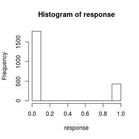

---
title       : Class02
subtitle    : regression examples
author      : 
job         : 
framework   : shower        # {io2012, html5slides, shower, dzslides, ...}
highlighter : highlight.js  # {highlight.js, prettify, highlight}
hitheme     : tomorrow      # 
widgets     : [mathjax]            # {mathjax, quiz, bootstrap}
mode        : selfcontained # {standalone, draft}
knit        : slidify::knit2slides
--- .modal

## Simple Regression

The examples are taken from [R in Action](http://www.manning.com/kabacoff/)
$$\hat{y}=\alpha +\beta x$$


```r
## we'll use an exmaple dataset 'women' in the 'car' package
library(car) ## load the package
women
```

```
##    height weight
## 1      58    115
## 2      59    117
## 3      60    120
## 4      61    123
## 5      62    126
## 6      63    129
## 7      64    132
## 8      65    135
## 9      66    139
## 10     67    142
## 11     68    146
## 12     69    150
## 13     70    154
## 14     71    159
## 15     72    164
```

--- .modal

## Simple Regression


```r
## data summary
summary(women)
```

```
##      height         weight     
##  Min.   :58.0   Min.   :115.0  
##  1st Qu.:61.5   1st Qu.:124.5  
##  Median :65.0   Median :135.0  
##  Mean   :65.0   Mean   :136.7  
##  3rd Qu.:68.5   3rd Qu.:148.0  
##  Max.   :72.0   Max.   :164.0
```

--- .modal

## Simple Regression


```r
## plot the data
plot(women$height, women$weight)
```



--- .modal

## Simple Regression


```r
library(ggplot2) ## load the plotting package
theme_set(theme_bw()) ## set default theme with a white background
ggplot(data=women, aes(x=height,y=weight)) + geom_point() 
```


--- .modal

## Simple Regression


```r
## plot with regression line
ggplot(women, aes(x = height, y = weight)) + geom_point() + 
  geom_smooth(method=lm, # add linear regression line
              se=FALSE) # (by default includes 95% confidence region)  
```


--- .modalS

## Simple Regression


```r
## perform linear regression
fit = lm(weight ~ height, data=women)
summary(fit)
```

```
## 
## Call:
## lm(formula = weight ~ height, data = women)
## 
## Residuals:
##     Min      1Q  Median      3Q     Max 
## -1.7333 -1.1333 -0.3833  0.7417  3.1167 
## 
## Coefficients:
##              Estimate Std. Error t value Pr(>|t|)    
## (Intercept) -87.51667    5.93694  -14.74 1.71e-09 ***
## height        3.45000    0.09114   37.85 1.09e-14 ***
## ---
## Signif. codes:  0 '***' 0.001 '**' 0.01 '*' 0.05 '.' 0.1 ' ' 1
## 
## Residual standard error: 1.525 on 13 degrees of freedom
## Multiple R-squared:  0.991,	Adjusted R-squared:  0.9903 
## F-statistic:  1433 on 1 and 13 DF,  p-value: 1.091e-14
```

--- &twocolvar w1:40% w2:60% .compact .modalS1

### What does the result mean?  

*** =left

$$ \hat{weight}=-87.52+3.45\times height $$
There's an expected increase of 3.45 pounds of weight for every 1 inch increase in height. 

The intercept is merely an adjustment constant.  


*** =right


```
## 
## Call:
## lm(formula = weight ~ height, data = women)
## 
## Residuals:
##     Min      1Q  Median      3Q     Max 
## -1.7333 -1.1333 -0.3833  0.7417  3.1167 
## 
## Coefficients:
##              Estimate Std. Error t value Pr(>|t|)    
## (Intercept) -87.51667    5.93694  -14.74 1.71e-09 ***
## height        3.45000    0.09114   37.85 1.09e-14 ***
## ---
## Signif. codes:  0 '***' 0.001 '**' 0.01 '*' 0.05 '.' 0.1 ' ' 1
## 
## Residual standard error: 1.525 on 13 degrees of freedom
## Multiple R-squared:  0.991,	Adjusted R-squared:  0.9903 
## F-statistic:  1433 on 1 and 13 DF,  p-value: 1.091e-14
```

--- &twocolvar w1:40% w2:60% .compact .modalS1

### Understand the summary

*** =left

* *Is the model statistically significant?* 
   * Check the **F statistic** at the bottom of the summary.
   * The F statistic tells you whether the model is insignificant or significant. Big p-value indicates a high likelihood of insignificance.


*** =right


```
## 
## Call:
## lm(formula = weight ~ height, data = women)
## 
## Residuals:
##     Min      1Q  Median      3Q     Max 
## -1.7333 -1.1333 -0.3833  0.7417  3.1167 
## 
## Coefficients:
##              Estimate Std. Error t value Pr(>|t|)    
## (Intercept) -87.51667    5.93694  -14.74 1.71e-09 ***
## height        3.45000    0.09114   37.85 1.09e-14 ***
## ---
## Signif. codes:  0 '***' 0.001 '**' 0.01 '*' 0.05 '.' 0.1 ' ' 1
## 
## Residual standard error: 1.525 on 13 degrees of freedom
## Multiple R-squared:  0.991,	Adjusted R-squared:  0.9903 
## F-statistic:  1433 on 1 and 13 DF,  p-value: 1.091e-14
```

--- &twocolvar w1:40% w2:60% .compact .modalS1

### Understand the summary

*** =left

* *Are the coefficients significant?*
   * Check the coefficient's **t statistics** and **p-values** in the summary, or check their confidence intervals.
   * If a variable's coefficient is zero then the variable is worthless; it adds nothing to the model. 
   * The p-value is a probability that the coefficient is not significant. Big is bad because it indicates a high likelihood of insignificance.
   * The regression coefficient (3.45) is significantly different from zero (p < 0.001).

*** =right


```
## 
## Call:
## lm(formula = weight ~ height, data = women)
## 
## Residuals:
##     Min      1Q  Median      3Q     Max 
## -1.7333 -1.1333 -0.3833  0.7417  3.1167 
## 
## Coefficients:
##              Estimate Std. Error t value Pr(>|t|)    
## (Intercept) -87.51667    5.93694  -14.74 1.71e-09 ***
## height        3.45000    0.09114   37.85 1.09e-14 ***
## ---
## Signif. codes:  0 '***' 0.001 '**' 0.01 '*' 0.05 '.' 0.1 ' ' 1
## 
## Residual standard error: 1.525 on 13 degrees of freedom
## Multiple R-squared:  0.991,	Adjusted R-squared:  0.9903 
## F-statistic:  1433 on 1 and 13 DF,  p-value: 1.091e-14
```

--- &twocolvar w1:50% w2:50% .compact .modalS1

### Understand the summary

*** =left

* *Is the model useful?*
   * Check the **R-squared** near the bottom of the summary.
   * R-squared is a measure of the model's quality -- the fraction of the variance of y that is explained by the regression model. Bigger is better.
   * The multiple R-squared (0.991) indicates that the model accounts for 99.1 percent of the variance in weights. The multiple R-squared is also the squared correlation between the actual and predicted value.
   * The adjusted value accounts for the number of variables in your model and so is a more realistic assessment of its effectiveness.

*** =right


```
## 
## Call:
## lm(formula = weight ~ height, data = women)
## 
## Residuals:
##     Min      1Q  Median      3Q     Max 
## -1.7333 -1.1333 -0.3833  0.7417  3.1167 
## 
## Coefficients:
##              Estimate Std. Error t value Pr(>|t|)    
## (Intercept) -87.51667    5.93694  -14.74 1.71e-09 ***
## height        3.45000    0.09114   37.85 1.09e-14 ***
## ---
## Signif. codes:  0 '***' 0.001 '**' 0.01 '*' 0.05 '.' 0.1 ' ' 1
## 
## Residual standard error: 1.525 on 13 degrees of freedom
## Multiple R-squared:  0.991,	Adjusted R-squared:  0.9903 
## F-statistic:  1433 on 1 and 13 DF,  p-value: 1.091e-14
```

--- &twocolvar w1:40% w2:60% .compact .modalS1

### Understand the summary

*** =left

* *Does the model fit the data well?*
   * Plot the residuals and check the regression diagnostics.
   * The residual standard error (1.53 lbs.) can be thought of as the average error in predicting weight from height using this model. 

*** =right


```
## 
## Call:
## lm(formula = weight ~ height, data = women)
## 
## Residuals:
##     Min      1Q  Median      3Q     Max 
## -1.7333 -1.1333 -0.3833  0.7417  3.1167 
## 
## Coefficients:
##              Estimate Std. Error t value Pr(>|t|)    
## (Intercept) -87.51667    5.93694  -14.74 1.71e-09 ***
## height        3.45000    0.09114   37.85 1.09e-14 ***
## ---
## Signif. codes:  0 '***' 0.001 '**' 0.01 '*' 0.05 '.' 0.1 ' ' 1
## 
## Residual standard error: 1.525 on 13 degrees of freedom
## Multiple R-squared:  0.991,	Adjusted R-squared:  0.9903 
## F-statistic:  1433 on 1 and 13 DF,  p-value: 1.091e-14
```


--- &twocolvar w1:40% w2:60% .compact .modalS1

### Understand the summary

*** =left

* *Does the data satisfy the assumptions behind linear regression?*
   * Check whether the diagnostics confirm that a linear model is reasonable for your data.
   * If the residuals have a normal distribution, then the first quartile (1Q) and third quartile (3Q) should have about the same magnitude.
   
*** =right


```
## 
## Call:
## lm(formula = weight ~ height, data = women)
## 
## Residuals:
##     Min      1Q  Median      3Q     Max 
## -1.7333 -1.1333 -0.3833  0.7417  3.1167 
## 
## Coefficients:
##              Estimate Std. Error t value Pr(>|t|)    
## (Intercept) -87.51667    5.93694  -14.74 1.71e-09 ***
## height        3.45000    0.09114   37.85 1.09e-14 ***
## ---
## Signif. codes:  0 '***' 0.001 '**' 0.01 '*' 0.05 '.' 0.1 ' ' 1
## 
## Residual standard error: 1.525 on 13 degrees of freedom
## Multiple R-squared:  0.991,	Adjusted R-squared:  0.9903 
## F-statistic:  1433 on 1 and 13 DF,  p-value: 1.091e-14
```
