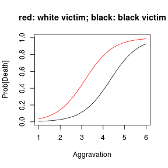

---
title       : Class03
subtitle    : binary classification
author      : 
job         : 
framework   : shower        # {io2012, html5slides, shower, dzslides, ...}
highlighter : highlight.js  # {highlight.js, prettify, highlight}
hitheme     : tomorrow      # 
widgets     : [mathjax]            # {mathjax, quiz, bootstrap}
mode        : selfcontained # {standalone, draft}
knit        : slidify::knit2slides
--- #toc

## Class03
* [Set up](#set-up)
* [Split data into two classes](#two-class)
* [Logistic Regression](#logistic-regression)
* [kNN](#knn)

--- #set-up .modal 

## Install R packages

```r
## this tutorial uses the following packages
```

--- #two-class .scode-nowrap .compact 

## Split data into two classes

```r
library(ggplot2) ## use ggplot for plotting
data.url = 'http://www.yurulin.com/class/spring2014_datamining/data/ml_hackers/'
data.file = file.path(data.url , '01_heights_weights_genders.csv')
heights.weights <- read.csv(data.file , header = TRUE , sep = ',')
# visualized their gender as the color of each point
ggplot(heights.weights, aes(x = Weight , y = Height , color = Gender)) +
  geom_point()
```


--- .scode-nowrap .compact 
## Split data into two classes


```r
heights.weights = transform(heights.weights , Male = ifelse(Gender == 'Male', 1, 0))
heights.weights [1:3,]
```

```
##   Gender   Height   Weight Male
## 1   Male 73.84702 241.8936    1
## 2   Male 68.78190 162.3105    1
## 3   Male 74.11011 212.7409    1
```

--- #logistic-regression .model
## Logistic Regression

Example 1: Death penelty data
-----------------------------

   * objective: to identify whether the death penalty more likely if the victim is white, or the crime is more aggravating
   * response variable: getting death panelty or not
   * explanatory variables: severity of the crime, race of victim (black: 0; white: 1), etc

--- .scode-nowrap .compact 
## Logistic Regression

```r
## analyzing individual observations
data.url = 'http://www.yurulin.com/class/spring2014_datamining/data/data_text'
dpen = read.csv(sprintf("%s/DeathPenalty.csv",data.url))
dpen[1:4,]
```

```
##   Agg VRace Death
## 1   1     1     1
## 2   1     1     1
## 3   1     1     0
## 4   1     1     0
```


--- .scode-nowrap .compact 
## Logistic Regression

```r
m1=glm(Death~VRace+Agg,family=binomial(link='logit'),data=dpen)
m1
```

```
## 
## Call:  glm(formula = Death ~ VRace + Agg, family = binomial(link = "logit"), 
##     data = dpen)
## 
## Coefficients:
## (Intercept)        VRace          Agg  
##      -6.676        1.811        1.540  
## 
## Degrees of Freedom: 361 Total (i.e. Null);  359 Residual
## Null Deviance:	    321.9 
## Residual Deviance: 113.5 	AIC: 119.5
```


--- .scode-nowrap .compact 
## Logistic Regression

```r
summary(m1)
```

```
## 
## Call:
## glm(formula = Death ~ VRace + Agg, family = binomial(link = "logit"), 
##     data = dpen)
## 
## Deviance Residuals: 
##     Min       1Q   Median       3Q      Max  
## -1.7526  -0.2658  -0.1083  -0.1083   3.2069  
## 
## Coefficients:
##             Estimate Std. Error z value Pr(>|z|)    
## (Intercept)  -6.6760     0.7574  -8.814  < 2e-16 ***
## VRace         1.8106     0.5361   3.377 0.000732 ***
## Agg           1.5397     0.1867   8.246  < 2e-16 ***
## ---
## Signif. codes:  0 '***' 0.001 '**' 0.01 '*' 0.05 '.' 0.1 ' ' 1
## 
## (Dispersion parameter for binomial family taken to be 1)
## 
##     Null deviance: 321.88  on 361  degrees of freedom
## Residual deviance: 113.48  on 359  degrees of freedom
## AIC: 119.48
## 
## Number of Fisher Scoring iterations: 7
```


--- .scode-nowrap .compact 
## Logistic Regression

```r
## calculating logits
exp(m1$coef[2])
```

```
##  VRace 
## 6.1144
```

```r
exp(m1$coef[3])
```

```
##      Agg 
## 4.663011
```

--- .sscode-nowrap .compact
## Logistic Regression


```r
## plotting probability of getting death penalty as a function of aggravation
## separately for black (in black) and white (in red) victim
n.dots = 501 ## number of dots in the curves (the nubmer is set to make the curves smooth)
x.ag=dim(n.dots) ## x-value is the aggravating level (severity of the crime)
y.black=dim(n.dots) ## y-value for the black victim curve
y.white=dim(n.dots) ## y-value for the white victim curve
for (i in 1:n.dots) {
  x.ag[i]=(99+i)/100
  is.white = 0
  y.black[i]=exp(m1$coef[1]+m1$coef[2]*is.white+m1$coef[3]*x.ag[i])/(1+exp(m1$coef[1]+m1$coef[2]*is.white+m1$coef[3]*x.ag[i]))
  is.white = 1
  y.white[i]=exp(m1$coef[1]+m1$coef[2]*is.white+m1$coef[3]*x.ag[i])/(1+exp(m1$coef[1]+m1$coef[2]*is.white+m1$coef[3]*x.ag[i]))
}
plot(y.black~x.ag,type="l",col="black",ylab="Prob[Death]",xlab="Aggravation",ylim=c(0,1),main="red: white victim; black: black victim")
points(y.white~x.ag,type="l",col="red")
```



--- .scode-nowrap .compact 
## Logistic Regression

```r
## another format for logistic regression:
## summarized data
dpenother <- read.csv(sprintf("%s/DeathPenaltyOther.csv",data.url))
dpenother
```

```
##    Agg VicRace VRace Death Freq
## 1    1   White     1     1    2
## 2    1   White     1     0   60
## 3    1   Black     0     1    1
## 4    1   Black     0     0  181
## 5    2   White     1     1    2
## 6    2   White     1     0   15
## 7    2   Black     0     1    1
## 8    2   Black     0     0   21
## 9    3   White     1     1    6
## 10   3   White     1     0    7
## 11   3   Black     0     1    2
## 12   3   Black     0     0    9
## 13   4   White     1     1    9
## 14   4   White     1     0    3
## 15   4   Black     0     1    2
## 16   4   Black     0     0    4
## 17   5   White     1     1    9
## 18   5   Black     0     1    4
## 19   5   Black     0     0    3
## 20   6   White     1     1   17
## 21   6   Black     0     1    4
```


--- .scode-nowrap .compact 
## Logistic Regression

```r
m1=glm(Death~VRace+Agg,family=binomial,weights=Freq,data=dpenother)
m1
```

```
## 
## Call:  glm(formula = Death ~ VRace + Agg, family = binomial, data = dpenother, 
##     weights = Freq)
## 
## Coefficients:
## (Intercept)        VRace          Agg  
##      -6.676        1.811        1.540  
## 
## Degrees of Freedom: 20 Total (i.e. Null);  18 Residual
## Null Deviance:	    321.9 
## Residual Deviance: 113.5 	AIC: 119.5
```

--- .sscode-nowrap .compact 
## Logistic Regression

```r
summary(m1)
```

```
## 
## Call:
## glm(formula = Death ~ VRace + Agg, family = binomial, data = dpenother, 
##     weights = Freq)
## 
## Deviance Residuals: 
##     Min       1Q   Median       3Q      Max  
## -3.0355  -1.9341   0.7711   2.6921   3.6666  
## 
## Coefficients:
##             Estimate Std. Error z value Pr(>|z|)    
## (Intercept)  -6.6760     0.7574  -8.814  < 2e-16 ***
## VRace         1.8106     0.5361   3.377 0.000732 ***
## Agg           1.5397     0.1867   8.246  < 2e-16 ***
## ---
## Signif. codes:  0 '***' 0.001 '**' 0.01 '*' 0.05 '.' 0.1 ' ' 1
## 
## (Dispersion parameter for binomial family taken to be 1)
## 
##     Null deviance: 321.88  on 20  degrees of freedom
## Residual deviance: 113.48  on 18  degrees of freedom
## AIC: 119.48
## 
## Number of Fisher Scoring iterations: 5
```

```r
exp(m1$coef[2])
```

```
##  VRace 
## 6.1144
```

```r
exp(m1$coef[3])
```

```
##      Agg 
## 4.663011
```

