---
title       : Class04
subtitle    : classification
author      : Yu-Ru Lin
job         : 
framework   : shower        # {io2012, html5slides, shower, dzslides, ...}
highlighter : highlight.js  # {highlight.js, prettify, highlight}
hitheme     : tomorrow      # 
widgets     : [mathjax]            # {mathjax, quiz, bootstrap}
mode        : selfcontained # {standalone, draft}
knit        : slidify::knit2slides
toc         : true
toc_depth   : 2

--- #toc
## Class04

* [Set up](#set-up)
* [Naive Bayesian](#nb)
* [Decision Trees](#tree)

--- #set-up .modal 

## Install R packages

--- #nb .modal 
## Naive Bayesian

The examples are taken from [Data Mining and Business Analytics with R](http://www.wiley.com/WileyCDA/WileyTitle/productCd-111844714X.html) and [Machine Learning for Hackers](http://shop.oreilly.com/product/0636920018483.do).


Example: Delayed Flights
-----------------------------
   * response variable: whether or not a flight has been delayed by more than 15 min (coded as 0 for no delay, and 1 for delay)
   * explanatory variables: different arrival airports, different departure airports, eight carriers, different hours of departure (6am to 10 pm), weather conditions (0 = good/1 = bad), day of week (1 for Sunday and Monday; and 0 for all other days)
   * objective: to identify flights that are likely to be delayed (a binary classification problem)

--- .scode-nowrap .compact
## Naive Bayesian

```
##   schedtime carrier deptime dest distance     date flightnumber origin
## 1      1455      OH    1455  JFK      184 1/1/2004         5935    BWI
## 2      1640      DH    1640  JFK      213 1/1/2004         6155    DCA
## 3      1245      DH    1245  LGA      229 1/1/2004         7208    IAD
##   weather dayweek daymonth tailnu  delay
## 1       0       4        1 N940CA ontime
## 2       0       4        1 N405FJ ontime
## 3       0       4        1 N695BR ontime
```

--- .scode-nowrap .compact
## Naive Bayesian


--- .sscode-nowrap .compact
## Naive Bayesian

```
## [1] 2201
```

```
## [1] 1320
```

```
## [1] 881
```

```
## 
##         0         1 
## 0.8022727 0.1977273
```

--- .ssscode-nowrap .compact
## Naive Bayesian

```
## 
##          1          2          3          4          5          6 
## 0.06137866 0.06798867 0.07176582 0.05949008 0.05004721 0.03399433 
##          7          8          9         10         11         12 
## 0.06421152 0.07743154 0.09537299 0.06326723 0.07743154 0.10198300 
##         13         14         15         16 
## 0.04249292 0.04627007 0.02171860 0.06515581
```

```
## 
##           1           2           3           4           5           6 
## 0.038314176 0.045977011 0.065134100 0.026819923 0.026819923 0.007662835 
##           7           8           9          10          11          12 
## 0.065134100 0.049808429 0.153256705 0.091954023 0.076628352 0.145593870 
##          13          14          15          16 
## 0.026819923 0.065134100 0.015325670 0.099616858
```

```
## 
##          1          2          3          4          5          6 
## 0.04060434 0.22757318 0.18508026 0.12181303 0.01510859 0.18035883 
##          7          8 
## 0.01510859 0.21435316
```

```
## 
##          1          2          3          4          5          6 
## 0.06896552 0.33716475 0.09195402 0.17624521 0.01149425 0.22222222 
##          7          8 
## 0.01532567 0.07662835
```

--- .ssscode-nowrap .compact
## Naive Bayesian

```
## 
##         1         2         3 
## 0.2861190 0.1690274 0.5448536
```

```
## 
##         1         2         3 
## 0.3869732 0.2107280 0.4022989
```

```
## 
##          1          2          3 
## 0.06421152 0.65250236 0.28328612
```

```
## 
##          1          2          3 
## 0.09578544 0.49042146 0.41379310
```

--- .ssscode-nowrap .compact
## Naive Bayesian

```
## 
## 0 
## 1
```

```
## 
##          0          1 
## 0.91954023 0.08045977
```

```
## 
##          1          2          3          4          5          6 
## 0.12747875 0.13692162 0.15391879 0.17847025 0.17563739 0.12842304 
##          7 
## 0.09915014
```

```
## 
##          1          2          3          4          5          6 
## 0.20689655 0.15325670 0.12643678 0.14176245 0.14559387 0.05363985 
##          7 
## 0.17241379
```

--- .sscode-nowrap .compact
## Naive Bayesian
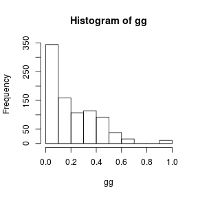

--- .sscode-nowrap .compact
## Naive Bayesian

```
##    gg1
##       0   1
##   0 679  35
##   1 137  30
```

```
## [1] 0.1952327
```


--- #tree .scode-nowrap .compact
## Decision Trees

Example: Fisher Iris
-----------------------------


```
##   Sepal.Length Sepal.Width Petal.Length Petal.Width Species
## 1          5.1         3.5          1.4         0.2  setosa
## 2          4.9         3.0          1.4         0.2  setosa
## 3          4.7         3.2          1.3         0.2  setosa
```

--- .scode-nowrap .compact
## Decision Trees

```
## node), split, n, deviance, yval, (yprob)
##       * denotes terminal node
## 
##  1) root 150 329.600 setosa ( 0.33333 0.33333 0.33333 )  
##    2) Petal.Length < 2.45 50   0.000 setosa ( 1.00000 0.00000 0.00000 ) *
##    3) Petal.Length > 2.45 100 138.600 versicolor ( 0.00000 0.50000 0.50000 )  
##      6) Petal.Width < 1.75 54  33.320 versicolor ( 0.00000 0.90741 0.09259 )  
##       12) Petal.Length < 4.95 48   9.721 versicolor ( 0.00000 0.97917 0.02083 )  
##         24) Sepal.Length < 5.15 5   5.004 versicolor ( 0.00000 0.80000 0.20000 ) *
##         25) Sepal.Length > 5.15 43   0.000 versicolor ( 0.00000 1.00000 0.00000 ) *
##       13) Petal.Length > 4.95 6   7.638 virginica ( 0.00000 0.33333 0.66667 ) *
##      7) Petal.Width > 1.75 46   9.635 virginica ( 0.00000 0.02174 0.97826 )  
##       14) Petal.Length < 4.95 6   5.407 virginica ( 0.00000 0.16667 0.83333 ) *
##       15) Petal.Length > 4.95 40   0.000 virginica ( 0.00000 0.00000 1.00000 ) *
```

--- .scode-nowrap .compact
## Decision Trees
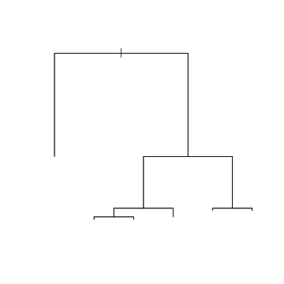

--- .scode-nowrap .compact
## Decision Trees
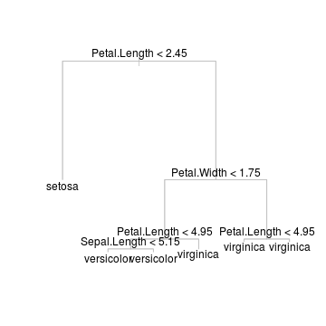

--- .scode-nowrap .compact
## Decision Trees

```
## 
## Classification tree:
## tree(formula = Species ~ ., data = iris)
## Variables actually used in tree construction:
## [1] "Petal.Length" "Petal.Width"  "Sepal.Length"
## Number of terminal nodes:  6 
## Residual mean deviance:  0.1253 = 18.05 / 144 
## Misclassification error rate: 0.02667 = 4 / 150
```


--- .scode-nowrap .compact
## Decision Trees

```
## node), split, n, deviance, yval, (yprob)
##       * denotes terminal node
## 
##  1) root 150 329.600 setosa ( 0.33333 0.33333 0.33333 )  
##    2) Petal.Length < 2.45 50   0.000 setosa ( 1.00000 0.00000 0.00000 ) *
##    3) Petal.Length > 2.45 100 138.600 versicolor ( 0.00000 0.50000 0.50000 )  
##      6) Petal.Width < 1.75 54  33.320 versicolor ( 0.00000 0.90741 0.09259 )  
##       12) Petal.Length < 4.95 48   9.721 versicolor ( 0.00000 0.97917 0.02083 ) *
##       13) Petal.Length > 4.95 6   7.638 virginica ( 0.00000 0.33333 0.66667 ) *
##      7) Petal.Width > 1.75 46   9.635 virginica ( 0.00000 0.02174 0.97826 ) *
```


--- .scode-nowrap .compact
## Decision Trees
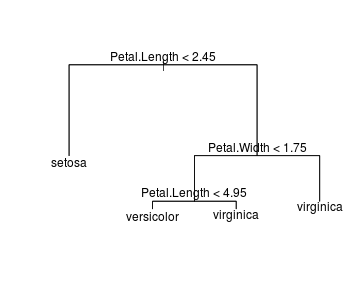

--- ##ex .scode-nowrap .compact
## Example: Prostate cancer

```
##       lcavol age      lbph       lcp gleason       lpsa
## 1 -0.5798185  50 -1.386294 -1.386294       6 -0.4307829
## 2 -0.9942523  58 -1.386294 -1.386294       6 -0.1625189
## 3 -0.5108256  74 -1.386294 -1.386294       7 -0.1625189
```

--- .sscode-nowrap .compact
## Example: Prostate cancer

```
## node), split, n, deviance, yval
##       * denotes terminal node
## 
##   1) root 97 133.4000  1.35000  
##     2) lcp < 0.261624 63  64.1100  0.79250  
##       4) lpsa < 2.30257 35  24.7200  0.27870  
##         8) lpsa < 0.104522 4   0.3311 -0.82220 *
##         9) lpsa > 0.104522 31  18.9200  0.42070  
##          18) age < 52 3   0.1195 -0.79620 *
##          19) age > 52 28  13.8800  0.55110  
##            38) lbph < 1.09012 18   6.3190  0.73790  
##              76) age < 65.5 14   4.0670  0.55550  
##               152) lcp < -0.698172 11   2.1200  0.37820 *
##               153) lcp > -0.698172 3   0.3329  1.20600 *
##              77) age > 65.5 4   0.1552  1.37600 *
##            39) lbph > 1.09012 10   5.8010  0.21490  
##              78) lpsa < 1.96623 7   2.8370 -0.08817 *
##              79) lpsa > 1.96623 3   0.8212  0.92200 *
##       5) lpsa > 2.30257 28  18.6000  1.43500  
##        10) lpsa < 3.24598 23  11.6100  1.23300 *
##        11) lpsa > 3.24598 5   1.7560  2.36200 *
##     3) lcp > 0.261624 34  13.3900  2.38300  
##       6) lcp < 2.13963 25   6.6620  2.14700  
##        12) age < 62.5 7   0.7253  1.68600 *
##        13) age > 62.5 18   3.8700  2.32600 *
##       7) lcp > 2.13963 9   1.4750  3.03800 *
```


--- .scode-nowrap .compact
## Example: Prostate cancer
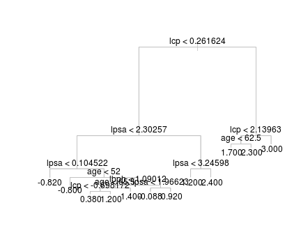


--- .scode-nowrap .compact
## Example: Prostate cancer
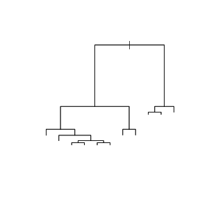


--- .sscode-nowrap .compact
## Example: Prostate cancer

```
## node), split, n, deviance, yval
##       * denotes terminal node
## 
##  1) root 97 133.4000  1.35000  
##    2) lcp < 0.261624 63  64.1100  0.79250  
##      4) lpsa < 2.30257 35  24.7200  0.27870  
##        8) lpsa < 0.104522 4   0.3311 -0.82220 *
##        9) lpsa > 0.104522 31  18.9200  0.42070  
##         18) age < 52 3   0.1195 -0.79620 *
##         19) age > 52 28  13.8800  0.55110  
##           38) lbph < 1.09012 18   6.3190  0.73790  
##             76) age < 65.5 14   4.0670  0.55550 *
##             77) age > 65.5 4   0.1552  1.37600 *
##           39) lbph > 1.09012 10   5.8010  0.21490  
##             78) lpsa < 1.96623 7   2.8370 -0.08817 *
##             79) lpsa > 1.96623 3   0.8212  0.92200 *
##      5) lpsa > 2.30257 28  18.6000  1.43500  
##       10) lpsa < 3.24598 23  11.6100  1.23300 *
##       11) lpsa > 3.24598 5   1.7560  2.36200 *
##    3) lcp > 0.261624 34  13.3900  2.38300  
##      6) lcp < 2.13963 25   6.6620  2.14700  
##       12) age < 62.5 7   0.7253  1.68600 *
##       13) age > 62.5 18   3.8700  2.32600 *
##      7) lcp > 2.13963 9   1.4750  3.03800 *
```


--- .scode-nowrap .compact
## Example: Prostate cancer
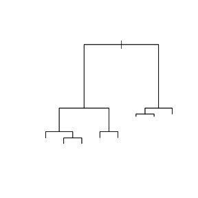

--- .sscode-nowrap .compact
## Example: Prostate cancer

```
## node), split, n, deviance, yval
##       * denotes terminal node
## 
##  1) root 97 133.4000  1.3500  
##    2) lcp < 0.261624 63  64.1100  0.7925  
##      4) lpsa < 2.30257 35  24.7200  0.2787  
##        8) lpsa < 0.104522 4   0.3311 -0.8222 *
##        9) lpsa > 0.104522 31  18.9200  0.4207  
##         18) age < 52 3   0.1195 -0.7962 *
##         19) age > 52 28  13.8800  0.5511 *
##      5) lpsa > 2.30257 28  18.6000  1.4350  
##       10) lpsa < 3.24598 23  11.6100  1.2330 *
##       11) lpsa > 3.24598 5   1.7560  2.3620 *
##    3) lcp > 0.261624 34  13.3900  2.3830  
##      6) lcp < 2.13963 25   6.6620  2.1470  
##       12) age < 62.5 7   0.7253  1.6860 *
##       13) age > 62.5 18   3.8700  2.3260 *
##      7) lcp > 2.13963 9   1.4750  3.0380 *
```

--- .scode-nowrap .compact
## Example: Prostate cancer
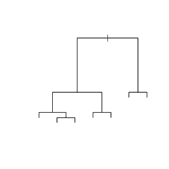


--- .scode-nowrap .compact
## Example: Prostate cancer

```
## node), split, n, deviance, yval
##       * denotes terminal node
## 
##  1) root 97 133.4000  1.3500  
##    2) lcp < 0.261624 63  64.1100  0.7925  
##      4) lpsa < 2.30257 35  24.7200  0.2787  
##        8) lpsa < 0.104522 4   0.3311 -0.8222 *
##        9) lpsa > 0.104522 31  18.9200  0.4207  
##         18) age < 52 3   0.1195 -0.7962 *
##         19) age > 52 28  13.8800  0.5511 *
##      5) lpsa > 2.30257 28  18.6000  1.4350  
##       10) lpsa < 3.24598 23  11.6100  1.2330 *
##       11) lpsa > 3.24598 5   1.7560  2.3620 *
##    3) lcp > 0.261624 34  13.3900  2.3830  
##      6) lcp < 2.13963 25   6.6620  2.1470 *
##      7) lcp > 2.13963 9   1.4750  3.0380 *
```

--- .sscode-nowrap .compact
## Example: Prostate cancer

```
## $size
##  [1] 12 11  8  7  6  5  4  3  2  1
## 
## $dev
##  [1]  26.15491  27.76888  33.76664  35.83388  40.75225  45.98251  51.23381
##  [8]  56.70719  77.50140 133.35903
## 
## $k
##  [1]      -Inf  1.613972  1.999253  2.067239  4.918373  5.230262  5.251294
##  [8]  5.473378 20.794213 55.857635
## 
## $method
## [1] "deviance"
## 
## attr(,"class")
## [1] "prune"         "tree.sequence"
```


--- .scode-nowrap .compact
## Example: Prostate cancer
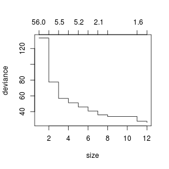

--- .sscode-nowrap .compact
## Example: Prostate cancer

```
## node), split, n, deviance, yval
##       * denotes terminal node
## 
## 1) root 97 133.40 1.3500  
##   2) lcp < 0.261624 63  64.11 0.7925  
##     4) lpsa < 2.30257 35  24.72 0.2787 *
##     5) lpsa > 2.30257 28  18.60 1.4350 *
##   3) lcp > 0.261624 34  13.39 2.3830 *
```


--- .scode-nowrap .compact
## Example: Prostate cancer
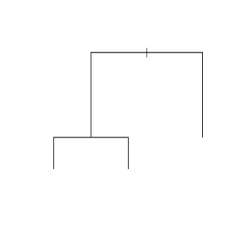

--- .scode-nowrap .compact
## Example: Prostate cancer

```
##  [1] 12 11  8  7  6  5  4  3  2  1
```

```
##  [1]  73.22055  70.18426  70.79439  70.24455  65.40004  65.30020  65.30020
##  [8]  64.93791  90.18312 134.09981
```


--- .scode-nowrap .compact
## Example: Prostate cancer
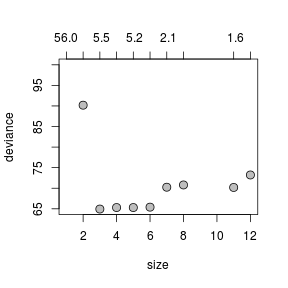

--- .sscode-nowrap .compact
## Example: Prostate cancer

```
## node), split, n, deviance, yval
##       * denotes terminal node
## 
## 1) root 97 133.40 1.3500  
##   2) lcp < 0.261624 63  64.11 0.7925  
##     4) lpsa < 2.30257 35  24.72 0.2787 *
##     5) lpsa > 2.30257 28  18.60 1.4350 *
##   3) lcp > 0.261624 34  13.39 2.3830 *
```


--- .scode-nowrap .compact
## Example: Prostate cancer
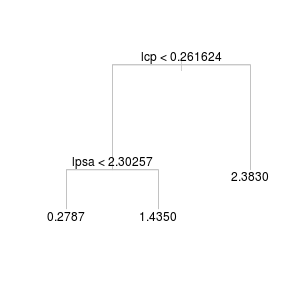

--- .scode-nowrap .compact
## Example: Prostate cancer
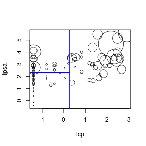
