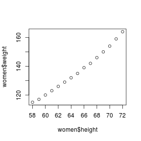

---
title       : Class04
subtitle    : classification
author      : Yu-Ru Lin
job         : 
framework   : shower        # {io2012, html5slides, shower, dzslides, ...}
highlighter : highlight.js  # {highlight.js, prettify, highlight}
hitheme     : tomorrow      # 
widgets     : [mathjax]            # {mathjax, quiz, bootstrap}
mode        : selfcontained # {standalone, draft}
knit        : slidify::knit2slides
toc         : true
toc_depth   : 2

--- #toc
* [Set up](#set-up)
* [Naive Bayesian](#nb)
* [Decision Trees](#tree)

--- #set-up .modal 

## Install R packages

```r
## this tutorial uses the following packages
```

--- #nb .modal 
## Naive Bayesian

The examples are taken from [Data Mining and Business Analytics with R](http://www.wiley.com/WileyCDA/WileyTitle/productCd-111844714X.html) and [Machine Learning for Hackers](http://shop.oreilly.com/product/0636920018483.do).


Example: Delayed Flights
-----------------------------
   * response variable: whether or not a flight has been delayed by more than 15 min (coded as 0 for no delay, and 1 for delay)
   * explanatory variables: different arrival airports, different departure airports, eight carriers, different hours of departure (6am to 10 pm), weather conditions (0 = good/1 = bad), day of week (1 for Sunday and Monday; and 0 for all other days)
   * objective: to identify flights that are likely to be delayed (a binary classification problem)

--- .scode-nowrap .compact
## Naive Bayesian

```r
set.seed(1)
library(car)  #used to recode a variable

## reading the data
data.url = 'http://www.yurulin.com/class/spring2014_datamining/data/data_text'
delay = read.csv(sprintf("%s/FlightDelays.csv",data.url))
delay[1:3,]
```

```
##   schedtime carrier deptime dest distance     date flightnumber origin
## 1      1455      OH    1455  JFK      184 1/1/2004         5935    BWI
## 2      1640      DH    1640  JFK      213 1/1/2004         6155    DCA
## 3      1245      DH    1245  LGA      229 1/1/2004         7208    IAD
##   weather dayweek daymonth tailnu  delay
## 1       0       4        1 N940CA ontime
## 2       0       4        1 N405FJ ontime
## 3       0       4        1 N695BR ontime
```

--- .scode-nowrap .compact
## Naive Bayesian

```r
del=data.frame(delay)
del$schedf=factor(floor(del$schedtime/100))
del$delay=recode(del$delay,"'delayed'=1;else=0")
response=as.numeric(levels(del$delay)[del$delay])
hist(response)
```



--- .sscode-nowrap .compact
## Naive Bayesian

```r
## determining test and evaluation data sets
n=length(del$dayweek)
n
```

```
## [1] 2201
```

```r
n1=floor(n*(0.6)) ## 60% for training
n1 # num of training cases
```

```
## [1] 1320
```

```r
n2=n-n1
n2 # num of testing cases
```

```
## [1] 881
```

```r
train=sample(1:n,n1)

## determining marginal probabilities
tttt=cbind(del$schedf[train],del$carrier[train],del$dest[train],del$origin[train],del$weather[train],del$dayweek[train],response[train])
tttrain0=tttt[tttt[,7]<0.5,]
tttrain1=tttt[tttt[,7]>0.5,]

## prior probabilities
tdel=table(response[train])
tdel=tdel/sum(tdel)
tdel
```

```
## 
##         0         1 
## 0.8022727 0.1977273
```

--- .ssscode-nowrap .compact
## Naive Bayesian

```r
## scheduled time
ts0=table(tttrain0[,1])
ts0=ts0/sum(ts0)
ts0
```

```
## 
##          1          2          3          4          5          6 
## 0.06137866 0.06798867 0.07176582 0.05949008 0.05004721 0.03399433 
##          7          8          9         10         11         12 
## 0.06421152 0.07743154 0.09537299 0.06326723 0.07743154 0.10198300 
##         13         14         15         16 
## 0.04249292 0.04627007 0.02171860 0.06515581
```

```r
ts1=table(tttrain1[,1])
ts1=ts1/sum(ts1)
ts1
```

```
## 
##           1           2           3           4           5           6 
## 0.038314176 0.045977011 0.065134100 0.026819923 0.026819923 0.007662835 
##           7           8           9          10          11          12 
## 0.065134100 0.049808429 0.153256705 0.091954023 0.076628352 0.145593870 
##          13          14          15          16 
## 0.026819923 0.065134100 0.015325670 0.099616858
```

```r
## scheduled carrier
tc0=table(tttrain0[,2])
tc0=tc0/sum(tc0)
tc0
```

```
## 
##          1          2          3          4          5          6 
## 0.04060434 0.22757318 0.18508026 0.12181303 0.01510859 0.18035883 
##          7          8 
## 0.01510859 0.21435316
```

```r
tc1=table(tttrain1[,2])
tc1=tc1/sum(tc1)
tc1
```

```
## 
##          1          2          3          4          5          6 
## 0.06896552 0.33716475 0.09195402 0.17624521 0.01149425 0.22222222 
##          7          8 
## 0.01532567 0.07662835
```

```r
## scheduled destination
td0=table(tttrain0[,3])
td0=td0/sum(td0)
td0
```

```
## 
##         1         2         3 
## 0.2861190 0.1690274 0.5448536
```

```r
td1=table(tttrain1[,3])
td1=td1/sum(td1)
td1
```

```
## 
##         1         2         3 
## 0.3869732 0.2107280 0.4022989
```

```r
## scheduled origin  
to0=table(tttrain0[,4])
to0=to0/sum(to0)
to0
```

```
## 
##          1          2          3 
## 0.06421152 0.65250236 0.28328612
```

```r
to1=table(tttrain1[,4])
to1=to1/sum(to1)
to1
```

```
## 
##          1          2          3 
## 0.09578544 0.49042146 0.41379310
```

```r
## weather
tw0=table(tttrain0[,5])
tw0=tw0/sum(tw0)
tw0
```

```
## 
## 0 
## 1
```

```r
tw1=table(tttrain1[,5])
tw1=tw1/sum(tw1)
tw1
```

```
## 
##          0          1 
## 0.91954023 0.08045977
```

```r
## bandaid as no observation in a cell
tw0=tw1
tw0[1]=1
tw0[2]=0

## scheduled day of week
tdw0=table(tttrain0[,6])
tdw0=tdw0/sum(tdw0)
tdw0
```

```
## 
##          1          2          3          4          5          6 
## 0.12747875 0.13692162 0.15391879 0.17847025 0.17563739 0.12842304 
##          7 
## 0.09915014
```

```r
tdw1=table(tttrain1[,6])
tdw1=tdw1/sum(tdw1)
tdw1
```

```
## 
##          1          2          3          4          5          6 
## 0.20689655 0.15325670 0.12643678 0.14176245 0.14559387 0.05363985 
##          7 
## 0.17241379
```

--- .sscode-nowrap .compact
## Naive Bayesian

```r
## creating test data set
tt=cbind(del$schedf[-train],del$carrier[-train],del$dest[-train],del$origin[-train],del$weather[-train],del$dayweek[-train],response[-train])

## creating predictions, stored in gg
p0=ts0[tt[,1]]*tc0[tt[,2]]*td0[tt[,3]]*to0[tt[,4]]*tw0[tt[,5]+1]*tdw0[tt[,6]]
p1=ts1[tt[,1]]*tc1[tt[,2]]*td1[tt[,3]]*to1[tt[,4]]*tw1[tt[,5]+1]*tdw1[tt[,6]]
gg=(p1*tdel[2])/(p1*tdel[2]+p0*tdel[1])
hist(gg)
```


--- .sscode-nowrap .compact
## Naive Bayesian

```r
## coding as 1 if probability 0.5 or larger
gg1=floor(gg+0.5)
ttt=table(response[-train],gg1)
ttt
```

```
##    gg1
##       0   1
##   0 679  35
##   1 137  30
```

```r
error=(ttt[1,2]+ttt[2,1])/n2
error
```

```
## [1] 0.1952327
```


--- .scode-nowrap .compact
## Decision Trees

Example: Fisher Iris
-----------------------------


```r
library(MASS) 
library(tree)
```

```
## Error in library(tree): there is no package called 'tree'
```

```r
## read in the iris data
iris[1:3,]
```

```
##   Sepal.Length Sepal.Width Petal.Length Petal.Width Species
## 1          5.1         3.5          1.4         0.2  setosa
## 2          4.9         3.0          1.4         0.2  setosa
## 3          4.7         3.2          1.3         0.2  setosa
```

--- .scode-nowrap .compact
## Decision Trees

```r
iristree <- tree(Species~.,data=iris)
```

```
## Error in tree(Species ~ ., data = iris): could not find function "tree"
```

```r
iristree  
```

```
## Error in eval(expr, envir, enclos): object 'iristree' not found
```

--- .scode-nowrap .compact
## Decision Trees

```r
plot(iristree)
```

```
## Error in plot(iristree): object 'iristree' not found
```

--- .scode-nowrap .compact
## Decision Trees

```r
plot(iristree,col=8)
```

```
## Error in plot(iristree, col = 8): object 'iristree' not found
```

```r
text(iristree,digits=2)
```

```
## Error in text(iristree, digits = 2): object 'iristree' not found
```

--- .scode-nowrap .compact
## Decision Trees

```r
summary(iristree)
```

```
## Error in summary(iristree): object 'iristree' not found
```


--- .scode-nowrap .compact
## Decision Trees

```r
# splitting on 7 and 12 lead to identical results, and these nodes and the
# trees below them can be snipped off
irissnip=snip.tree(iristree,nodes=c(7,12))
```

```
## Error in snip.tree(iristree, nodes = c(7, 12)): could not find function "snip.tree"
```

```r
irissnip
```

```
## Error in eval(expr, envir, enclos): object 'irissnip' not found
```


--- .scode-nowrap .compact
## Decision Trees

```r
plot(irissnip)
```

```
## Error in plot(irissnip): object 'irissnip' not found
```

```r
text(irissnip)
```

```
## Error in text(irissnip): object 'irissnip' not found
```

--- ##ex .scode-nowrap .compact
## Example: Prostate cancer

```r
data.url = 'http://www.yurulin.com/class/spring2014_datamining/data/data_text'
prostate <- read.csv(sprintf("%s/prostate.csv",data.url))
prostate[1:3,]
```

```
##       lcavol age      lbph       lcp gleason       lpsa
## 1 -0.5798185  50 -1.386294 -1.386294       6 -0.4307829
## 2 -0.9942523  58 -1.386294 -1.386294       6 -0.1625189
## 3 -0.5108256  74 -1.386294 -1.386294       7 -0.1625189
```

--- .sscode-nowrap .compact
## Example: Prostate cancer

```r
library(tree)
```

```
## Error in library(tree): there is no package called 'tree'
```

```r
## Construct the tree
## You can further control the tree:
## mincut -- The minimum number of observations to include in either child node;
## mindev -- The within-node deviance must be at least this times that of the root node for the node to be split.

pstree <- tree(lcavol ~., data=prostate, mindev=0.1, mincut=1)
```

```
## Error in tree(lcavol ~ ., data = prostate, mindev = 0.1, mincut = 1): could not find function "tree"
```

```r
pstree <- tree(lcavol ~., data=prostate, mincut=1)
```

```
## Error in tree(lcavol ~ ., data = prostate, mincut = 1): could not find function "tree"
```

```r
pstree
```

```
## Error in eval(expr, envir, enclos): object 'pstree' not found
```


--- .scode-nowrap .compact
## Example: Prostate cancer

```r
plot(pstree, col=8)
```

```
## Error in plot(pstree, col = 8): object 'pstree' not found
```

```r
text(pstree, digits=2)
```

```
## Error in text(pstree, digits = 2): object 'pstree' not found
```


--- .scode-nowrap .compact
## Example: Prostate cancer

```r
# vary the panelty term k in pruning
pstcut <- prune.tree(pstree,k=1.7)
```

```
## Error in prune.tree(pstree, k = 1.7): could not find function "prune.tree"
```

```r
plot(pstcut)
```

```
## Error in plot(pstcut): object 'pstcut' not found
```


--- .sscode-nowrap .compact
## Example: Prostate cancer

```r
pstcut
```

```
## Error in eval(expr, envir, enclos): object 'pstcut' not found
```


--- .scode-nowrap .compact
## Example: Prostate cancer

```r
pstcut <- prune.tree(pstree,k=2.05)
```

```
## Error in prune.tree(pstree, k = 2.05): could not find function "prune.tree"
```

```r
plot(pstcut)
```

```
## Error in plot(pstcut): object 'pstcut' not found
```

--- .sscode-nowrap .compact
## Example: Prostate cancer

```r
pstcut
```

```
## Error in eval(expr, envir, enclos): object 'pstcut' not found
```

--- .scode-nowrap .compact
## Example: Prostate cancer

```r
pstcut <- prune.tree(pstree,k=3)
```

```
## Error in prune.tree(pstree, k = 3): could not find function "prune.tree"
```

```r
plot(pstcut)
```

```
## Error in plot(pstcut): object 'pstcut' not found
```


--- .scode-nowrap .compact
## Example: Prostate cancer

```r
pstcut
```

```
## Error in eval(expr, envir, enclos): object 'pstcut' not found
```

--- .sscode-nowrap .compact
## Example: Prostate cancer

```r
pstcut <- prune.tree(pstree)
```

```
## Error in prune.tree(pstree): could not find function "prune.tree"
```

```r
pstcut
```

```
## Error in eval(expr, envir, enclos): object 'pstcut' not found
```


--- .scode-nowrap .compact
## Example: Prostate cancer

```r
plot(pstcut)
```

```
## Error in plot(pstcut): object 'pstcut' not found
```

--- .sscode-nowrap .compact
## Example: Prostate cancer

```r
pstcut <- prune.tree(pstree,best=3)
```

```
## Error in prune.tree(pstree, best = 3): could not find function "prune.tree"
```

```r
pstcut
```

```
## Error in eval(expr, envir, enclos): object 'pstcut' not found
```


--- .scode-nowrap .compact
## Example: Prostate cancer

```r
plot(pstcut)
```

```
## Error in plot(pstcut): object 'pstcut' not found
```

--- .scode-nowrap .compact
## Example: Prostate cancer

```r
## Use cross-validation to prune the tree
set.seed(2)
cvpst <- cv.tree(pstree, K=10)
```

```
## Error in cv.tree(pstree, K = 10): could not find function "cv.tree"
```

```r
cvpst$size
```

```
## Error in eval(expr, envir, enclos): object 'cvpst' not found
```


--- .scode-nowrap .compact
## Example: Prostate cancer

```r
cvpst$dev
```

```
## Error in eval(expr, envir, enclos): object 'cvpst' not found
```


--- .scode-nowrap .compact
## Example: Prostate cancer

```r
plot(cvpst, pch=21, bg=8, type="p", cex=1.5, ylim=c(65,100))
```

```
## Error in plot(cvpst, pch = 21, bg = 8, type = "p", cex = 1.5, ylim = c(65, : object 'cvpst' not found
```

--- .sscode-nowrap .compact
## Example: Prostate cancer

```r
pstcut <- prune.tree(pstree, best=3)
```

```
## Error in prune.tree(pstree, best = 3): could not find function "prune.tree"
```

```r
pstcut
```

```
## Error in eval(expr, envir, enclos): object 'pstcut' not found
```


--- .scode-nowrap .compact
## Example: Prostate cancer

```r
plot(pstcut, col=8)
```

```
## Error in plot(pstcut, col = 8): object 'pstcut' not found
```

```r
text(pstcut)
```

```
## Error in text(pstcut): object 'pstcut' not found
```

--- .scode-nowrap .compact
## Example: Prostate cancer

```r
## Plot what we end up with
plot(prostate[,c("lcp","lpsa")],cex=0.2*exp(prostate$lcavol))
abline(v=.261624, col=4, lwd=2)
lines(x=c(-2,.261624), y=c(2.30257,2.30257), col=4, lwd=2)  
```


