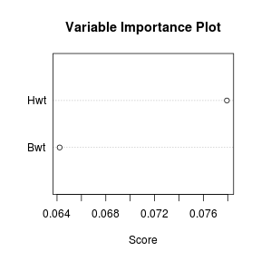

---
title       : Class05
subtitle    : classification
author      : Yu-Ru Lin
job         : 
framework   : shower        # {io2012, html5slides, shower, dzslides, ...}
highlighter : highlight.js  # {highlight.js, prettify, highlight}
hitheme     : tomorrow      # 
widgets     : [mathjax]            # {mathjax, quiz, bootstrap}
mode        : selfcontained # {standalone, draft}
knit        : slidify::knit2slides
toc         : true
toc_depth   : 2

--- #toc
## Class05

* [Set up](#set-up)
* [SVM](#svm)
* [AdaBoost](#ada)

--- #set-up .modal 

## Install R packages

```r
## this tutorial uses the following packages
```

--- .modal #svm
## SVM
The examples are taken from [Data Mining Algorithms In R](http://en.wikibooks.org/wiki/Data_Mining_Algorithms_In_R)


```r
library(e1071)
```

```
## 
## Attaching package: 'e1071'
```

```
## The following objects are masked from 'package:PerformanceAnalytics':
## 
##     kurtosis, skewness
```

```
## The following object is masked from 'package:Hmisc':
## 
##     impute
```

```r
library(MASS)
data(cats)
model <- svm(Sex~., data = cats)

print(model)
```

```
## 
## Call:
## svm(formula = Sex ~ ., data = cats)
## 
## 
## Parameters:
##    SVM-Type:  C-classification 
##  SVM-Kernel:  radial 
##        cost:  1 
##       gamma:  0.5 
## 
## Number of Support Vectors:  84
```

--- .modal

```r
summary(model)
```

```
## 
## Call:
## svm(formula = Sex ~ ., data = cats)
## 
## 
## Parameters:
##    SVM-Type:  C-classification 
##  SVM-Kernel:  radial 
##        cost:  1 
##       gamma:  0.5 
## 
## Number of Support Vectors:  84
## 
##  ( 39 45 )
## 
## 
## Number of Classes:  2 
## 
## Levels: 
##  F M
```

--- .modal

```r
plot(model,cats)
```


--- .scode-nowrap .compact

```r
## run svm with training / testing sets
index <- 1:nrow(cats)
testindex <- sample(index, trunc(length(index)/3))
testset <- cats[testindex,]
trainset <- cats[-testindex,]
model <- svm(Sex~., data = trainset)
prediction <- predict(model, testset[,-1])
tab <- table(pred = prediction, true = testset[,1])

## tune hyperparameters using a grid search over the supplied parameter ranges
tuned <- tune.svm(Sex~., data = trainset, gamma = 10^(-6:-1), cost = 10^(1:2))
summary(tuned)
```

```
## 
## Parameter tuning of 'svm':
## 
## - sampling method: 10-fold cross validation 
## 
## - best parameters:
##  gamma cost
##    0.1  100
## 
## - best performance: 0.1733333 
## 
## - Detailed performance results:
##    gamma cost     error dispersion
## 1  1e-06   10 0.3022222 0.07403703
## 2  1e-05   10 0.3022222 0.07403703
## 3  1e-04   10 0.3022222 0.07403703
## 4  1e-03   10 0.3022222 0.07403703
## 5  1e-02   10 0.2911111 0.10194272
## 6  1e-01   10 0.2166667 0.13055227
## 7  1e-06  100 0.3022222 0.07403703
## 8  1e-05  100 0.3022222 0.07403703
## 9  1e-04  100 0.3022222 0.07403703
## 10 1e-03  100 0.2911111 0.10194272
## 11 1e-02  100 0.2166667 0.13880244
## 12 1e-01  100 0.1733333 0.12529252
```

--- .modal #ada
## AdaBoost


```r
library(ada)
```

```
## Loading required package: rpart
```

```
## 
## Attaching package: 'rpart'
```

```
## The following object is masked from 'package:survival':
## 
##     solder
```

```r
library(MASS)
data(cats)

index <- 1:nrow(cats)
testindex <- sample(index, trunc(length(index)/3))
testset <- cats[testindex,]
trainset <- cats[-testindex,]
model <- ada(Sex~., data = trainset)
pred <- addtest(model, testset[,-1], testset[,1])
summary(pred)
```

```
## Call:
## ada(Sex ~ ., data = trainset)
## 
## Loss: exponential Method: discrete   Iteration: 50 
## 
## Training Results
## 
## Accuracy: 0.844 Kappa: 0.646 
## 
## Testing Results
## 
## Accuracy: 0.792 Kappa: 0.545
```

--- .modal

```r
## plot of variables ordered by the variable importance measure (based on improvement)
varplot(pred)
```


