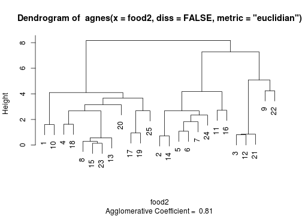
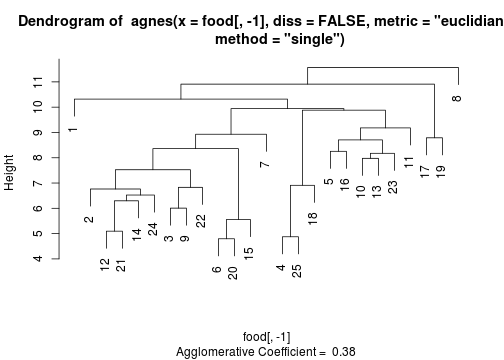
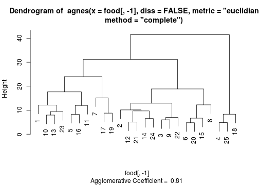
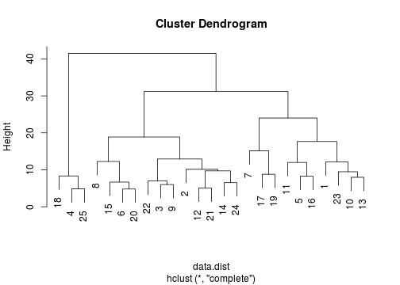

---
title       : Class06
subtitle    : clustering
author      : Yu-Ru Lin
job         : 
framework   : shower        # {io2012, html5slides, shower, dzslides, ...}
highlighter : highlight.js  # {highlight.js, prettify, highlight}
hitheme     : tomorrow      # 
widgets     : [mathjax]            # {mathjax, quiz, bootstrap}
mode        : selfcontained # {standalone, draft}
knit        : slidify::knit2slides
toc         : true
toc_depth   : 2

--- #toc
## Class06
  
* [Set up](#set-up)
* [k-means](#kmeans)
* [Hierarchical clustering](#hclu)
* [Clustering evaluation](#eval)

--- #set-up .modal 

## Install R packages

```r
## this tutorial uses the following packages
```

--- .scode-nowrap .compact #kmeans
## k-means
Protein consumption data


```r
## load the data:
data.url = 'http://www.yurulin.com/class/spring2014_datamining/data/data_text'
food = read.csv(sprintf("%s/protein.csv",data.url))
dim(food)
```

```
## [1] 25 10
```

```r
food[1:3,] ## take a look at the first three rows
```

```
##   Country RedMeat WhiteMeat Eggs Milk Fish Cereals Starch Nuts Fr.Veg
## 1 Albania    10.1       1.4  0.5  8.9  0.2    42.3    0.6  5.5    1.7
## 2 Austria     8.9      14.0  4.3 19.9  2.1    28.0    3.6  1.3    4.3
## 3 Belgium    13.5       9.3  4.1 17.5  4.5    26.6    5.7  2.1    4.0
```

--- .scode-nowrap .compact
## k-means

```r
## k-means clustering on just Red and White meat, with k=3 clusters
set.seed(1) ## fix the random seed to produce the same results 
grpMeat = kmeans(food[,c("WhiteMeat","RedMeat")], centers=3, nstart=10)
grpMeat
```

```
## K-means clustering with 3 clusters of sizes 12, 5, 8
## 
## Cluster means:
##   WhiteMeat   RedMeat
## 1  4.658333  8.258333
## 2  9.000000 15.180000
## 3 12.062500  8.837500
## 
## Clustering vector:
##  [1] 1 3 2 1 3 3 3 1 2 1 3 2 1 3 1 3 1 1 1 1 2 2 1 3 1
## 
## Within cluster sum of squares by cluster:
## [1] 69.85833 35.66800 39.45750
##  (between_SS / total_SS =  75.7 %)
## 
## Available components:
## 
## [1] "cluster"      "centers"      "totss"        "withinss"    
## [5] "tot.withinss" "betweenss"    "size"         "iter"        
## [9] "ifault"
```

--- .sscode-nowrap .compact
## k-means

```r
## list the cluster assignments
o=order(grpMeat$cluster)
data.frame(food$Country[o],grpMeat$cluster[o])
```

```
##    food.Country.o. grpMeat.cluster.o.
## 1          Albania                  1
## 2         Bulgaria                  1
## 3          Finland                  1
## 4           Greece                  1
## 5            Italy                  1
## 6           Norway                  1
## 7         Portugal                  1
## 8          Romania                  1
## 9            Spain                  1
## 10          Sweden                  1
## 11            USSR                  1
## 12      Yugoslavia                  1
## 13         Belgium                  2
## 14          France                  2
## 15         Ireland                  2
## 16     Switzerland                  2
## 17              UK                  2
## 18         Austria                  3
## 19  Czechoslovakia                  3
## 20         Denmark                  3
## 21       E Germany                  3
## 22         Hungary                  3
## 23     Netherlands                  3
## 24          Poland                  3
## 25       W Germany                  3
```

--- .scode-nowrap .compact
## k-means

```r
## generate a scatter plot with cluster assignments
plot(food$Red, food$White, type="n", xlim=c(3,19), xlab="Red Meat", ylab="White Meat")
text(x=food$Red, y=food$White, labels=food$Country, col=grpMeat$cluster+1)
```


--- .sscode-nowrap .compact
## k-means

```r
## same analysis, but now with clustering on all nine features;
## change the number of clusters to 7
set.seed(1)
grpProtein = kmeans(food[,-1], centers=7, nstart=10) 
o=order(grpProtein$cluster)
data.frame(food$Country[o],grpProtein$cluster[o])
```

```
##    food.Country.o. grpProtein.cluster.o.
## 1         Portugal                     1
## 2            Spain                     1
## 3          Denmark                     2
## 4          Finland                     2
## 5           Norway                     2
## 6           Sweden                     2
## 7          Austria                     3
## 8        E Germany                     3
## 9      Netherlands                     3
## 10       W Germany                     3
## 11  Czechoslovakia                     4
## 12         Hungary                     4
## 13          Poland                     4
## 14         Belgium                     5
## 15          France                     5
## 16         Ireland                     5
## 17     Switzerland                     5
## 18              UK                     5
## 19        Bulgaria                     6
## 20         Romania                     6
## 21      Yugoslavia                     6
## 22         Albania                     7
## 23          Greece                     7
## 24           Italy                     7
## 25            USSR                     7
```

--- .scode-nowrap .compact
## k-means

```r
## generate a scatter plot for the new result
plot(food$Red, food$White, type="n", xlim=c(3,19), xlab="Red Meat", ylab="White Meat")
text(x=food$Red, y=food$White, labels=food$Country, col=rainbow(7)[grpProtein$cluster])
```


--- .scode-nowrap .compact #hclu
## Hierarchical clustering 
Protein consumption data


```r
## use library 'cluster'
library(cluster)
## load the data
data.url = 'http://www.yurulin.com/class/spring2014_datamining/data/data_text'
food = read.csv(sprintf("%s/protein.csv",data.url))
food[1:3,] ## take a look at the first three rows
```

```
##   Country RedMeat WhiteMeat Eggs Milk Fish Cereals Starch Nuts Fr.Veg
## 1 Albania    10.1       1.4  0.5  8.9  0.2    42.3    0.6  5.5    1.7
## 2 Austria     8.9      14.0  4.3 19.9  2.1    28.0    3.6  1.3    4.3
## 3 Belgium    13.5       9.3  4.1 17.5  4.5    26.6    5.7  2.1    4.0
```

--- .scode-nowrap .compact 
## Hierarchical clustering 

```r
## consider just Red and White meat clusters;
## use the program 'agnes' in the package cluster;
## argument:
## diss=FALSE indicates that we use the dissimilarity matrix that is being calculated from raw data;
## metric="euclidian" indicates that we use Euclidian distance;
## no standardization is used as the default (stand = FALSE);
## use average linkage by default (method = "average"); 
food2 = food[,c("WhiteMeat","RedMeat")]
food2agg = agnes(food2, diss=FALSE, metric="euclidian")
food2agg
```

```
## Call:	 agnes(x = food2, diss = FALSE, metric = "euclidian") 
## Agglomerative coefficient:  0.8066169 
## Order of objects:
##  [1]  1 10  4 18  8 15 23 13 20 17 19 25  2 14  5  6  7 24 11 16  3 12 21
## [24]  9 22
## Height (summary):
##    Min. 1st Qu.  Median    Mean 3rd Qu.    Max. 
##  0.1414  0.9241  2.5090  2.6441  3.7826  8.1700 
## 
## Available components:
## [1] "order"  "height" "ac"     "merge"  "diss"   "call"   "method" "data"
```

--- .scode-nowrap .compact 
## Hierarchical clustering 

```r
plot(food2agg, which.plots=2) ## dendrogram
```



--- .sscode-nowrap .compact 
## Hierarchical clustering 

```r
food2agg$merge  ## describes the sequential merge steps
```

```
##       [,1] [,2]
##  [1,]  -15  -23
##  [2,]   -8    1
##  [3,]    2  -13
##  [4,]   -2  -14
##  [5,]   -3  -12
##  [6,]    5  -21
##  [7,]  -17  -19
##  [8,]   -5   -6
##  [9,]   -1  -10
## [10,]   -4  -18
## [11,]    8   -7
## [12,]   11  -24
## [13,]   10    3
## [14,]    4   12
## [15,]    7  -25
## [16,]  -11  -16
## [17,]   13  -20
## [18,]   17   15
## [19,]    9   18
## [20,]   14   16
## [21,]   -9  -22
## [22,]    6   21
## [23,]   20   22
## [24,]   19   23
```

--- .scode-nowrap .compact 
## Hierarchical clustering 

```r
## identical result obtained by first computing the distance matrix
food2aggv = agnes(daisy(food2), metric="euclidian", diss=T)
plot(food2aggv, which.plots=2)
```


--- .scode-nowrap .compact 
## Hierarchical clustering 

```r
## use all nine features with Euclidean distance and average linkage
foodagg = agnes(food[,-1],diss=FALSE,metric="euclidian")
plot(foodagg, which.plots=2)  ## dendrogram
```


--- .scode-nowrap .compact 
## Hierarchical clustering 

```r
# foodagg$merge  ## describes the sequential merge steps

## Using data on all nine variables (features)
## Euclidean distance and single linkage
foodaggsin=agnes(food[,-1],diss=FALSE,metric="euclidian",method="single")
plot(foodaggsin, which.plots=2)	## dendrogram
```



--- .scode-nowrap .compact 
## Hierarchical clustering 

```r
# foodaggsin$merge	## describes the sequential merge steps

## Euclidean distance and complete linkage
foodaggcomp=agnes(food[,-1],diss=FALSE,metric="euclidian",method="complete")
plot(foodaggcomp, which.plots=2)	## dendrogram
```



--- .ssscode-nowrap .compact 
## Hierarchical clustering 

```r
# foodaggcomp$merge	## describes the sequential merge steps

## use hclust,cutree for hierarchical clustering
data.dist = dist(food[,-1]) ## use dist to obtain distance matrix
hc = hclust(data.dist,method='complete')
data.dist
```

```
##            1         2         3         4         5         6         7
## 2  23.176281                                                            
## 3  21.650173  7.868291                                                  
## 4  15.688212 32.304489 32.786125                                        
## 5  15.154537 10.305338 10.609901 24.005416                              
## 6  30.157586 11.956588 11.119802 40.334105 19.420608                    
## 7  22.865913 10.742905  8.928606 33.614729 10.613670 15.184532          
## 8  30.990966 17.421251 17.603125 40.335096 24.019992 12.249898 23.827505
## 9  23.174124 11.010904  6.007495 33.263494 13.435029 12.718490 13.855324
## 10 12.136309 19.529721 18.254862 19.315538 15.025645 24.466099 22.109274
## 11 13.157127 16.974982 18.784036 18.399185  9.179869 26.734809 17.517991
## 12 27.902509 10.039422  9.146584 38.359745 17.582093  8.938121 16.177763
## 13 10.624500 14.688771 13.568714 21.013329  8.705171 21.595833 15.622740
## 14 28.302120  6.763875  9.675743 38.526744 16.352676  8.360024 13.268760
## 15 26.805410 13.684663 10.803703 38.174730 18.727253  6.688049 14.985326
## 16 17.643979  9.942334 12.201639 24.493877  8.255301 17.813759 14.874811
## 17 23.111036 22.931201 19.200781 33.293843 19.060430 23.926972 15.156187
## 18 10.319399 25.261235 25.878563  8.334867 17.311557 33.292191 26.731629
## 19 17.149927 17.440183 13.916537 28.887367 13.070578 21.187732 11.784312
## 20 29.987998 13.032268 11.632283 41.480598 20.430370  4.795832 15.584287
## 21 24.928899  7.583535  7.525955 35.509013 14.971640  9.650389 14.647184
## 22 24.308435 12.920526  6.830081 36.419500 16.497273 11.740528 14.780054
## 23 11.034038 19.042846 18.416840 16.675431 12.635268 25.334759 21.369137
## 24 29.143953 10.131634  9.066422 40.619823 17.151385  9.901010 10.558409
## 25 15.474818 31.946987 32.684859  4.875449 23.977698 39.874177 33.279423
##            8         9        10        11        12        13        14
## 2                                                                       
## 3                                                                       
## 4                                                                       
## 5                                                                       
## 6                                                                       
## 7                                                                       
## 8                                                                       
## 9  18.181309                                                            
## 10 24.107053 18.254588                                                  
## 11 29.983829 21.256293 14.933185                                        
## 12 11.569356 10.153325 22.976510 25.019193                              
## 13 23.755420 15.157836  7.976841 10.702803 20.037215                    
## 14 14.677534 12.350304 24.062834 23.208619  6.827884 19.872343          
## 15 11.688028 13.150285 21.419617 25.669437 10.883014 18.766726 11.551623
## 16 19.358977 14.013208 12.358803 11.992498 16.008748  9.066973 15.336884
## 17 31.176273 21.854061 22.156489 22.031568 27.137612 17.866169 25.384838
## 18 33.398054 27.116969 13.341664 11.638728 31.295687 14.311184 31.244840
## 19 26.571413 17.215110 16.268682 16.165704 21.806192 10.910545 20.661317
## 20 11.908820 14.027117 25.157305 27.655198  8.884256 21.877386  8.497647
## 21 13.054118  8.182298 20.039960 22.139557  5.097058 16.668833  6.297619
## 22 15.951176  6.987131 20.320187 24.172091  8.241966 17.261518 11.987076
## 23 24.692711 19.434248  8.175573 12.493198 23.017385  9.462029 24.233448
## 24 18.878824 12.459936 26.280411 24.701012  9.709789 21.096682  6.525335
## 25 39.330014 33.723137 18.747800 17.615902 37.953919 20.721245 37.969725
##           15        16        17        18        19        20        21
## 2                                                                       
## 3                                                                       
## 4                                                                       
## 5                                                                       
## 6                                                                       
## 7                                                                       
## 8                                                                       
## 9                                                                       
## 10                                                                      
## 11                                                                      
## 12                                                                      
## 13                                                                      
## 14                                                                      
## 15                                                                      
## 16 16.913308                                                            
## 17 20.662768 21.676946                                                  
## 18 31.020638 17.429859 27.650859                                        
## 19 17.575836 15.496774  8.788629 22.286094                              
## 20  5.557877 19.150196 24.082774 34.196052 20.789420                    
## 21 10.653638 13.500370 24.844516 28.574464 19.311396  9.537819          
## 22 10.523783 17.070735 22.770156 29.726924 17.655028 10.903211  7.969316
## 23 22.826301 10.812955 24.005208  9.880283 17.884910 26.293155 20.975700
## 24 12.152366 18.513239 22.834842 33.438600 19.048097  9.090105  9.624968
## 25 37.451569 23.728464 32.829408  6.910861 28.132721 40.833932 35.278889
##           22        23        24
## 2                               
## 3                               
## 4                               
## 5                               
## 6                               
## 7                               
## 8                               
## 9                               
## 10                              
## 11                              
## 12                              
## 13                              
## 14                              
## 15                              
## 16                              
## 17                              
## 18                              
## 19                              
## 20                              
## 21                              
## 22                              
## 23 21.605786                    
## 24 11.101802 26.583454          
## 25 36.405906 15.791770 40.275551
```

--- .scode-nowrap .compact 
## Hierarchical clustering 

```r
plot(hc)
```



--- .scode-nowrap .compact 
## Hierarchical clustering 

```r
hc1 = cutree(hc,k=3)
print(hc1)
```

```
##  [1] 1 2 2 3 1 2 1 2 2 1 1 2 1 2 2 1 1 3 1 2 2 2 1 2 3
```

--- .scode-nowrap .compact #eval
## Clustering evaluation
* purity and entropy
* an "elbow" in the plot of SSE against cluster solutions

```r
cluster.purity <- function(clusters, classes) {
  sum(apply(table(classes, clusters), 2, max)) / length(clusters)
}

cluster.entropy <- function(clusters,classes) {
  en <- function(x) {
    s = sum(x)
    sum(sapply(x/s, function(p) {if (p) -p*log2(p) else 0} ) )
  }
  M = table(classes, clusters)
  m = apply(M, 2, en)
  c = colSums(M) / sum(M)
  sum(m*c)
}
```

--- .scode-nowrap .compact 
## Clustering evaluation

```r
## test the purity and entropy functions
n = 20
classes = sample(3, n, replace=T) ## randomly assign classes
classes
```

```
##  [1] 2 3 2 2 2 3 3 2 3 3 2 3 2 1 3 1 3 1 1 1
```

--- .scode-nowrap .compact 
## Clustering evaluation

```r
clusters = sample(2, n, replace=T) ## randomly assign clusters
clusters
```

```
##  [1] 1 1 2 2 2 2 1 1 2 2 2 1 1 2 2 1 1 1 2 2
```

--- .scode-nowrap .compact 
## Clustering evaluation

```r
table(classes, clusters) ## confusion matrix
```

```
##        clusters
## classes 1 2
##       1 2 3
##       2 3 4
##       3 4 4
```

--- .scode-nowrap .compact 
## Clustering evaluation

```r
cluster.purity(clusters,classes)  ## purity
```

```
## [1] 0.4
```

--- .scode-nowrap .compact 
## Clustering evaluation

```r
cluster.entropy(clusters,classes) ## entropy
```

```
## [1] 1.553665
```

--- .scode-nowrap .compact 
## Clustering evaluation

```r
data.url = 'http://www.yurulin.com/class/spring2014_datamining/data/data_text'
food = read.csv(sprintf("%s/protein.csv",data.url))


wssplot <- function(data, nc=15, seed=1234) {
  wss = dim(nc)
  for (i in 2:nc) {
    set.seed(seed)
    wss[i] = sum(kmeans(data, centers=i)$withinss)
  }
  plot(1:nc, wss, type="b", xlab="Number of Clusters", ylab="Within groups sum of squares")
}
```

--- .scode-nowrap .compact 
## Clustering evaluation

```r
n.clusters = 10
wssplot(scale(food[,-1]),nc=n.clusters)
```


