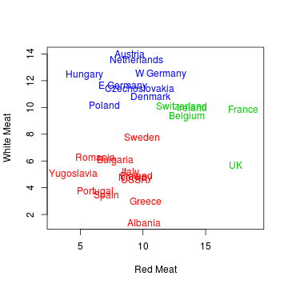
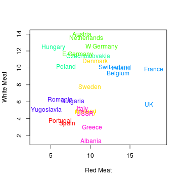

---
title       : Class06
subtitle    : clustering
author      : Yu-Ru Lin
job         : 
framework   : shower        # {io2012, html5slides, shower, dzslides, ...}
highlighter : highlight.js  # {highlight.js, prettify, highlight}
hitheme     : tomorrow      # 
widgets     : [mathjax]            # {mathjax, quiz, bootstrap}
mode        : selfcontained # {standalone, draft}
knit        : slidify::knit2slides
toc         : true
toc_depth   : 2

--- #toc
## Class06
  
* [Set up](#set-up)
* [k-means](#kmeans)
* [Hierarchical clustering](#hclu)
* [Clustering evaluation](#eval)

--- #set-up .modal 

## Install R packages

```r
## this tutorial uses the following packages
```

--- .modal #kmeans
## k-means

protein consumption data


```r
## load the data:
data.url = 'http://www.yurulin.com/class/spring2014_datamining/data/data_text'
food = read.csv(sprintf("%s/protein.csv",data.url))
dim(food)
```

```
## [1] 25 10
```

```r
food[1:3,] ## take a look at the first three rows
```

```
##   Country RedMeat WhiteMeat Eggs Milk Fish Cereals Starch Nuts Fr.Veg
## 1 Albania    10.1       1.4  0.5  8.9  0.2    42.3    0.6  5.5    1.7
## 2 Austria     8.9      14.0  4.3 19.9  2.1    28.0    3.6  1.3    4.3
## 3 Belgium    13.5       9.3  4.1 17.5  4.5    26.6    5.7  2.1    4.0
```

--- .scode-nowrap .compact
## k-means

```r
## k-means clustering on just Red and White meat, with k=3 clusters
set.seed(1) ## fix the random seed to produce the same results 
grpMeat = kmeans(food[,c("WhiteMeat","RedMeat")], centers=3, nstart=10)
grpMeat
```

```
## K-means clustering with 3 clusters of sizes 12, 5, 8
## 
## Cluster means:
##   WhiteMeat   RedMeat
## 1  4.658333  8.258333
## 2  9.000000 15.180000
## 3 12.062500  8.837500
## 
## Clustering vector:
##  [1] 1 3 2 1 3 3 3 1 2 1 3 2 1 3 1 3 1 1 1 1 2 2 1 3 1
## 
## Within cluster sum of squares by cluster:
## [1] 69.85833 35.66800 39.45750
##  (between_SS / total_SS =  75.7 %)
## 
## Available components:
## 
## [1] "cluster"      "centers"      "totss"        "withinss"    
## [5] "tot.withinss" "betweenss"    "size"         "iter"        
## [9] "ifault"
```

--- .scode-nowrap .compact
## k-means

```r
## list the cluster assignments
o=order(grpMeat$cluster)
data.frame(food$Country[o],grpMeat$cluster[o])
```

```
##    food.Country.o. grpMeat.cluster.o.
## 1          Albania                  1
## 2         Bulgaria                  1
## 3          Finland                  1
## 4           Greece                  1
## 5            Italy                  1
## 6           Norway                  1
## 7         Portugal                  1
## 8          Romania                  1
## 9            Spain                  1
## 10          Sweden                  1
## 11            USSR                  1
## 12      Yugoslavia                  1
## 13         Belgium                  2
## 14          France                  2
## 15         Ireland                  2
## 16     Switzerland                  2
## 17              UK                  2
## 18         Austria                  3
## 19  Czechoslovakia                  3
## 20         Denmark                  3
## 21       E Germany                  3
## 22         Hungary                  3
## 23     Netherlands                  3
## 24          Poland                  3
## 25       W Germany                  3
```

--- .scode-nowrap .compact
## k-means

```r
## generate a scatter plot with cluster assignments
plot(food$Red, food$White, type="n", xlim=c(3,19), xlab="Red Meat", ylab="White Meat")
text(x=food$Red, y=food$White, labels=food$Country, col=grpMeat$cluster+1)
```



--- .scode-nowrap .compact
## k-means

```r
## same analysis, but now with clustering on all nine features;
## change the number of clusters to 7
set.seed(1)
grpProtein = kmeans(food[,-1], centers=7, nstart=10) 
o=order(grpProtein$cluster)
data.frame(food$Country[o],grpProtein$cluster[o])
```

```
##    food.Country.o. grpProtein.cluster.o.
## 1         Portugal                     1
## 2            Spain                     1
## 3          Denmark                     2
## 4          Finland                     2
## 5           Norway                     2
## 6           Sweden                     2
## 7          Austria                     3
## 8        E Germany                     3
## 9      Netherlands                     3
## 10       W Germany                     3
## 11  Czechoslovakia                     4
## 12         Hungary                     4
## 13          Poland                     4
## 14         Belgium                     5
## 15          France                     5
## 16         Ireland                     5
## 17     Switzerland                     5
## 18              UK                     5
## 19        Bulgaria                     6
## 20         Romania                     6
## 21      Yugoslavia                     6
## 22         Albania                     7
## 23          Greece                     7
## 24           Italy                     7
## 25            USSR                     7
```

--- .scode-nowrap .compact
## k-means

```r
## generate a scatter plot for the new result
plot(food$Red, food$White, type="n", xlim=c(3,19), xlab="Red Meat", ylab="White Meat")
text(x=food$Red, y=food$White, labels=food$Country, col=rainbow(7)[grpProtein$cluster])
```



