---
title       : Class07
subtitle    : Dimension Reduction
author      : Yu-Ru Lin
job         : 
framework   : shower        # {io2012, html5slides, shower, dzslides, ...}
highlighter : highlight.js  # {highlight.js, prettify, highlight}
hitheme     : tomorrow      # 
widgets     : [mathjax]            # {mathjax, quiz, bootstrap}
mode        : selfcontained # {standalone, draft}
knit        : slidify::knit2slides
toc         : true
toc_depth   : 2

--- #toc
## Class07
  
* [Set up](#set-up)
* [PCA process](#pca)
* [PCA on protein consumption data](#pca1)
* [SVD](#svd)
* [MDS](#mds)
* [MDS on protein consumption data](#mds1)

--- #set-up .modal 

## Install R packages

```r
## this tutorial uses the following packages
```

--- #pca .compact
## PCA process
   * Center the data according to the mean
   * Calculate the covariance matrix
   * Calculate the eigenvectors and eigenvalues of the covariance matrix
   * Express the scaled data in terms of eigenvectors (principal components)

--- .scode-nowrap .compact
## PCA

```r
data.url = 'http://www.yurulin.com/class/spring2014_datamining/data/data_text'
data = read.csv(sprintf("%s/unemp.csv",data.url))
data[1:3,]
```

```
##   state     mean   stddev
## 1    AL 6.644952 2.527530
## 2    AK 8.033173 1.464966
## 3    AZ 6.120673 1.743672
```

```r
dim(data)
```

```
## [1] 50  3
```

--- .scode-nowrap .compact
## PCA

```r
states = data[,1]; n = length(states)
data = (as.matrix(data[,-1]))
## 1) Center the data according to the mean
my.scaled.data = apply(data,2,function(x) (x-mean(x)))
plot(my.scaled.data,cex=0.9,col="blue",main="Plot of Scaled Data")
```

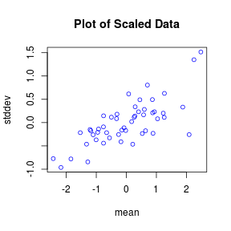

--- .scode-nowrap .compact
## PCA

```r
## 2) Calculate the covariance matrix
my.cov = cov(my.scaled.data)
my.cov
```

```
##             mean    stddev
## mean   1.2308637 0.3930731
## stddev 0.3930731 0.2279926
```


--- .scode-nowrap .compact
## PCA

```r
## 3) Calculate the eigenvectors and eigenvalues of the covariance matrix
my.eigen = eigen(my.cov)
my.eigen
```

```
## eigen() decomposition
## $values
## [1] 1.36656552 0.09229076
## 
## $vectors
##            [,1]       [,2]
## [1,] -0.9452548  0.3263333
## [2,] -0.3263333 -0.9452548
```

--- .scode-nowrap .compact
## PCA

```r
## 3a) Plot the Eigenvectors over the scaled data
plot(my.scaled.data,cex=0.9,col="blue",main="Plot of Scaled Data")
pc1.slope = my.eigen$vectors[2,1] /my.eigen$vectors[1,1]
pc2.slope = my.eigen$vectors[2,2] /my.eigen$vectors[1,2]
abline(0,pc1.slope,col="red")
abline(0,pc2.slope,col="green")
```

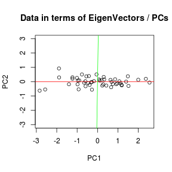

--- .scode-nowrap .compact
## PCA

```r
## 4) Express the scaled data in terms of eigenvectors (principal components)
## get the P matrix (loadings, i.e., a matrix whose columns contain the eigenvectors)
loadings = my.eigen$vectors 
## project data onto the loadings
scores = my.scaled.data %*% loadings 
## plot the projected data on the first two PCs
plot(scores,ylim=c(-3,3),main='Data in terms of EigenVectors / PCs',xlab='PC1',ylab='PC2')
abline(0,0,col="red")
abline(0,90,col="green")
```


--- .scode-nowrap .compact #pca1
## PCA on protein consumption data

```r
## load the data:
data.url = 'http://www.yurulin.com/class/spring2014_datamining/data/data_text'
food = read.csv(sprintf("%s/protein.csv",data.url))
food[1:3,] ## take a look at the first three rows
```

```
##   Country RedMeat WhiteMeat Eggs Milk Fish Cereals Starch Nuts Fr.Veg
## 1 Albania    10.1       1.4  0.5  8.9  0.2    42.3    0.6  5.5    1.7
## 2 Austria     8.9      14.0  4.3 19.9  2.1    28.0    3.6  1.3    4.3
## 3 Belgium    13.5       9.3  4.1 17.5  4.5    26.6    5.7  2.1    4.0
```

--- .ssscode-nowrap .compact 
## PCA on protein consumption data

```r
## correlation matrix
## we strip the first column (country labels) from the data set
cor(food[,-1])
```

```
##               RedMeat  WhiteMeat        Eggs       Milk        Fish
## RedMeat    1.00000000  0.1530027  0.58560895  0.5029311  0.06095745
## WhiteMeat  0.15300271  1.0000000  0.62040916  0.2814839 -0.23400923
## Eggs       0.58560895  0.6204092  1.00000000  0.5755331  0.06557136
## Milk       0.50293110  0.2814839  0.57553312  1.0000000  0.13788370
## Fish       0.06095745 -0.2340092  0.06557136  0.1378837  1.00000000
## Cereals   -0.49987746 -0.4137969 -0.71243682 -0.5927366 -0.52423080
## Starch     0.13542594  0.3137721  0.45223071  0.2224112  0.40385286
## Nuts      -0.34944855 -0.6349618 -0.55978097 -0.6210875 -0.14715294
## Fr.Veg    -0.07422123 -0.0613167 -0.04551755 -0.4083641  0.26613865
##               Cereals      Starch       Nuts      Fr.Veg
## RedMeat   -0.49987746  0.13542594 -0.3494486 -0.07422123
## WhiteMeat -0.41379691  0.31377205 -0.6349618 -0.06131670
## Eggs      -0.71243682  0.45223071 -0.5597810 -0.04551755
## Milk      -0.59273662  0.22241118 -0.6210875 -0.40836414
## Fish      -0.52423080  0.40385286 -0.1471529  0.26613865
## Cereals    1.00000000 -0.53326231  0.6509973  0.04654808
## Starch    -0.53326231  1.00000000 -0.4743116  0.08440956
## Nuts       0.65099727 -0.47431155  1.0000000  0.37496971
## Fr.Veg     0.04654808  0.08440956  0.3749697  1.00000000
```

--- .ssscode-nowrap .compact 
## PCA on protein consumption data

```r
## scale = TRUE: variables are first standardized. Default is FALSE
pcafood = prcomp(food[,-1], scale=TRUE) 
pcafood
```

```
## Standard deviations (1, .., p=9):
## [1] 2.0016087 1.2786710 1.0620355 0.9770691 0.6810568 0.5702026 0.5211586
## [8] 0.3410160 0.3148204
## 
## Rotation (n x k) = (9 x 9):
##                  PC1         PC2         PC3          PC4         PC5
## RedMeat   -0.3026094 -0.05625165 -0.29757957 -0.646476536  0.32216008
## WhiteMeat -0.3105562 -0.23685334  0.62389724  0.036992271 -0.30016494
## Eggs      -0.4266785 -0.03533576  0.18152828 -0.313163873  0.07911048
## Milk      -0.3777273 -0.18458877 -0.38565773  0.003318279 -0.20041361
## Fish      -0.1356499  0.64681970 -0.32127431  0.215955001 -0.29003065
## Cereals    0.4377434 -0.23348508  0.09591750  0.006204117  0.23816783
## Starch    -0.2972477  0.35282564  0.24297503  0.336684733  0.73597332
## Nuts       0.4203344  0.14331056 -0.05438778 -0.330287545  0.15053689
## Fr.Veg     0.1104199  0.53619004  0.40755612 -0.462055746 -0.23351666
##                   PC6         PC7         PC8        PC9
## RedMeat   -0.45986989  0.15033385 -0.01985770  0.2459995
## WhiteMeat -0.12100707 -0.01966356 -0.02787648  0.5923966
## Eggs       0.36124872 -0.44327151 -0.49120023 -0.3333861
## Milk       0.61843780  0.46209500  0.08142193  0.1780841
## Fish      -0.13679059 -0.10639350 -0.44873197  0.3128262
## Cereals    0.08075842  0.40496408 -0.70299504  0.1522596
## Starch     0.14766670  0.15275311  0.11453956  0.1218582
## Nuts       0.44701001 -0.40726235  0.18379989  0.5182749
## Fr.Veg     0.11854972  0.44997782  0.09196337 -0.2029503
```

--- .ssscode-nowrap .compact 
## PCA on protein consumption data

```r
## the loadings (i.e., a matrix whose columns contain the eigenvectors)
pcafood$rotation
```

```
##                  PC1         PC2         PC3          PC4         PC5
## RedMeat   -0.3026094 -0.05625165 -0.29757957 -0.646476536  0.32216008
## WhiteMeat -0.3105562 -0.23685334  0.62389724  0.036992271 -0.30016494
## Eggs      -0.4266785 -0.03533576  0.18152828 -0.313163873  0.07911048
## Milk      -0.3777273 -0.18458877 -0.38565773  0.003318279 -0.20041361
## Fish      -0.1356499  0.64681970 -0.32127431  0.215955001 -0.29003065
## Cereals    0.4377434 -0.23348508  0.09591750  0.006204117  0.23816783
## Starch    -0.2972477  0.35282564  0.24297503  0.336684733  0.73597332
## Nuts       0.4203344  0.14331056 -0.05438778 -0.330287545  0.15053689
## Fr.Veg     0.1104199  0.53619004  0.40755612 -0.462055746 -0.23351666
##                   PC6         PC7         PC8        PC9
## RedMeat   -0.45986989  0.15033385 -0.01985770  0.2459995
## WhiteMeat -0.12100707 -0.01966356 -0.02787648  0.5923966
## Eggs       0.36124872 -0.44327151 -0.49120023 -0.3333861
## Milk       0.61843780  0.46209500  0.08142193  0.1780841
## Fish      -0.13679059 -0.10639350 -0.44873197  0.3128262
## Cereals    0.08075842  0.40496408 -0.70299504  0.1522596
## Starch     0.14766670  0.15275311  0.11453956  0.1218582
## Nuts       0.44701001 -0.40726235  0.18379989  0.5182749
## Fr.Veg     0.11854972  0.44997782  0.09196337 -0.2029503
```

--- .ssscode-nowrap .compact 
## PCA on protein consumption data

```r
## use 'predict' to project data onto the loadings
foodpc = predict(pcafood)
foodpc  
```

```
##              PC1         PC2         PC3        PC4         PC5
##  [1,]  3.4853673 -1.63047985 -1.76123326 -0.2296580  0.02325397
##  [2,] -1.4226694 -1.04123130  1.33780391 -0.1680973 -0.93344658
##  [3,] -1.6220323  0.15949557  0.21653445 -0.5207260  0.75509039
##  [4,]  3.1340813 -1.30106563  0.15128956 -0.2141894 -0.48474537
##  [5,] -0.3704646 -0.60266842  1.19594183  0.4639821  0.25682380
##  [6,] -2.3652688  0.28544582 -0.75226337  0.9673412 -0.75243310
##  [7,] -1.4222108  0.45030085  1.30254017  1.1359613  0.42294279
##  [8,] -1.5638563 -0.59600255 -2.04950734  1.4153084  0.03720310
##  [9,] -1.4879824  0.78536517  0.00188261 -1.9574576  0.25045870
## [10,]  2.2397000  1.00105887 -0.88260339 -1.7943200 -0.40497731
## [11,]  1.4574398 -0.81595115  1.91416751  0.2173883 -0.04139773
## [12,] -2.6634775 -0.76370648 -0.01988068 -0.4347281  1.01438731
## [13,]  1.5345653  0.39898708  0.12608962 -1.2224605 -0.80354036
## [14,] -1.6414454 -0.91199089  0.76648819  0.1261517 -0.76127751
## [15,] -0.9747029  0.82202867 -1.70407650  1.1376216 -0.41487370
## [16,] -0.1218695  0.53174194  1.47478926  0.4582224 -0.02321953
## [17,]  1.7058540  4.28893399  0.04363280  0.8935596 -0.38528872
## [18,]  2.7568124 -1.11878536  0.07008085  0.6150113  0.31709607
## [19,]  1.3118074  2.55352416  0.51528370 -0.3592043  0.51590218
## [20,] -1.6337300 -0.20738445 -1.28037195  0.7341013 -0.81982482
## [21,] -0.9123182 -0.75105865 -0.15425409 -1.1704447 -0.83095955
## [22,] -1.7353682 -0.09397944 -1.15268145 -1.7336921  1.08393948
## [23,]  0.7825965 -0.11077014 -0.36967910  0.9275729  1.66955744
## [24,] -2.0938353 -0.29377901  0.80397944 -0.1087951 -0.06836077
## [25,]  3.6230077 -1.03802883  0.20604724  0.8215511  0.37768982
##               PC6         PC7         PC8         PC9
##  [1,] -1.03426476 -0.47174197  0.76155126 -0.10325325
##  [2,]  0.21842810 -0.18115417 -0.25100249 -0.21744631
##  [3,] -0.28980510 -0.19559674 -0.20331176 -0.03317146
##  [4,] -0.69557793  0.46478244 -0.80824466 -0.29986287
##  [5,] -0.82309047  0.31494841  0.01229809 -0.14944825
##  [6,] -0.17032964 -0.22581590 -0.62102079  0.48027941
##  [7,] -0.64831247 -0.55478278 -0.16317720 -0.25990129
##  [8,]  0.83420035  0.72623047  0.22591749 -0.13308980
##  [9,] -0.89894837  0.94647514 -0.02222005  0.54360773
## [10,]  1.14447671 -0.14739068 -0.30583067  0.38796520
## [11,]  0.53910843 -0.76810179  0.14561849  0.53694446
## [12,]  0.48232591 -0.02866861  0.02299904 -0.07946587
## [13,]  0.21408555  0.14999185 -0.08040607 -0.73235148
## [14,]  0.29752197 -0.06209574  0.45992565  0.26087199
## [15,] -0.05645162 -0.04278766 -0.10734586 -0.14732974
## [16,]  0.58830002  1.26072252  0.19159633 -0.22099984
## [17,] -0.69709651  0.04649963  0.20502225  0.26348804
## [18,]  0.13051679 -0.13307908 -0.02689368  0.33803173
## [19,]  0.66928818 -0.59721082  0.23532802 -0.47673575
## [20,]  0.04407662 -0.54116219 -0.07221780 -0.10839228
## [21,] -0.09024236  0.51229089  0.52929748  0.06656513
## [22,] -0.09656499 -0.65096941 -0.23920906 -0.13193590
## [23,]  0.18542992  0.57410168 -0.05202711  0.09168518
## [24,] -0.20099295 -0.45677673  0.35662909 -0.02527918
## [25,]  0.35391862  0.06129122 -0.19327598  0.14922442
```

--- .scode-nowrap .compact 
## PCA on protein consumption data

```r
## how many principal components do we need?
## plot the variances against the number of the principal component;
## retain only factors with eigenvalues greater than 1
plot(pcafood, main="") ## same as screeplot(pcafood)
mtext(side=1, "European Protein Principal Components",  line=1, font=2)
```

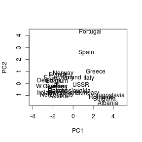

--- .scode-nowrap .compact 
## PCA on protein consumption data

```r
## how do the PCs look?
plot(foodpc[,1:2], type="n", xlim=c(-4,5))
text(x=foodpc[,1], y=foodpc[,2], labels=food$Country)
```

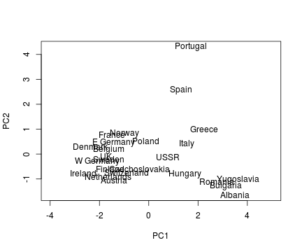

--- .scode-nowrap .compact 
## PCA on protein consumption data

```r
plot(foodpc[,3:4], type="n", xlim=c(-3,3))
text(x=foodpc[,3], y=foodpc[,4], labels=food$Country)
```

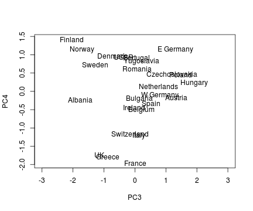

--- .sscode-nowrap .compact 
## PCA on protein consumption data

```r
pcafood$rotation[,1]
```

```
##    RedMeat  WhiteMeat       Eggs       Milk       Fish    Cereals 
## -0.3026094 -0.3105562 -0.4266785 -0.3777273 -0.1356499  0.4377434 
##     Starch       Nuts     Fr.Veg 
## -0.2972477  0.4203344  0.1104199
```

--- .scode-nowrap .compact 
## PCA on protein consumption data

```r
## plot both the observations and variables of a matrix
biplot(pcafood)
```

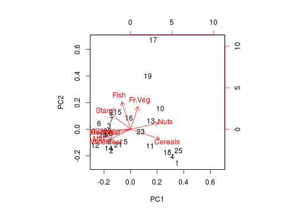

--- #svd .ssscode-nowrap .compact
## SVD

```r
## on a simple term-doc matrix example
## 9 documents and 12 terms
docs = c(
  "Human machine interface for Lab ABC computer applications",
  "A survey of user opinion of computer system response time",
  "The EPS user interface management system",
  "System and human system engineering testing of EPS",
  "Relation of user-perceived response time to error measurement",
  "The generation of random, binary, unordered trees",
  "The intersection graph of paths in trees",
  "Graph minors IV: Widths of trees and well-quasi-ordering",
  "Graph minors: A survey"
)
terms = c(
  "human",
  "interface",
  "computer",
  "user",
  "system",
  "response",
  "time",
  "EPS",
  "survey",
  "trees",
  "graph",
  "minors"
)
data = c(
  1, 0, 0, 1, 0, 0, 0, 0, 0 ,
  1, 0, 1, 0, 0, 0, 0, 0, 0 ,
  1, 1, 0, 0, 0, 0, 0, 0, 0 ,
  0, 1, 1, 0, 1, 0, 0, 0, 0 ,
  0, 1, 1, 2, 0, 0, 0, 0, 0 ,
  0, 1, 0, 0, 1, 0, 0, 0, 0 ,
  0, 1, 0, 0, 1, 0, 0, 0, 0 ,
  0, 0, 1, 1, 0, 0, 0, 0, 0 ,
  0, 1, 0, 0, 0, 0, 0, 0, 1 ,
  0, 0, 0, 0, 0, 1, 1, 1, 0 ,
  0, 0, 0, 0, 0, 0, 1, 1, 1 ,
  0, 0, 0, 0, 0, 0, 0, 1, 1 
)
## construct term-doc matrix
tdm = matrix(data,nrow=12,ncol=9,byrow=T)
dim(tdm)
```

```
## [1] 12  9
```

--- .scode-nowrap .compact 
## SVD

```r
rownames(tdm) = terms
tdm
```

```
##           [,1] [,2] [,3] [,4] [,5] [,6] [,7] [,8] [,9]
## human        1    0    0    1    0    0    0    0    0
## interface    1    0    1    0    0    0    0    0    0
## computer     1    1    0    0    0    0    0    0    0
## user         0    1    1    0    1    0    0    0    0
## system       0    1    1    2    0    0    0    0    0
## response     0    1    0    0    1    0    0    0    0
## time         0    1    0    0    1    0    0    0    0
## EPS          0    0    1    1    0    0    0    0    0
## survey       0    1    0    0    0    0    0    0    1
## trees        0    0    0    0    0    1    1    1    0
## graph        0    0    0    0    0    0    1    1    1
## minors       0    0    0    0    0    0    0    1    1
```

--- .scode-nowrap .compact 
## SVD

```r
## perform svd
S = svd(tdm,nu=2,nv=2)
u = S$u; s = S$d; v = S$v
rownames(u) = terms
rownames(v) = docs
cat("scale:"); s
```

```
## scale:
```

```
## [1] 3.3408838 2.5417010 2.3539435 1.6445323 1.5048316 1.3063820 0.8459031
## [8] 0.5601344 0.3636768
```

--- .ssscode-nowrap .compact 
## SVD

```r
cat("term vector:"); u
```

```
## term vector:
```

```
##                  [,1]        [,2]
## human     -0.22135078 -0.11317962
## interface -0.19764540 -0.07208778
## computer  -0.24047023  0.04315195
## user      -0.40359886  0.05707026
## system    -0.64448115 -0.16730121
## response  -0.26503747  0.10715957
## time      -0.26503747  0.10715957
## EPS       -0.30082816 -0.14127047
## survey    -0.20591786  0.27364743
## trees     -0.01274618  0.49016179
## graph     -0.03613585  0.62278523
## minors    -0.03175633  0.45050892
```

--- .ssscode-nowrap .compact 
## SVD

```r
cat("doc vector:"); v
```

```
## doc vector:
```

```
##                                                                       [,1]
## Human machine interface for Lab ABC computer applications     -0.197392802
## A survey of user opinion of computer system response time     -0.605990269
## The EPS user interface management system                      -0.462917508
## System and human system engineering testing of EPS            -0.542114417
## Relation of user-perceived response time to error measurement -0.279469108
## The generation of random, binary, unordered trees             -0.003815213
## The intersection graph of paths in trees                      -0.014631468
## Graph minors IV: Widths of trees and well-quasi-ordering      -0.024136835
## Graph minors: A survey                                        -0.081957368
##                                                                      [,2]
## Human machine interface for Lab ABC computer applications     -0.05591352
## A survey of user opinion of computer system response time      0.16559288
## The EPS user interface management system                      -0.12731206
## System and human system engineering testing of EPS            -0.23175523
## Relation of user-perceived response time to error measurement  0.10677472
## The generation of random, binary, unordered trees              0.19284794
## The intersection graph of paths in trees                       0.43787488
## Graph minors IV: Widths of trees and well-quasi-ordering       0.61512190
## Graph minors: A survey                                         0.52993707
```

--- #mds .scode-nowrap .compact 
## MDS
* on a toy example

```r
set.seed(851982) # To make sure results are consistent
ex.matrix = matrix(sample(c(-1, 0, 1), 24, replace = TRUE),
                   nrow = 4,
                   ncol = 6)
row.names(ex.matrix) = c('A', 'B', 'C', 'D')
colnames(ex.matrix) = c('P1', 'P2', 'P3', 'P4', 'P5', 'P6')
ex.matrix ## a customer-product matrix
```

```
##   P1 P2 P3 P4 P5 P6
## A  0 -1  0 -1  0  0
## B -1  0  1  1  1  0
## C  0  0  0  1 -1  1
## D  1  0  1 -1  0  0
```

--- .scode-nowrap .compact 
## MDS

```r
t(ex.matrix) ## a product-customer matrix
```

```
##     A  B  C  D
## P1  0 -1  0  1
## P2 -1  0  0  0
## P3  0  1  0  1
## P4 -1  1  1 -1
## P5  0  1 -1  0
## P6  0  0  1  0
```

--- .scode-nowrap .compact 
## MDS

```r
## convert matrix to customer-by-customer matrix
ex.mult = ex.matrix %*% t(ex.matrix)
ex.mult
```

```
##    A  B  C  D
## A  2 -1 -1  1
## B -1  4  0 -1
## C -1  0  3 -1
## D  1 -1 -1  3
```

--- .scode-nowrap .compact 
## MDS

```r
## calculate distance between A and D
sqrt(sum((ex.mult[1, ] - ex.mult[4, ]) ^ 2))
```

```
## [1] 2.236068
```

--- .scode-nowrap .compact 
## MDS

```r
## calculate distance matrix
ex.dist = dist(ex.mult)
ex.dist
```

```
##          A        B        C
## B 6.244998                  
## C 5.477226 5.000000         
## D 2.236068 6.782330 6.082763
```

--- .scode-nowrap .compact 
## MDS

```r
## visualize clusters
ex.mds <- cmdscale(ex.dist)
plot(ex.mds, type = 'n')
text(ex.mds, c('A', 'B', 'C', 'D'))
```

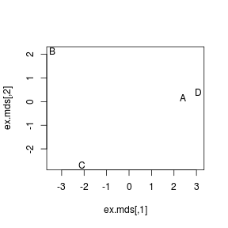

--- .sscode-nowrap .compact #mds1
## MDS on protein consumption data

```r
## load the data:
data.url = 'http://www.yurulin.com/class/spring2014_datamining/data/data_text'
food = read.csv(sprintf("%s/protein.csv",data.url))
food[1:3,] ## take a look at the first three rows
```

```
##   Country RedMeat WhiteMeat Eggs Milk Fish Cereals Starch Nuts Fr.Veg
## 1 Albania    10.1       1.4  0.5  8.9  0.2    42.3    0.6  5.5    1.7
## 2 Austria     8.9      14.0  4.3 19.9  2.1    28.0    3.6  1.3    4.3
## 3 Belgium    13.5       9.3  4.1 17.5  4.5    26.6    5.7  2.1    4.0
```

--- .ssscode-nowrap .compact 
## MDS on protein consumption data

```r
## calculate distance matrix
country.dist = dist(food[,-1])
country.dist
```

```
##            1         2         3         4         5         6         7
## 2  23.176281                                                            
## 3  21.650173  7.868291                                                  
## 4  15.688212 32.304489 32.786125                                        
## 5  15.154537 10.305338 10.609901 24.005416                              
## 6  30.157586 11.956588 11.119802 40.334105 19.420608                    
## 7  22.865913 10.742905  8.928606 33.614729 10.613670 15.184532          
## 8  30.990966 17.421251 17.603125 40.335096 24.019992 12.249898 23.827505
## 9  23.174124 11.010904  6.007495 33.263494 13.435029 12.718490 13.855324
## 10 12.136309 19.529721 18.254862 19.315538 15.025645 24.466099 22.109274
## 11 13.157127 16.974982 18.784036 18.399185  9.179869 26.734809 17.517991
## 12 27.902509 10.039422  9.146584 38.359745 17.582093  8.938121 16.177763
## 13 10.624500 14.688771 13.568714 21.013329  8.705171 21.595833 15.622740
## 14 28.302120  6.763875  9.675743 38.526744 16.352676  8.360024 13.268760
## 15 26.805410 13.684663 10.803703 38.174730 18.727253  6.688049 14.985326
## 16 17.643979  9.942334 12.201639 24.493877  8.255301 17.813759 14.874811
## 17 23.111036 22.931201 19.200781 33.293843 19.060430 23.926972 15.156187
## 18 10.319399 25.261235 25.878563  8.334867 17.311557 33.292191 26.731629
## 19 17.149927 17.440183 13.916537 28.887367 13.070578 21.187732 11.784312
## 20 29.987998 13.032268 11.632283 41.480598 20.430370  4.795832 15.584287
## 21 24.928899  7.583535  7.525955 35.509013 14.971640  9.650389 14.647184
## 22 24.308435 12.920526  6.830081 36.419500 16.497273 11.740528 14.780054
## 23 11.034038 19.042846 18.416840 16.675431 12.635268 25.334759 21.369137
## 24 29.143953 10.131634  9.066422 40.619823 17.151385  9.901010 10.558409
## 25 15.474818 31.946987 32.684859  4.875449 23.977698 39.874177 33.279423
##            8         9        10        11        12        13        14
## 2                                                                       
## 3                                                                       
## 4                                                                       
## 5                                                                       
## 6                                                                       
## 7                                                                       
## 8                                                                       
## 9  18.181309                                                            
## 10 24.107053 18.254588                                                  
## 11 29.983829 21.256293 14.933185                                        
## 12 11.569356 10.153325 22.976510 25.019193                              
## 13 23.755420 15.157836  7.976841 10.702803 20.037215                    
## 14 14.677534 12.350304 24.062834 23.208619  6.827884 19.872343          
## 15 11.688028 13.150285 21.419617 25.669437 10.883014 18.766726 11.551623
## 16 19.358977 14.013208 12.358803 11.992498 16.008748  9.066973 15.336884
## 17 31.176273 21.854061 22.156489 22.031568 27.137612 17.866169 25.384838
## 18 33.398054 27.116969 13.341664 11.638728 31.295687 14.311184 31.244840
## 19 26.571413 17.215110 16.268682 16.165704 21.806192 10.910545 20.661317
## 20 11.908820 14.027117 25.157305 27.655198  8.884256 21.877386  8.497647
## 21 13.054118  8.182298 20.039960 22.139557  5.097058 16.668833  6.297619
## 22 15.951176  6.987131 20.320187 24.172091  8.241966 17.261518 11.987076
## 23 24.692711 19.434248  8.175573 12.493198 23.017385  9.462029 24.233448
## 24 18.878824 12.459936 26.280411 24.701012  9.709789 21.096682  6.525335
## 25 39.330014 33.723137 18.747800 17.615902 37.953919 20.721245 37.969725
##           15        16        17        18        19        20        21
## 2                                                                       
## 3                                                                       
## 4                                                                       
## 5                                                                       
## 6                                                                       
## 7                                                                       
## 8                                                                       
## 9                                                                       
## 10                                                                      
## 11                                                                      
## 12                                                                      
## 13                                                                      
## 14                                                                      
## 15                                                                      
## 16 16.913308                                                            
## 17 20.662768 21.676946                                                  
## 18 31.020638 17.429859 27.650859                                        
## 19 17.575836 15.496774  8.788629 22.286094                              
## 20  5.557877 19.150196 24.082774 34.196052 20.789420                    
## 21 10.653638 13.500370 24.844516 28.574464 19.311396  9.537819          
## 22 10.523783 17.070735 22.770156 29.726924 17.655028 10.903211  7.969316
## 23 22.826301 10.812955 24.005208  9.880283 17.884910 26.293155 20.975700
## 24 12.152366 18.513239 22.834842 33.438600 19.048097  9.090105  9.624968
## 25 37.451569 23.728464 32.829408  6.910861 28.132721 40.833932 35.278889
##           22        23        24
## 2                               
## 3                               
## 4                               
## 5                               
## 6                               
## 7                               
## 8                               
## 9                               
## 10                              
## 11                              
## 12                              
## 13                              
## 14                              
## 15                              
## 16                              
## 17                              
## 18                              
## 19                              
## 20                              
## 21                              
## 22                              
## 23 21.605786                    
## 24 11.101802 26.583454          
## 25 36.405906 15.791770 40.275551
```

--- .ssscode-nowrap .compact 
## MDS on protein consumption data

```r
## visualize clusters
country.mds <- cmdscale(country.dist)
country.mds 
```

```
##             [,1]         [,2]
##  [1,]  14.102253   1.32182853
##  [2,]  -5.461275  -1.54779209
##  [3,]  -6.076615   1.47936225
##  [4,]  26.115946  -3.31886209
##  [5,]   3.317268   2.09233294
##  [6,] -13.860785  -1.37385677
##  [7,]  -4.902451   8.35954024
##  [8,] -12.262293 -11.29011726
##  [9,]  -6.345336  -0.67163472
## [10,]   9.036383  -3.03261543
## [11,]  10.804568   2.36343759
## [12,] -11.857348  -5.31221411
## [13,]   6.308735   1.31411427
## [14,] -11.808532  -2.13277291
## [15,] -11.005402   0.07710031
## [16,]   2.526200  -2.99904424
## [17,]   0.784241  16.75315196
## [18,]  19.067295  -2.59125512
## [19,]   1.923092  10.48292903
## [20,] -14.841949  -0.72624862
## [21,]  -9.067809  -3.99988465
## [22,]  -9.310863  -0.69769430
## [23,]  10.586310  -4.35466293
## [24,] -13.513808   3.35281843
## [25,]  25.742175  -3.54796030
```

--- .scode-nowrap .compact 
## MDS on protein consumption data

```r
plot(country.mds, type = 'n')
text(country.mds, labels=food$Country)
```

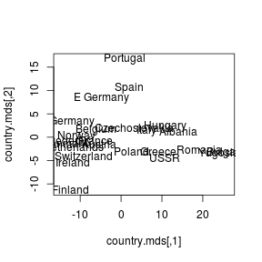

--- .sscode-nowrap .compact #mds2
## MDS on congress vote data
* The example and code are modified from "Machine Learning for Hackers" by Drew Conway and John Myles White (O'Reilly).


```r
library('foreign') ## for loading dta files using read.dta
library('ggplot2')

data.url = 'http://www.yurulin.com/class/spring2015_datamining/data/roll_call'
#data.dir = file.path("data", "roll_call")
#data.files = list.files(data.dir)
data.files = c("sen101kh.dta", "sen102kh.dta",
               "sen103kh.dta", "sen104kh.dta",
               "sen105kh.dta", "sen106kh.dta",
               "sen107kh.dta", "sen108kh_7.dta",
               "sen109kh.dta", "sen110kh_2008.dta",
               "sen111kh.dta")
## Add all roll call vote data frames to a single list
rollcall.data = lapply(data.files,
                       function(f) {
                         read.dta(file.path(data.url, f), convert.factors = FALSE)
                       })
dim(rollcall.data[[1]])
```

```
## [1] 103 647
```

--- .ssscode-nowrap .compact 
## MDS on congress vote data

```r
head(rollcall.data[[1]][,1:12])
```

```
##   cong    id state dist  lstate party eh1 eh2        name V1 V2 V3
## 1  101 99908    99    0 USA       200   0   0 BUSH         1  1  1
## 2  101 14659    41    0 ALABAMA   100   0   1 SHELBY, RIC  1  1  1
## 3  101 14705    41    0 ALABAMA   100   0   1 HEFLIN, HOW  1  1  1
## 4  101 12109    81    0 ALASKA    200   0   1 STEVENS, TH  1  1  1
## 5  101 14907    81    0 ALASKA    200   0   1 MURKOWSKI,   1  1  1
## 6  101 14502    61    0 ARIZONA   100   0   1 DECONCINI,   1  1  1
```

--- .ssscode-nowrap .compact 
## MDS on congress vote data

```r
## @see http://www.voteview.com/senate101.htm'

## This function takes a single data frame of roll call votes and returns a 
## Senator-by-vote matrix.
rollcall.simplified <- function(df) {
  no.pres <- subset(df, state < 99)
  ## to group all Yea and Nay types together
  for(i in 10:ncol(no.pres)) {
    no.pres[,i] = ifelse(no.pres[,i] > 6, 0, no.pres[,i])
    no.pres[,i] = ifelse(no.pres[,i] > 0 & no.pres[,i] < 4, 1, no.pres[,i])
    no.pres[,i] = ifelse(no.pres[,i] > 1, -1, no.pres[,i])
  }
  
  return(as.matrix(no.pres[,10:ncol(no.pres)]))
}

rollcall.simple = lapply(rollcall.data, rollcall.simplified)
```

--- .sscode-nowrap .compact 
## MDS on congress vote data

```r
## Multiply the matrix by its transpose to get Senator-to-Senator tranformation, 
## and calculate the Euclidan distance between each Senator.
rollcall.dist = lapply(rollcall.simple, function(m) dist(m %*% t(m)))

## Do the MDS
rollcall.mds = lapply(rollcall.dist,
                      function(d) as.data.frame((cmdscale(d, k = 2)) * -1))

## Add identification information about Senators back into MDS data frames
congresses = 101:111

for(i in 1:length(rollcall.mds)) {
  names(rollcall.mds[[i]]) = c("x", "y")
  
  congress = subset(rollcall.data[[i]], state < 99)
  
  congress.names = sapply(as.character(congress$name),
                          function(n) strsplit(n, "[, ]")[[1]][1])
  
  rollcall.mds[[i]] = transform(rollcall.mds[[i]],
                                name = congress.names,
                                party = as.factor(congress$party),
                                congress = congresses[i])
}
```

--- .ssscode-nowrap .compact 
## MDS on congress vote data

```r
head(rollcall.mds[[1]])
```

```
##            x        y      name party congress
## 2  -11.44068 293.0001    SHELBY   100      101
## 3  283.82580 132.4369    HEFLIN   100      101
## 4  885.85564 430.3451   STEVENS   200      101
## 5 1714.21327 185.5262 MURKOWSKI   200      101
## 6 -843.58421 220.1038 DECONCINI   100      101
## 7 1594.50998 225.8166    MCCAIN   200      101
```

--- .ssscode-nowrap .compact 
## MDS on congress vote data

```r
## Create a plot of just the 110th Congress
cong.110 <- rollcall.mds[[10]]

base.110 <- ggplot(cong.110, aes(x = x, y = y)) +
  scale_alpha(guide="none") + theme_bw() +
  theme(axis.ticks = element_blank(),
       axis.text.x = element_blank(),
       axis.text.y = element_blank()) +
  xlab("") +
  ylab("") +
  scale_shape(name = "Party", breaks = c("100", "200", "328"),
              labels = c("Dem.", "Rep.", "Ind."), solid = FALSE) +
  scale_color_manual(name = "Party", values = c("100" = "blue",
                                                "200" = "red",
                                                "328"="grey"),
                     breaks = c("100", "200", "328"),
                     labels = c("Dem.", "Rep.", "Ind."))

print(base.110 + geom_point(aes(shape = party, alpha = 0.75),size=4))
```

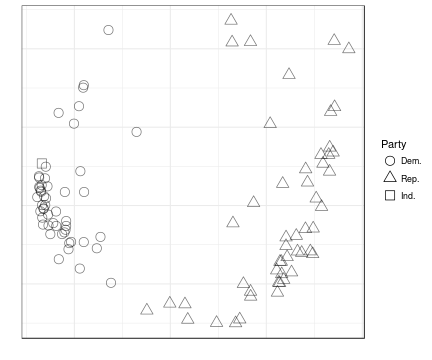

--- .scode-nowrap .compact 
## MDS on congress vote data

```r
print(base.110 + geom_text(aes(color = party,
                               alpha = 0.75,
                               label = cong.110$name),size=4))
```

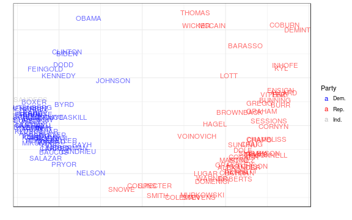

--- .scode-nowrap .compact 
## MDS on congress vote data

```r
## Create a single visualization of MDS for all Congresses on a grid
all.mds <- do.call(rbind, rollcall.mds)
all.plot <- ggplot(all.mds, aes(x = x, y = y)) +
  geom_point(aes(shape = party, alpha = 0.75), size = 2) +
  scale_alpha(guide="none") +
  theme_bw() +
  theme(axis.ticks = element_blank(),
        axis.text.x = element_blank(),
        axis.text.y = element_blank()) +
  xlab("") +
  ylab("") +
  scale_shape(name = "Party",
              breaks = c("100", "200", "328"),
              labels = c("Dem.", "Rep.", "Ind."),
              solid = FALSE) +
  facet_wrap(~ congress)

print(all.plot)
```

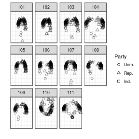

--- .ssscode-nowrap .compact 
## MDS on congress vote data

```r
## plot all congresses and save into images
if (0) { ## not run
  for (i in 1:length(rollcall.mds)) {
    mds <- rollcall.mds[[i]]
    congress <- congresses[i]
    plot.title <- paste("Roll Call Vote MDS Clustering for ",
                        congress, " U.S. Senate", sep = "")
    
    # Build base plot
    mds.plot <- ggplot(mds, aes(x = x, y = y)) +
      scale_alpha(legend = FALSE) +
      theme_bw() +
      opts(axis.ticks = theme_blank(), 
           axis.text.x = theme_blank(),
           axis.text.y = theme_blank(),
           title = plot.title,
           panel.grid.major = theme_blank()) +
      xlab("") +
      ylab("")
    
    # Build up point and text plots separately
    mds.point <- mds.plot + geom_point(aes(shape = party,
                                           alpha = 0.75), size = 2)
    mds.text <- mds.plot + geom_text(aes(color = party,
                                         alpha = 0.75,
                                         label = mds$name),size = 2)
    
    # Fix labels, shapes and colors
    if(length(levels(mds$party)) > 2) {
      mds.point <- mds.point + scale_shape(name = "Party",
                                           breaks = c("100", "200", "328"),
                                           labels = c("Dem.", "Rep.", "Ind."),
                                           solid = FALSE)
      mds.text <- mds.text + scale_color_manual(name = "Party",
                                                values = c("100" = "black",
                                                           "200" = "dimgray",
                                                           "328" = "gray"),
                                                breaks = c("100", "200", "328"),
                                                labels = c("Dem.", "Rep.", "Ind."))
    }
    else {
      mds.point <- mds.point + scale_shape(name = "Party",
                                           breaks = c("100", "200"),
                                           labels = c("Dem.", "Rep."),
                                           solid = FALSE)
      mds.text <- mds.text + scale_color_manual(name = "Party",
                                                values = c("100" = "blue",
                                                           "200" = "red"),
                                                breaks = c("100", "200"),
                                                labels = c("Dem.", "Rep."))
    }
    
    ggsave(plot = mds.point,
           filename = file.path('images_senate_plots',
                                paste(congress, "_point.pdf", sep = "")),
           width = 8,
           height = 5)
    ggsave(plot = mds.text,
           filename = file.path('images_senate_plots',
                                paste(congress, "_names.pdf", sep = "")),
           width = 8,
           height = 5)
  }
}
```

--- .scode-nowrap .compact 
## MDS on congress vote data


--- .scode-nowrap .compact 
## MDS on congress vote data


--- .scode-nowrap .compact 
## MDS on congress vote data

