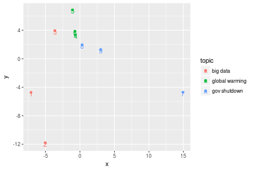

---
title       : Class08
subtitle    : Text Mining
author      : Yu-Ru Lin
job         : 
framework   : shower        # {io2012, html5slides, shower, dzslides, ...}
highlighter : highlight.js  # {highlight.js, prettify, highlight}
hitheme     : tomorrow      # 
widgets     : [mathjax]            # {mathjax, quiz, bootstrap}
mode        : selfcontained # {standalone, draft}
knit        : slidify::knit2slides
toc         : true
toc_depth   : 2

--- #toc
## Class08
  
* [Set up](#set-up)
* [Text processing](#text)
* [LSA](#lsa)
* [LDA](#lda)
* [NMF](#nmf)
* [Text classification](#textclassify)

--- #set-up .modal 

## Install R packages

```r
## this tutorial uses the following packages
```

--- #text .sscode-nowrap .compact
## Text processing

```r
## load libraries
library(tm)
library(lsa)
library(ggplot2)

## prepare a toy example with 9 documents in three topics: big data, global warming, government shutdown
text = c(
  "With all the buzz surrounding big data, the data management practitioner is constantly inundated with information regarding big data technologies.",
  "We create so much data every day that 90 percent of the information in the world today has been created in the last two years alone, according to IBM.",
  "Random algorithms and probabilistic data structures are algorithmically efficient and can provide shockingly good practical results.",
  "Scientists will issue their starkest warning yet about the mounting dangers of global warming.",
  "Scientists are more certain than ever that humans are causing the majority of climate change, a major new report has shown.",
  "There's a consensus among leading scientists that global warming is caused by human activity.",
  "The mood in financial markets was cautious on Monday as the partial shut-down of the American government entered a seventh day and lawmakers appeared to be making little headway in raising the country's debt ceiling.",
  "President Obama must continue to refuse to negotiate policy while the government is shut down. ",
  "The stock market is closing at its lowest level in a month as the U.S. government enters a second week of being partially shut down."
)
```

--- .sscode-nowrap .compact
## Text processing

```r
## give the topic labels
topic = factor(rep(c("big data", "global warming", "gov shutdown"), each = 3))
df = data.frame(text, topic, stringsAsFactors = FALSE)
df[1:3,]
```

```
##                                                                                                                                                     text
## 1     With all the buzz surrounding big data, the data management practitioner is constantly inundated with information regarding big data technologies.
## 2 We create so much data every day that 90 percent of the information in the world today has been created in the last two years alone, according to IBM.
## 3                   Random algorithms and probabilistic data structures are algorithmically efficient and can provide shockingly good practical results.
##      topic
## 1 big data
## 2 big data
## 3 big data
```

```r
dim(df)
```

```
## [1] 9 2
```

--- .sscode-nowrap .compact
## Text processing

```r
## prepare corpus
corpus = Corpus(VectorSource(df$text))
corpus = tm_map(corpus, tolower) ## convert text to lower case
inspect(corpus[1:3])  
```

```
## <<SimpleCorpus>>
## Metadata:  corpus specific: 1, document level (indexed): 0
## Content:  documents: 3
## 
## [1] with all the buzz surrounding big data, the data management practitioner is constantly inundated with information regarding big data technologies.    
## [2] we create so much data every day that 90 percent of the information in the world today has been created in the last two years alone, according to ibm.
## [3] random algorithms and probabilistic data structures are algorithmically efficient and can provide shockingly good practical results.
```

--- .sscode-nowrap .compact
## Text processing

```r
corpus = tm_map(corpus, removePunctuation) ## remove punctuations
inspect(corpus[1:3]) 
```

```
## <<SimpleCorpus>>
## Metadata:  corpus specific: 1, document level (indexed): 0
## Content:  documents: 3
## 
## [1] with all the buzz surrounding big data the data management practitioner is constantly inundated with information regarding big data technologies    
## [2] we create so much data every day that 90 percent of the information in the world today has been created in the last two years alone according to ibm
## [3] random algorithms and probabilistic data structures are algorithmically efficient and can provide shockingly good practical results
```

--- .sscode-nowrap .compact
## Text processing

```r
corpus = tm_map(corpus, removeNumbers) ## remove numbers
inspect(corpus[1:3]) 
```

```
## <<SimpleCorpus>>
## Metadata:  corpus specific: 1, document level (indexed): 0
## Content:  documents: 3
## 
## [1] with all the buzz surrounding big data the data management practitioner is constantly inundated with information regarding big data technologies  
## [2] we create so much data every day that  percent of the information in the world today has been created in the last two years alone according to ibm
## [3] random algorithms and probabilistic data structures are algorithmically efficient and can provide shockingly good practical results
```

--- .sscode-nowrap .compact
## Text processing

```r
corpus = tm_map(corpus, function(x) removeWords(x, stopwords("english"))) ## remove stopwords
inspect(corpus[1:3]) 
```

```
## <<SimpleCorpus>>
## Metadata:  corpus specific: 1, document level (indexed): 0
## Content:  documents: 3
## 
## [1]    buzz surrounding big data  data management practitioner  constantly inundated  information regarding big data technologies
## [2]  create  much data every day   percent   information   world today   created   last two years alone according  ibm           
## [3] random algorithms  probabilistic data structures  algorithmically efficient  can provide shockingly good practical results
```

--- .sscode-nowrap .compact
## Text processing

```r
corpus = tm_map(corpus, stemDocument, language = "english") ## stemming
inspect(corpus[1:3])
```

```
## <<SimpleCorpus>>
## Metadata:  corpus specific: 1, document level (indexed): 0
## Content:  documents: 3
## 
## [1] buzz surround big data data manag practition constant inund inform regard big data technolog    
## [2] creat much data everi day percent inform world today creat last two year alon accord ibm        
## [3] random algorithm probabilist data structur algorithm effici can provid shock good practic result
```

```r
corpus  # check corpus
```

```
## <<SimpleCorpus>>
## Metadata:  corpus specific: 1, document level (indexed): 0
## Content:  documents: 9
```

--- .sscode-nowrap .compact
## Text processing

```r
td.mat = as.matrix(TermDocumentMatrix(corpus))
td.mat[1:3,]
```

```
##           Docs
## Terms      1 2 3 4 5 6 7 8 9
##   big      2 0 0 0 0 0 0 0 0
##   buzz     1 0 0 0 0 0 0 0 0
##   constant 1 0 0 0 0 0 0 0 0
```

```r
dim(td.mat) ## dimension of term-doc matrix
```

```
## [1] 95  9
```

--- .sscode-nowrap .compact
## Text processing

```r
dist.mat = dist(t(as.matrix(td.mat))) ## compute distance matrix
dist.mat  ## check distance matrix
```

```
##          1        2        3        4        5        6        7        8
## 2 5.656854                                                               
## 3 5.567764 5.567764                                                      
## 4 5.656854 5.291503 5.000000                                             
## 5 6.000000 5.656854 5.385165 4.690416                                    
## 6 5.656854 5.291503 5.000000 3.741657 4.242641                           
## 7 6.557439 6.082763 6.000000 5.567764 5.916080 5.567764                  
## 8 5.567764 5.196152 4.898979 4.358899 4.795832 4.358899 5.291503         
## 9 5.830952 5.477226 5.196152 4.690416 5.099020 4.690416 5.000000 4.123106
```

--- .sscode-nowrap .compact
## Text processing

```r
## generate mds plot
doc.mds = cmdscale(dist.mat, k = 2)
data = data.frame(x = doc.mds[, 1], y = doc.mds[, 2], topic = df$topic, id = row.names(df))
ggplot(data, aes(x = x, y = y, color=topic)) + 
  geom_point() + geom_text(aes(x = x, y = y - 0.2, label = id))
```


--- .sscode-nowrap .compact
## Text processing

```r
td.mat.w = lw_tf(td.mat) * gw_idf(td.mat)  ## tf-idf weighting
dist.mat = dist(t(as.matrix(td.mat.w))) ## compute distance matrix

## generate mds plot using new distance matrix
doc.mds = cmdscale(dist.mat, k = 2)
data = data.frame(x = doc.mds[, 1], y = doc.mds[, 2], topic = df$topic, id = row.names(df))
ggplot(data, aes(x = x, y = y, color=topic)) + 
  geom_point() + geom_text(aes(x = x, y = y - 0.2, label = id))
```



--- .sscode-nowrap .compact
## Text processing

```r
## generate wordcloud
library(wordcloud)
m = as.matrix(td.mat)
## calculate the frequency of words
v = sort(rowSums(m), decreasing=TRUE) 
words = names(v)
wc = data.frame(word=words, freq=v)
wc[1:3,]
```

```
##                word freq
## data           data    5
## scientist scientist    3
## govern       govern    3
```

--- .sscode-nowrap .compact
## Text processing

```r
wordcloud(wc$word, wc$freq, min.freq=2)
```


