---
title       : Class10
subtitle    : Network Mining
author      : Yu-Ru Lin
job         : 
framework   : shower        # {io2012, html5slides, shower, dzslides, ...}
highlighter : highlight.js  # {highlight.js, prettify, highlight}
hitheme     : tomorrow      # 
widgets     : [mathjax]            # {mathjax, quiz, bootstrap}
mode        : selfcontained # {standalone, draft}
knit        : slidify::knit2slides
toc         : true
toc_depth   : 2

--- #toc
## Class10
  
* [Set up](#set-up)
* [network representation](#rep)
* [network centrality](#cen)
* [network layout](#layout)
* [network community](#comm)
* [plotting the diameter](#dim)
* [graph with attributes](#attr)

--- #set-up .modal 

## Install R packages

```r
## this tutorial uses the following packages
```

--- #rep .sscode-nowrap 
## network representation

* Network mining using igraph
* adjacency matrices and adjacency lists
* directed and undirected networks


```r
library(igraph)

## create a toy matrix
m = matrix(nrow=3,ncol=3)
m[1,1]=0
m[1,2]=1
m[1,3]=1
m[2,1]=1
m[2,2]=0
m[2,3]=0
m[3,1]=0
m[3,2]=1
m[3,3]=0
m
```

```
##      [,1] [,2] [,3]
## [1,]    0    1    1
## [2,]    1    0    0
## [3,]    0    1    0
```

--- #rep .scode-nowrap .compact
## network representation

```r
lab = c('a','b','c') ## label nodes as 'a','b','c'
## create directed graph from the toy matrix
g = graph.adjacency(m,mode="directed") 
g
```

```
## IGRAPH fa75bfc D--- 3 4 -- 
## + edges from fa75bfc:
## [1] 1->2 1->3 2->1 3->2
```

--- .scode-nowrap .compact
## network representation

```r
set.seed(1) ## reset random seed before drawing
plot(g,vertex.label=lab,edge.color='black')
```

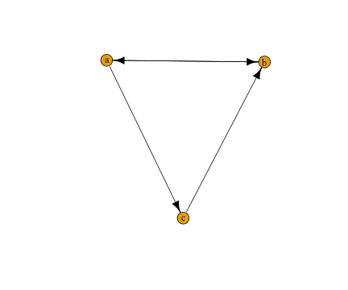

---  .scode-nowrap .compact
## network representation

```r
adj = get.adjacency(g)
adj
```

```
## 3 x 3 sparse Matrix of class "dgCMatrix"
##           
## [1,] . 1 1
## [2,] 1 . .
## [3,] . 1 .
```

---  .scode-nowrap .compact
## network representation

```r
el = get.edgelist(g)
el
```

```
##      [,1] [,2]
## [1,]    1    2
## [2,]    1    3
## [3,]    2    1
## [4,]    3    2
```

---  .scode-nowrap .compact
## network representation

```r
degree(g)
```

```
## [1] 3 3 2
```

```r
degree(g, mode="in")
```

```
## [1] 1 2 1
```

```r
degree(g, mode="out")
```

```
## [1] 2 1 1
```

```r
colSums(m) ## in-degree
```

```
## [1] 1 2 1
```

```r
rowSums(m) ## out-degree
```

```
## [1] 2 1 1
```

---  .scode-nowrap .compact
## network representation

```r
## how far apart?
shortest.paths(g, mode='out')
```

```
##      [,1] [,2] [,3]
## [1,]    0    1    1
## [2,]    1    0    2
## [3,]    2    1    0
```

```r
diameter(g)
```

```
## [1] 2
```

```r
average.path.length(g,directed=T) ## 8/6
```

```
## [1] 1.333333
```

---  .scode-nowrap .compact
## network representation

```r
## how dense are they?
graph.density(g) ## 4/6
```

```
## [1] 0.6666667
```

```r
## connected components of a graph
clusters(g)
```

```
## $membership
## [1] 1 1 1
## 
## $csize
## [1] 3
## 
## $no
## [1] 1
```

---  .scode-nowrap .compact
## network representation

```r
## create undirected graph from the same matrix
g = graph.adjacency(m,mode="undirected") 
g
```

```
## IGRAPH 18791e0 U--- 3 3 -- 
## + edges from 18791e0:
## [1] 1--2 1--3 2--3
```

---  .scode-nowrap .compact
## network representation

```r
set.seed(1)
plot(g,vertex.label=lab,edge.color='black')
```

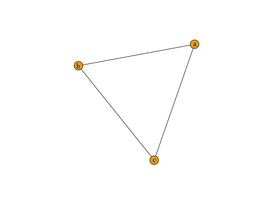

---  .scode-nowrap .compact
## network representation

```r
adj = get.adjacency(g)
adj
```

```
## 3 x 3 sparse Matrix of class "dgCMatrix"
##           
## [1,] . 1 1
## [2,] 1 . 1
## [3,] 1 1 .
```

---  .scode-nowrap .compact
## network representation

```r
el = get.edgelist(g)
el
```

```
##      [,1] [,2]
## [1,]    1    2
## [2,]    1    3
## [3,]    2    3
```

--- #cen .scode-nowrap .modal
## network centrality

* degree centrality
* closeness centrality
* betweenness centrality
* PageRank
* HITS (authority and hub scores)


```r
## KARATE network.
## Zachary's karate club: social network of friendships between 34 members of a karate club at a US university in the 1970s. Please cite W. W. Zachary, An information flow model for conflict and fission in small groups, Journal of Anthropological Research 33, 452-473 (1977).

## load the famous karate network from igraph package
g = graph.famous("Zachary")
g
```

```
## IGRAPH 2ef41ef U--- 34 78 -- Zachary
## + attr: name (g/c)
## + edges from 2ef41ef:
##  [1]  1-- 2  1-- 3  1-- 4  1-- 5  1-- 6  1-- 7  1-- 8  1-- 9  1--11  1--12
## [11]  1--13  1--14  1--18  1--20  1--22  1--32  2-- 3  2-- 4  2-- 8  2--14
## [21]  2--18  2--20  2--22  2--31  3-- 4  3-- 8  3--28  3--29  3--33  3--10
## [31]  3-- 9  3--14  4-- 8  4--13  4--14  5-- 7  5--11  6-- 7  6--11  6--17
## [41]  7--17  9--31  9--33  9--34 10--34 14--34 15--33 15--34 16--33 16--34
## [51] 19--33 19--34 20--34 21--33 21--34 23--33 23--34 24--26 24--28 24--33
## [61] 24--34 24--30 25--26 25--28 25--32 26--32 27--30 27--34 28--34 29--32
## [71] 29--34 30--33 30--34 31--33 31--34 32--33 32--34 33--34
```

--- .scode-nowrap .compact
## network centrality

```r
set.seed(1)
E(g)$color = "black"
plot(g)
```

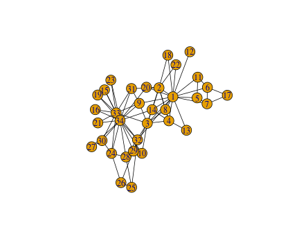

--- .scode-nowrap .compact
## network centrality

```r
## obtain node degrees
deg = degree(g)
deg
```

```
##  [1] 16  9 10  6  3  4  4  4  5  2  3  1  2  5  2  2  2  2  2  3  2  2  2
## [24]  5  3  3  2  4  3  4  4  6 12 17
```

```r
top = order(deg,decreasing=T)[1:5] ## the top-5 nodes with highest degrees
top 
```

```
## [1] 34  1 33  3  2
```

--- .sscode-nowrap .compact
## network centrality

```r
## size node by degree
V(g)$size = abs(deg) * 1.5
V(g)$label.color = "black"
E(g)$color = "black"
V(g)[ top ]$label.color = "red" ## highlight the top-5 nodes
set.seed(1)
plot(g)
title("degree centrality")
```


--- .scode-nowrap .compact
## network centrality

```r
## compute node closeness centrality
clo = closeness(g)
clo
```

```
##  [1] 0.01724138 0.01470588 0.01694915 0.01408451 0.01149425 0.01162791
##  [7] 0.01162791 0.01333333 0.01562500 0.01315789 0.01149425 0.01111111
## [13] 0.01123596 0.01562500 0.01123596 0.01123596 0.00862069 0.01136364
## [19] 0.01123596 0.01515152 0.01123596 0.01136364 0.01123596 0.01190476
## [25] 0.01136364 0.01136364 0.01098901 0.01388889 0.01369863 0.01162791
## [31] 0.01388889 0.01639344 0.01562500 0.01666667
```

--- .sscode-nowrap .compact
## network centrality

```r
top = order(clo,decreasing=T)[1:5]

## size node by closeness
V(g)$size = abs(clo) * 1000
V(g)$label.color = "black"
V(g)[ top ]$label.color = "red" ## highlight the top-5 nodes
set.seed(1)
plot(g)
title("closeness")
```

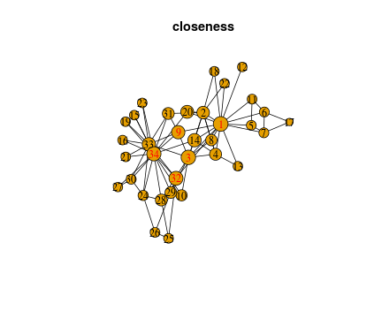

--- .scode-nowrap .compact
## network centrality

```r
## compute node betweenness centrality
bet = betweenness(g)
bet
```

```
##  [1] 231.0714286  28.4785714  75.8507937   6.2880952   0.3333333
##  [6]  15.8333333  15.8333333   0.0000000  29.5293651   0.4476190
## [11]   0.3333333   0.0000000   0.0000000  24.2158730   0.0000000
## [16]   0.0000000   0.0000000   0.0000000   0.0000000  17.1468254
## [21]   0.0000000   0.0000000   0.0000000   9.3000000   1.1666667
## [26]   2.0277778   0.0000000  11.7920635   0.9476190   1.5428571
## [31]   7.6095238  73.0095238  76.6904762 160.5515873
```

--- .sscode-nowrap .compact
## network centrality

```r
top = order(bet,decreasing=T)[1:5]

## size node by betweenness
V(g)$size = abs(bet) * 0.1
V(g)$label.color = "black"
V(g)[ top ]$label.color = "red" ## highlight the top-5 nodes
set.seed(1)
plot(g)
title("betweenness")
```


--- .scode-nowrap .compact
## network centrality

```r
pg = page.rank(g)$vector
pg
```

```
##  [1] 0.096997285 0.052876924 0.057078509 0.035859858 0.021977952
##  [6] 0.029111155 0.029111155 0.024490497 0.029766056 0.014309397
## [11] 0.021977952 0.009564745 0.014644892 0.029536456 0.014535994
## [16] 0.014535994 0.016784005 0.014558677 0.014535994 0.019604636
## [21] 0.014535994 0.014558677 0.014535994 0.031522515 0.021076034
## [26] 0.021006197 0.015044038 0.025639767 0.019573459 0.026288538
## [31] 0.024590155 0.037158087 0.071693226 0.100919182
```

--- .sscode-nowrap .compact
## network centrality

```r
top = order(pg,decreasing=T)[1:5]

## size node by pagerank
V(g)$size = abs(pg) * 250
V(g)$label.color = "black"
V(g)[ top ]$label.color = "red" ## highlight the top-5 nodes
set.seed(1)
plot(g)
title("PageRank")
```


--- .sscode-nowrap .compact
## network centrality

```r
## compute HITS
aut = authority.score(g)$vector
top = order(aut,decreasing=T)[1:5]

## size node by authority scores
V(g)$size = abs(aut) * 20
V(g)$label.color = "black"
V(g)[ top ]$label.color = "red" ## highlight the top-5 nodes
set.seed(1)
plot(g)
title("HITS (authority)")
```

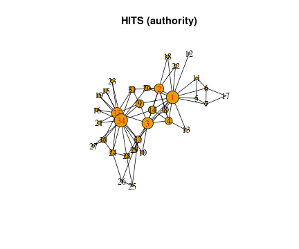

--- .sscode-nowrap .compact
## network centrality

```r
hub = hub.score(g)$vector 
top = order(hub,decreasing=T)[1:5]

## size node by hub scores
V(g)$size = abs(aut) * 20
V(g)$label.color = "black"
V(g)[ top ]$label.color = "red" ## highlight the top-5 nodes
set.seed(1)
plot(g)
title("HITS (hub)")
```

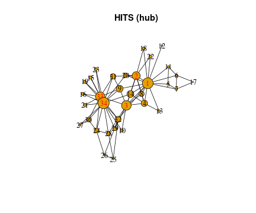

--- .scode-nowrap .compact
## network centrality

```r
## apply HITS on the toy matrix (directed network)
m
```

```
##      [,1] [,2] [,3]
## [1,]    0    1    1
## [2,]    1    0    0
## [3,]    0    1    0
```

```r
lab = c('a','b','c') ## label nodes as 'a','b','c'
## create directed graph from the toy matrix
g = graph.adjacency(m,mode="directed") 
g
```

```
## IGRAPH 62169c1 D--- 3 4 -- 
## + edges from 62169c1:
## [1] 1->2 1->3 2->1 3->2
```

--- .sscode-nowrap .compact
## network centrality

```r
aut = authority.score(g)$vector
top = order(aut,decreasing=T)[1]

## size node by authority scores
V(g)$size = abs(aut) * 30
V(g)$label.color = "black"
V(g)[ top ]$label.color = "red" ## highlight the top-5 nodes
set.seed(1)
plot(g,edge.color='black')
title("HITS (authority)")
```


--- .sscode-nowrap .compact
## network centrality

```r
hub = hub.score(g)$vector 
top = order(hub,decreasing=T)[1]

## size node by hub scores
V(g)$size = abs(hub) * 30
V(g)$label.color = "black"
V(g)[ top ]$label.color = "red" ## highlight the top-5 nodes
set.seed(1)
plot(g,edge.color='black')
title("HITS (hub)")
```

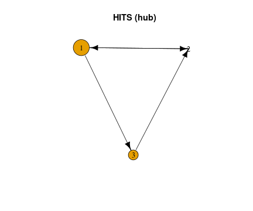

--- #layout .scode-nowrap .compact
## network layout

```r
## load the famous karate network from igraph package
g = graph.famous("Zachary")
E(g)$color = "black"

set.seed(1)
plot(g, layout=layout.random, main='random')
```

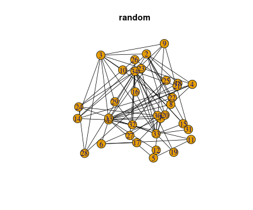

--- .scode-nowrap .compact
## network layout

```r
set.seed(1)
plot(g, layout=layout.kamada.kawai, main='kamada kawai (KK)')
```

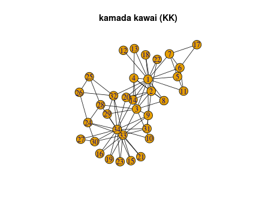

--- .scode-nowrap .compact
## network layout

```r
set.seed(1)
plot(g, layout=layout.circle, main = 'circle')
```

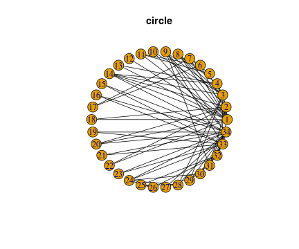

--- .scode-nowrap .compact
## network layout

```r
set.seed(1)
plot(g, layout=layout.fruchterman.reingold, main = 'fruchterman reingold (FR)')
```

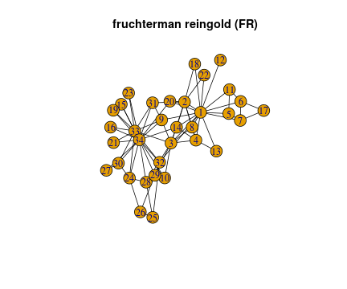

--- .scode-nowrap .compact
## network layout

```r
set.seed(1)
plot(g, layout=layout.lgl, main = 'lgl')
```

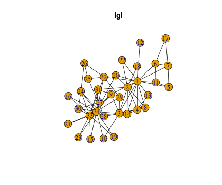

--- .scode-nowrap .compact
## network layout

```r
set.seed(1)
plot(g, layout=layout.graphopt, main = 'graphopt')
```

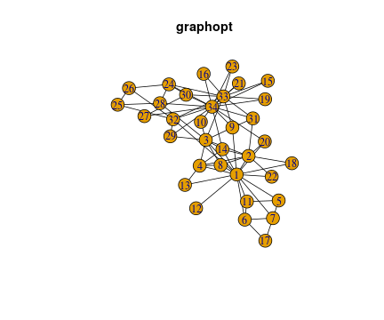

--- #comm .scode-nowrap .compact
## network community
 * modularity
 * random walk
 * spin-glass
 * eigenvector
 * ...

```r
g = graph.famous("Zachary")

## get random-walk community
wc = walktrap.community(g)
modularity(wc)
```

```
## [1] 0.3532216
```

```r
membership(wc)
```

```
##  [1] 1 1 2 1 5 5 5 1 2 2 5 1 1 2 3 3 5 1 3 1 3 1 3 4 4 4 3 4 2 3 2 2 3 3
```

--- .scode-nowrap .compact
## network community

```r
set.seed(1)
plot(wc, g, main='random-walk community')
```


--- .scode-nowrap .compact
## network community

```r
dend = as.dendrogram(wc, use.modularity=TRUE)
plot(dend, nodePar=list(pch=c(NA, 20)))
```


--- .scode-nowrap .compact
## network community

```r
dendPlot(wc)
```


--- .scode-nowrap .compact
## network community

```r
## get modularity-based community
fc = fastgreedy.community(g)
modularity(fc)
```

```
## [1] 0.3806706
```

```r
membership(fc)
```

```
##  [1] 1 3 3 3 1 1 1 3 2 3 1 1 3 3 2 2 1 3 2 1 2 3 2 2 2 2 2 2 2 2 2 2 2 2
```

--- .scode-nowrap .compact
## network community

```r
set.seed(1)
plot(fc, g, main='modularity community')
```

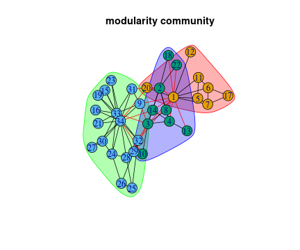

--- .scode-nowrap .compact
## network community

```r
dendPlot(fc)
```

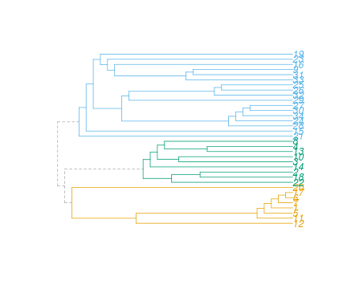

--- .scode-nowrap .compact
## network community

```r
sg = spinglass.community(g)
modularity(sg)
```

```
## [1] 0.4197896
```

```r
set.seed(1)
plot(sg, g, main='spin-glass community')
```

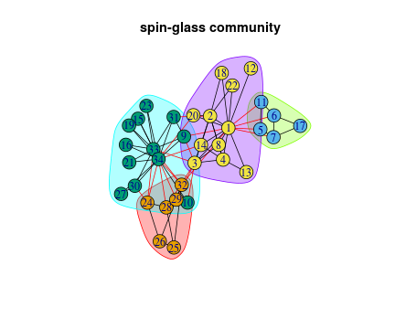

--- .scode-nowrap .compact
## network community

```r
le = leading.eigenvector.community(g)
modularity(sg)
```

```
## [1] 0.4197896
```

```r
set.seed(1)
plot(le, g, main='eigenvector community')
```


--- .scode-nowrap .compact
## network community

```r
## compare the simlarity between two community assignment
## @see http://hosho.ees.hokudai.ac.jp/~kubo/Rdoc/library/igraph/html/compare.communities.html
compare(sg, le, method="rand")
```

```
## [1] 0.9500891
```

```r
compare(sg, le, method="nmi")
```

```
## [1] 0.896476
```

```r
compare(membership(sg), membership(le), method="rand")
```

```
## [1] 0.9500891
```

--- .scode-nowrap .compact
## network community

```r
## highlight between-community edges
le = leading.eigenvector.community(g,steps=1)
le
```

```
## IGRAPH clustering leading eigenvector, groups: 2, mod: 0.37
## + groups:
##   $`1`
##    [1]  1  2  3  4  5  6  7  8 11 12 13 14 17 18 20 22
##   
##   $`2`
##    [1]  9 10 15 16 19 21 23 24 25 26 27 28 29 30 31 32 33 34
## 
```

```r
V(g)$color = ifelse(le$membership==1, "lightblue", "green")

scale <- function(v, a, b) {
  v = v-min(v) ; v = v/max(v) ; v = v * (b-a) ; v+a
}

V(g)$size = scale(sapply(le$eigenvector,abs), 10, 20)
E(g)$color = "grey"
E(g)[ V(g)[ color=="lightblue" ] %--% V(g)[ color=="green" ] ]$color = "red"
set.seed(1)
plot(g, layout=layout.kamada.kawai, vertex.label.font=2)
```


--- #dim .scode-nowrap .compact
## plotting the diameter

```r
## load the karet network from file (in pajek format)
ifilename = 'http://igraph.sourceforge.net/karate.net'
## url.show(ifilename)
g = read.graph(ifilename, format="pajek")
```

```
## Error in read.graph.pajek(file, ...): At foreign.c:586 : Parse error in Pajek file, line 1 (syntax error, unexpected NEWLINE, expecting VERTICESLINE), Parse error
```

--- .scode-nowrap .compact
## plotting the diameter

