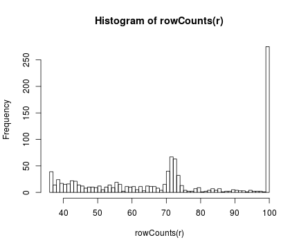

---
title       : Class11
subtitle    : Recommendation
author      : Yu-Ru Lin
job         : 
framework   : shower        # {io2012, html5slides, shower, dzslides, ...}
highlighter : highlight.js  # {highlight.js, prettify, highlight}
hitheme     : tomorrow      # 
widgets     : [mathjax]            # {mathjax, quiz, bootstrap}
mode        : selfcontained # {standalone, draft}
knit        : slidify::knit2slides
toc         : true
toc_depth   : 2

--- #toc
## Class11
  
* [Set up](#set-up)
* [Data manipulation](#data)
* [Sample dataset](#sample)
* [Recommender System](#recommender)
* [Evaluation](#eval)

--- #set-up .modal 

## Install R packages

```r
## this tutorial uses the following packages
install.packages('recommenderlab')
```

--- .compact
## Recommendation

* The sample code is based on the examples given in http://cran.r-project.org/web/packages/recommenderlab/vignettes/recommenderlab.pdf
* See information about the installation and more details about what the package can do in the manual.


```r
library(recommenderlab)
```

--- .scode-nowrap .compact #data
## Data manipulation


```r
## create a toy reating matrix
m = matrix(sample(c(as.numeric(0:5), NA), 50,
                  replace=TRUE, prob=c(rep(.4/6,6),.6)), ncol=10,
           dimnames=list(user=paste("u", 1:5, sep=''),
                         item=paste("i", 1:10, sep='')))
m
```

```
##     item
## user i1 i2 i3 i4 i5 i6 i7 i8 i9 i10
##   u1 NA NA NA  3 NA NA NA NA  1  NA
##   u2 NA NA NA NA NA NA NA  3 NA   4
##   u3  3  3 NA NA  4  0  3  4 NA   4
##   u4  1 NA NA NA  5 NA  1 NA NA  NA
##   u5 NA NA NA NA NA NA NA  3 NA   0
```

--- .sscode-nowrap .compact 
## Data manipulation


```r
r = as(m, "realRatingMatrix") ## store the matrix in sparse format
r
```

```
## 5 x 10 rating matrix of class 'realRatingMatrix' with 16 ratings.
```

```r
## The realRatingMatrix can be coerced back into a matrix which is identical to the original matrix
identical(as(r, "matrix"),m)
```

```
## [1] TRUE
```

--- .sscode-nowrap .compact
## Data manipulation


```r
## a list of users
as(r, "list")
```

```
## $u1
## i4 i9 
##  3  1 
## 
## $u2
##  i8 i10 
##   3   4 
## 
## $u3
##  i1  i2  i5  i6  i7  i8 i10 
##   3   3   4   0   3   4   4 
## 
## $u4
## i1 i5 i7 
##  1  5  1 
## 
## $u5
##  i8 i10 
##   3   0
```

--- .sscode-nowrap .compact
## Data manipulation


```r
## rating data in data.frame format
head(as(r, "data.frame"))
```

```
##    user item rating
## 4    u1   i4      3
## 13   u1   i9      1
## 10   u2   i8      3
## 14   u2  i10      4
## 1    u3   i1      3
## 3    u3   i2      3
```

--- .sscode-nowrap .compact
## Data manipulation


```r
## normalization: remove rating bias by subtracting the row mean from all ratings in the row
r_m = normalize(r)
r_m
```

```
## 5 x 10 rating matrix of class 'realRatingMatrix' with 16 ratings.
## Normalized using center on rows.
```

```r
getRatingMatrix(r_m)
```

```
## 5 x 10 sparse Matrix of class "dgCMatrix"
##                                                      
## u1  .        . . 1 .         .  .         .   -1  .  
## u2  .        . . . .         .  .        -0.5  .  0.5
## u3  0.000000 0 . . 1.000000 -3  0.000000  1.0  .  1.0
## u4 -1.333333 . . . 2.666667  . -1.333333  .    .  .  
## u5  .        . . . .         .  .         1.5  . -1.5
```

--- .scode-nowrap .compact
## Data manipulation


```r
r_z = normalize(r,method="Z-score")
r_z
```

```
## 5 x 10 rating matrix of class 'realRatingMatrix' with 16 ratings.
## Normalized using z-score on rows.
```

--- .scode-nowrap .compact
## Data manipulation


```r
## visualize the matrices
image(r, main = "Raw Ratings")
```


--- .scode-nowrap .compact
## Data manipulation


```r
image(r_m, main = "Normalized Ratings")
```


--- .scode-nowrap .compact
## Data manipulation


```r
image(r_z, main = "Normalized Ratings (Z-score)")
```


--- .sscode-nowrap .compact
## Data manipulation


```r
## Binarization: transform the real-valued matrix into a 0-1 matrix based on a user specified threshold (min_ratings)
r_b = binarize(r, minRating=4)
as(r_b, "matrix")
```

```
##       i1    i2    i3    i4    i5    i6    i7    i8    i9   i10
## u1 FALSE FALSE FALSE FALSE FALSE FALSE FALSE FALSE FALSE FALSE
## u2 FALSE FALSE FALSE FALSE FALSE FALSE FALSE FALSE FALSE  TRUE
## u3 FALSE FALSE FALSE FALSE  TRUE FALSE FALSE  TRUE FALSE  TRUE
## u4 FALSE FALSE FALSE FALSE  TRUE FALSE FALSE FALSE FALSE FALSE
## u5 FALSE FALSE FALSE FALSE FALSE FALSE FALSE FALSE FALSE FALSE
```

--- .scode-nowrap .compact #sample
## Sample dataset


```r
## load the Jester5k data: it contains a sample of 5000 users from the anonymous ratings data from the Jester Online Joke Recommender System collected between April 1999 and May 2003 (Goldberg, Roeder, Gupta, and Perkins, 2001).

data(Jester5k)
Jester5k
```

```
## 5000 x 100 rating matrix of class 'realRatingMatrix' with 362106 ratings.
```

--- .sscode-nowrap .compact
## Sample dataset


```r
set.seed(1234) ## reset random seed before sampling

## use only a subset of the data containing a sample of 1000 users
r = sample(Jester5k, 1000)

## the ratings for the first user
rowCounts(r[1,])
```

```
## u5092 
##    70
```

```r
as(r[1,], "list")
```

```
## $u5092
##    j1    j2    j3    j4    j5    j6    j7    j8    j9   j10   j11   j12 
## -3.40 -3.40 -1.99  1.31 -4.03 -0.15 -4.22 -4.56 -4.37 -0.34  0.53 -5.87 
##   j13   j14   j15   j16   j17   j18   j19   j20   j21   j22   j23   j24 
## -2.57 -5.39  0.44 -3.98 -3.35 -4.03 -4.03 -0.29 -3.79 -3.59  0.05 -6.94 
##   j25   j26   j27   j28   j29   j30   j31   j32   j33   j34   j35   j36 
## -0.53 -2.57  1.80 -5.87  2.14 -4.42 -1.70  0.68 -7.82 -0.49 -0.92  2.38 
##   j37   j38   j39   j40   j41   j42   j43   j44   j45   j46   j47   j48 
## -7.96 -5.15 -5.87 -7.23 -4.37 -2.33 -5.15  0.34  3.40 -1.60 -2.04 -3.11 
##   j49   j50   j51   j52   j53   j54   j55   j56   j57   j58   j59   j60 
##  2.82  2.96 -3.35  1.07  0.10 -6.99  0.78 -2.57 -6.75 -6.60 -4.51  1.46 
##   j61   j62   j63   j64   j65   j66   j67   j68   j69   j70 
## -1.55  1.12 -7.48 -7.96  2.52  0.49 -3.25 -1.21  2.18 -5.87
```

--- .scode-nowrap .compact
## Sample dataset


```r
rowMeans(r[1,])
```

```
## Error in rowMeans(r[1, ]): 'x' must be an array of at least two dimensions
```

```r
## The user has rated 70 jokes
## the list shows the ratings and the user's rating average

rowMeans(as(r[1,], "matrix"),na.rm=TRUE)
```

```
##     u5092 
## -2.413429
```

--- .scode-nowrap .compact
## Sample dataset


```r
## generate a histogram to show the distribution of the ratings
hist(getRatings(r), breaks=100)
```


--- .scode-nowrap .compact
## Sample dataset


```r
## the distribution after normalization
hist(getRatings(normalize(r)), breaks=100)
```


--- .scode-nowrap .compact
## Sample dataset


```r
hist(getRatings(normalize(r, method="Z-score")), breaks=100)
```


--- .scode-nowrap .compact
## Sample dataset


```r
## how many jokes each user has rated
hist(rowCounts(r), breaks=50)
```



--- .scode-nowrap .compact
## Sample dataset


```r
## the mean rating for each joke
hist(colMeans(r), breaks=20)
```

```
## Error in colMeans(r): 'x' must be an array of at least two dimensions
```

```r
#hist(colMeans(as(r, "matrix")), breaks=20)
```

--- .scode-nowrap .compact #recommender
## Recommender System


```r
## (training) create a recommender which generates recommendations solely on the popularity of items (the number of users who have the item in their profile)
r = Recommender(Jester5k[1:1000], method = "POPULAR")
r
```

```
## Recommender of type 'POPULAR' for 'realRatingMatrix' 
## learned using 1000 users.
```

```r
## get the model by getModel()
names(getModel(r))
```

```
## [1] "topN"                  "ratings"               "normalize"            
## [4] "aggregationRatings"    "aggregationPopularity" "verbose"
```

--- .sscode-nowrap .compact
## Recommender System


```r
getModel(r)$topN
```

```
## Recommendations as 'topNList' with n = 100 for 1 users.
```

```r
## (prediction) create top-5 recommendation lists for two users who were not used to learn the model
recom = predict(r, Jester5k[1001:1002], n=5)
recom
```

```
## Recommendations as 'topNList' with n = 5 for 2 users.
```

```r
as(recom, "list")
```

```
## $u20089
## [1] "j89" "j72" "j47" "j93" "j76"
## 
## $u11691
## [1] "j89" "j93" "j76" "j88" "j96"
```

--- .scode-nowrap .compact
## Recommender System


```r
## extract sublists of the best items in the top-N
recom3 = bestN(recom, n = 3)
recom3
```

```
## Recommendations as 'topNList' with n = 3 for 2 users.
```

```r
as(recom3, "list")
```

```
## $u20089
## [1] "j89" "j72" "j47"
## 
## $u11691
## [1] "j89" "j93" "j76"
```

--- .scode-nowrap .compact
## Recommender System


```r
## predict ratings
recom = predict(r, Jester5k[1001:1002], type="ratings")
recom
```

```
## 2 x 100 rating matrix of class 'realRatingMatrix' with 97 ratings.
```

```r
as(recom, "matrix")[,1:10] 
```

```
##               j1        j2         j3        j4 j5 j6 j7 j8        j9
## u20089 -1.013133 -1.631921 -1.8756885 -3.684513 NA NA NA NA -2.742669
## u11691        NA        NA -0.6376646 -2.446489 NA NA NA NA -1.504646
##               j10
## u20089 -0.8324626
## u11691         NA
```

```r
## The prediction contains NA for the items rated by the active users
```

--- .scode-nowrap .compact #eval
## Evaluation


```r
## evaluation scheme -- determines what and how data is used for training and evaluation;
## splits the first 1000 users in Jester5k into a training set (90%) and a test set (10%)
e = evaluationScheme(Jester5k[1:1000], method="split", train=0.9, given=15, goodRating=5)
e
```

```
## Evaluation scheme with 15 items given
## Method: 'split' with 1 run(s).
## Training set proportion: 0.900
## Good ratings: >=5.000000
## Data set: 1000 x 100 rating matrix of class 'realRatingMatrix' with 72358 ratings.
```

--- .scode-nowrap .compact
## Evaluation


```r
## create a user-based collaborative filtering
r1 = Recommender(getData(e, "train"), "UBCF")
r1
```

```
## Recommender of type 'UBCF' for 'realRatingMatrix' 
## learned using 900 users.
```

```r
## create an item-based collaborative filtering
r2 = Recommender(getData(e, "train"), "IBCF")
r2
```

```
## Recommender of type 'IBCF' for 'realRatingMatrix' 
## learned using 900 users.
```

```r
## compute predicted ratings for the known part (rated items) of the test data (15 items for each user)
p1 = predict(r1, getData(e, "known"), type="ratings")
p1
```

```
## 100 x 100 rating matrix of class 'realRatingMatrix' with 8500 ratings.
```

```r
p2 = predict(r2, getData(e, "known"), type="ratings")
p2
```

```
## 100 x 100 rating matrix of class 'realRatingMatrix' with 8465 ratings.
```

--- .scode-nowrap .compact
## Evaluation


--- .scode-nowrap .compact
## Evaluation


