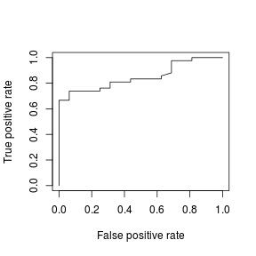
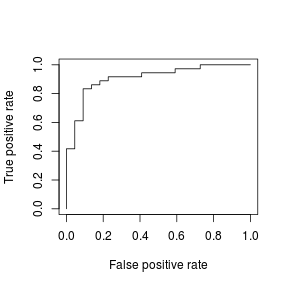
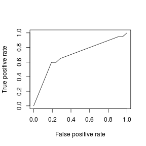
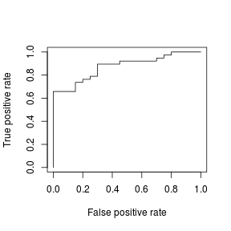
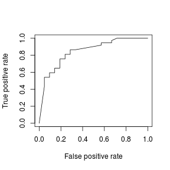
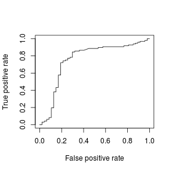
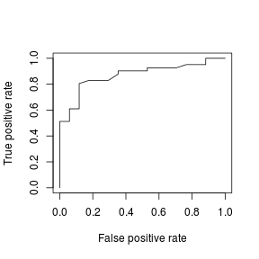
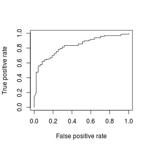
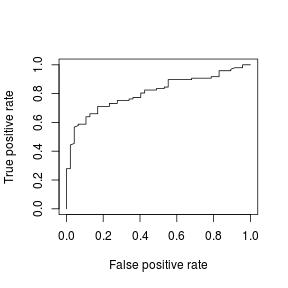

---
title       : hw3 sample
subtitle    : 
author      : Yu-Ru Lin
job         : 
framework   : shower        # {io2012, html5slides, shower, dzslides, ...}
highlighter : highlight.js  # {highlight.js, prettify, highlight}
hitheme     : tomorrow      # 
widgets     : [mathjax]            # {mathjax, quiz, bootstrap}
mode        : selfcontained # {standalone, draft}
knit        : slidify::knit2slides
toc         : true
toc_depth   : 2

--- #set-up .modal 

## Install R packages

```r
## this tutorial uses the following packages
```

--- .sscode-nowrap .compact 
## 

```r
library(MASS) # for the example dataset 
library(plyr) # for recoding data
library(ROCR) # for plotting roc
library(e1071) # for NB and SVM
library(rpart) # for decision tree
library(ada) # for adaboost

set.seed(12345) # set the seed so you can get exactly the same results whenever you run the code
```

--- .ssscode-nowrap .compact 
## 

```r
do.classification <- function(train.set, test.set, 
                              cl.name, verbose=F) {
  ## note: to plot ROC later, we want the raw probabilities,
  ## not binary decisions
  switch(cl.name, 
         knn = { # here we test k=3; you should evaluate different k's
           prob = knn(train.set[,-1], test.set[,-1], cl=train.set[,1], k = 3, prob=T)
           prob = attr(prob,"prob")
           #print(cbind(prob,as.character(test.set$y)))
           prob
         },
         lr = { # logistic regression
           model = glm(y~., family=binomial, data=train.set)
           if (verbose) {
             print(summary(model))             
           }
           prob = predict(model, newdata=test.set, type="response") 
           #print(cbind(prob,as.character(test.set$y)))
           prob
         },
         nb = {
           model = naiveBayes(y~., data=train.set)
           prob = predict(model, newdata=test.set, type="raw") 
           #print(cbind(prob,as.character(test.set$y)))
           prob = prob[,2]/rowSums(prob) # renormalize the prob.
           prob
         },
         dtree = {
           model = rpart(y~., data=train.set)
           if (verbose) {
             print(summary(model)) # detailed summary of splits
             printcp(model) # print the cross-validation results
             plotcp(model) # visualize the cross-validation results
             ## plot the tree
             plot(model, uniform=TRUE, main="Classification Tree")
             text(model, use.n=TRUE, all=TRUE, cex=.8)
           }           
           prob = predict(model, newdata=test.set)
           
           if (0) { # here we use the default tree, 
             ## you should evaluate different size of tree
             ## prune the tree 
             pfit<- prune(model, cp=model$cptable[which.min(model$cptable[,"xerror"]),"CP"])
             prob = predict(pfit, newdata=test.set)
             ## plot the pruned tree 
             plot(pfit, uniform=TRUE,main="Pruned Classification Tree")
             text(pfit, use.n=TRUE, all=TRUE, cex=.8)             
           }
           #print(cbind(prob,as.character(test.set$y)))
           prob = prob[,2]/rowSums(prob) # renormalize the prob.
           prob
         },
         svm = {
           model = svm(y~., data=train.set, probability=T)
           if (0) { # fine-tune the model with different kernel and parameters
             ## evaluate the range of gamma parameter between 0.000001 and 0.1
             ## and cost parameter from 0.1 until 10
             tuned <- tune.svm(y~., data = train.set, 
                               kernel="radial", 
                               gamma = 10^(-6:-1), cost = 10^(-1:1))
             #print(summary(tuned))
             gamma = tuned[['best.parameters']]$gamma
             cost = tuned[['best.parameters']]$cost
             model = svm(y~., data = train.set, probability=T, 
                         kernel="radial", gamma=gamma, cost=cost)                        
           }
           prob = predict(model, newdata=test.set, probability=T)
           prob = attr(prob,"probabilities")
           #print(cbind(prob,as.character(test.set$y)))
           #print(dim(prob))
           prob = prob[,which(colnames(prob)==1)]/rowSums(prob)
           prob
         },
         ada = {
           model = ada(y~., data = train.set)
           prob = predict(model, newdata=test.set, type='probs')
           #print(cbind(prob,as.character(test.set$y)))
           prob = prob[,2]/rowSums(prob)
           prob
         }
  ) 
}
```

--- .ssscode-nowrap .compact 
## 

```r
pre.test <- function(dataset, cl.name, r=0.6, prob.cutoff=0.5) {
  ## Let's use 60% random sample as training and remaining as testing
  ## by default use 0.5 as cut-off
  n.obs <- nrow(dataset) # no. of observations in dataset
  n.train = floor(n.obs*r)
  train.idx = sample(1:n.obs,n.train)
  train.idx
  train.set = dataset[train.idx,]
  test.set = dataset[-train.idx,]
  cat('pre-test',cl.name,':',
      '#training:',nrow(train.set),
      '#testing',nrow(test.set),'\n')
  prob = do.classification(train.set, test.set, cl.name)
  # prob is an array of probabilities for cases being positive
  
  ## get confusion matrix
  predicted = as.numeric(prob > prob.cutoff)
  actual = test.set$y
  confusion.matrix = table(actual,factor(predicted,levels=c(0,1)))
  error = (confusion.matrix[1,2]+confusion.matrix[2,1]) / nrow(test.set)  
  cat('error rate:',error,'\n')
  # you may compute other measures based on confusion.matrix
  # @see handout03 p.30-
  
  ## plot ROC
  result = data.frame(prob,actual)
  pred = prediction(result$prob,result$actual)
  perf = performance(pred, "tpr","fpr")
  plot(perf)    
}
```

--- .ssscode-nowrap .compact 
## 

```r
k.fold.cv <- function(dataset, cl.name, k.fold=10, prob.cutoff=0.5) {
  ## default: 10-fold CV, cut-off 0.5 
  n.obs <- nrow(dataset) # no. of observations 
  s = sample(n.obs)
  errors = dim(k.fold)
  probs = NULL
  actuals = NULL
  for (k in 1:k.fold) {
    test.idx = which(s %% k.fold == (k-1) ) # use modular operator
    train.set = dataset[-test.idx,]
    test.set = dataset[test.idx,]
    cat(k.fold,'-fold CV run',k,cl.name,':',
        '#training:',nrow(train.set),
        '#testing',nrow(test.set),'\n')
    prob = do.classification(train.set, test.set, cl.name)
    predicted = as.numeric(prob > prob.cutoff)
    actual = test.set$y
    confusion.matrix = table(actual,factor(predicted,levels=c(0,1)))
    confusion.matrix
    error = (confusion.matrix[1,2]+confusion.matrix[2,1]) / nrow(test.set)  
    errors[k] = error
    cat('\t\terror=',error,'\n')
    probs = c(probs,prob)
    actuals = c(actuals,actual)
    ## you may compute other measures and store them in arrays
  }
  avg.error = mean(errors)
  cat(k.fold,'-fold CV results:','avg error=',avg.error,'\n')
  
  ## plot ROC
  result = data.frame(probs,actuals)
  pred = prediction(result$probs,result$actuals)
  perf = performance(pred, "tpr","fpr")
  plot(perf)  
  
  ## get other measures by using 'performance'
  get.measure <- function(pred, measure.name='auc') {
    perf = performance(pred,measure.name)
    m <- unlist(slot(perf, "y.values"))
    m
  }
  err = mean(get.measure(pred, 'err'))
  precision = mean(get.measure(pred, 'prec'),na.rm=T)
  recall = mean(get.measure(pred, 'rec'),na.rm=T)
  fscore = mean(get.measure(pred, 'f'),na.rm=T)
  cat('error=',err,'precision=',precision,'recall=',recall,'f-score',fscore,'\n')
  auc = get.measure(pred, 'auc')
  cat('auc=',auc,'\n')
}
```

--- .ssscode-nowrap .compact 
## 

```r
my.classifier <- function(dataset, cl.name='knn', do.cv=F) {
  n.obs <- nrow(dataset) # no. of observations in dataset
  n.cols <- ncol(dataset) # no. of predictors
  cat('my dataset:',
      n.obs,'observations',
      n.cols-1,'predictors','\n')
  print(dataset[1:3,])
  cat('label (y) distribution:')
  print(table(dataset$y))
  
  pre.test(dataset, cl.name)
  if (do.cv) k.fold.cv(dataset, cl.name)
}
```

--- .ssscode-nowrap .compact 
## 

```r
load.data.example <- function() {
  ## this is an example for loading the cats data
  ## you will modify this code to load your own data
  data(cats)
  print(cats[1:3,])
  ## you may do any recoding of your data
  ## here I recode the class labels into 0/1 
  ## so later I can retrieve 
  ## response.var = dataset[,1]; predictors = dataset[,-1]
  y = mapvalues(cats$Sex, from=c('F','M'), to=c(0,1))
  cats = cbind(y=y,cats)
  cats$Sex = NULL # remove the original labels  
  return(cats)
}
```

--- .ssscode-nowrap .compact 
## 

```r
load.data.task <- function() {
  data.url = 'http://www.yurulin.com/class/spring2015_datamining/data'
  dataset <- read.csv(sprintf("%s/statlog.csv",data.url))
  ## do some preprocessing here
  ## ...
  dataset
}
```

--- .scode-nowrap .compact 
## 

```r
### main ###
dataset = load.data.example()
```

```
##   Sex Bwt Hwt
## 1   F   2 7.0
## 2   F   2 7.4
## 3   F   2 9.5
```

--- .scode-nowrap .compact 
## 

```r
dataset[1:3,]
```

```
##   y Bwt Hwt
## 1 0   2 7.0
## 2 0   2 7.4
## 3 0   2 9.5
```

--- .scode-nowrap .compact 
## 

```r
## cl.name can take 'lr','knn','nb','dtree','svm','ada'
my.classifier(dataset, cl.name='svm',do.cv=F)
```

```
## my dataset: 144 observations 2 predictors 
##   y Bwt Hwt
## 1 0   2 7.0
## 2 0   2 7.4
## 3 0   2 9.5
## label (y) distribution:
##  0  1 
## 47 97 
## pre-test svm : #training: 86 #testing 58 
## error rate: 0.2413793
```



--- .scode-nowrap .compact 
## 

```r
my.classifier(dataset, cl.name='lr',do.cv=F)
```

```
## my dataset: 144 observations 2 predictors 
##   y Bwt Hwt
## 1 0   2 7.0
## 2 0   2 7.4
## 3 0   2 9.5
## label (y) distribution:
##  0  1 
## 47 97 
## pre-test lr : #training: 86 #testing 58 
## error rate: 0.2413793
```



--- .scode-nowrap .compact 
## 

```r
my.classifier(dataset, cl.name='knn',do.cv=F)
```

```
## my dataset: 144 observations 2 predictors 
##   y Bwt Hwt
## 1 0   2 7.0
## 2 0   2 7.4
## 3 0   2 9.5
## label (y) distribution:
##  0  1 
## 47 97 
## pre-test knn : #training: 86 #testing 58 
## error rate: 0.3793103
```



--- .scode-nowrap .compact 
## 

```r
my.classifier(dataset, cl.name='nb',do.cv=F)
```

```
## my dataset: 144 observations 2 predictors 
##   y Bwt Hwt
## 1 0   2 7.0
## 2 0   2 7.4
## 3 0   2 9.5
## label (y) distribution:
##  0  1 
## 47 97 
## pre-test nb : #training: 86 #testing 58 
## error rate: 0.2241379
```



--- .scode-nowrap .compact 
## 

```r
my.classifier(dataset, cl.name='ada',do.cv=F)
```

```
## my dataset: 144 observations 2 predictors 
##   y Bwt Hwt
## 1 0   2 7.0
## 2 0   2 7.4
## 3 0   2 9.5
## label (y) distribution:
##  0  1 
## 47 97 
## pre-test ada : #training: 86 #testing 58 
## error rate: 0.2413793
```



--- .scode-nowrap .compact 
## 

```r
## run k-fold cross-validation by setting do.cv=T 
my.classifier(dataset, cl.name='svm',do.cv=T)
```

```
## my dataset: 144 observations 2 predictors 
##   y Bwt Hwt
## 1 0   2 7.0
## 2 0   2 7.4
## 3 0   2 9.5
## label (y) distribution:
##  0  1 
## 47 97 
## pre-test svm : #training: 86 #testing 58 
## error rate: 0.2241379
```


```
## 10 -fold CV run 1 svm : #training: 130 #testing 14 
## 		error= 0.2142857 
## 10 -fold CV run 2 svm : #training: 129 #testing 15 
## 		error= 0.3333333 
## 10 -fold CV run 3 svm : #training: 129 #testing 15 
## 		error= 0.2 
## 10 -fold CV run 4 svm : #training: 129 #testing 15 
## 		error= 0.2 
## 10 -fold CV run 5 svm : #training: 129 #testing 15 
## 		error= 0.1333333 
## 10 -fold CV run 6 svm : #training: 130 #testing 14 
## 		error= 0.2142857 
## 10 -fold CV run 7 svm : #training: 130 #testing 14 
## 		error= 0.07142857 
## 10 -fold CV run 8 svm : #training: 130 #testing 14 
## 		error= 0.2857143 
## 10 -fold CV run 9 svm : #training: 130 #testing 14 
## 		error= 0.07142857 
## 10 -fold CV run 10 svm : #training: 130 #testing 14 
## 		error= 0.5 
## 10 -fold CV results: avg error= 0.222381
```



```
## error= 0.3912852 precision= 0.7805924 recall= 0.5771018 f-score 0.612505 
## auc= 0.7569642
```

--- .scode-nowrap .compact 
## 

```r
my.classifier(dataset, cl.name='ada',do.cv=T)
```

```
## my dataset: 144 observations 2 predictors 
##   y Bwt Hwt
## 1 0   2 7.0
## 2 0   2 7.4
## 3 0   2 9.5
## label (y) distribution:
##  0  1 
## 47 97 
## pre-test ada : #training: 86 #testing 58 
## error rate: 0.2241379
```



```
## 10 -fold CV run 1 ada : #training: 130 #testing 14 
## 		error= 0.1428571 
## 10 -fold CV run 2 ada : #training: 129 #testing 15 
## 		error= 0.2666667 
## 10 -fold CV run 3 ada : #training: 129 #testing 15 
## 		error= 0.06666667 
## 10 -fold CV run 4 ada : #training: 129 #testing 15 
## 		error= 0.2 
## 10 -fold CV run 5 ada : #training: 129 #testing 15 
## 		error= 0.2666667 
## 10 -fold CV run 6 ada : #training: 130 #testing 14 
## 		error= 0.4285714 
## 10 -fold CV run 7 ada : #training: 130 #testing 14 
## 		error= 0.3571429 
## 10 -fold CV run 8 ada : #training: 130 #testing 14 
## 		error= 0.2142857 
## 10 -fold CV run 9 ada : #training: 130 #testing 14 
## 		error= 0.1428571 
## 10 -fold CV run 10 ada : #training: 130 #testing 14 
## 		error= 0.2857143 
## 10 -fold CV results: avg error= 0.2371429
```



```
## error= 0.3223684 precision= 0.8579653 recall= 0.6779707 f-score 0.7121553 
## auc= 0.8296776
```

--- .scode-nowrap .compact 
## 

```r
my.classifier(dataset, cl.name='nb',do.cv=T)
```

```
## my dataset: 144 observations 2 predictors 
##   y Bwt Hwt
## 1 0   2 7.0
## 2 0   2 7.4
## 3 0   2 9.5
## label (y) distribution:
##  0  1 
## 47 97 
## pre-test nb : #training: 86 #testing 58 
## error rate: 0.2413793
```


```
## 10 -fold CV run 1 nb : #training: 130 #testing 14 
## 		error= 0.1428571 
## 10 -fold CV run 2 nb : #training: 129 #testing 15 
## 		error= 0.4666667 
## 10 -fold CV run 3 nb : #training: 129 #testing 15 
## 		error= 0.2666667 
## 10 -fold CV run 4 nb : #training: 129 #testing 15 
## 		error= 0.2 
## 10 -fold CV run 5 nb : #training: 129 #testing 15 
## 		error= 0.3333333 
## 10 -fold CV run 6 nb : #training: 130 #testing 14 
## 		error= 0.2857143 
## 10 -fold CV run 7 nb : #training: 130 #testing 14 
## 		error= 0.3571429 
## 10 -fold CV run 8 nb : #training: 130 #testing 14 
## 		error= 0.2857143 
## 10 -fold CV run 9 nb : #training: 130 #testing 14 
## 		error= 0.1428571 
## 10 -fold CV run 10 nb : #training: 130 #testing 14 
## 		error= 0 
## 10 -fold CV results: avg error= 0.2480952
```



```
## error= 0.3663928 precision= 0.870686 recall= 0.5983011 f-score 0.6429794 
## auc= 0.8075236
```

